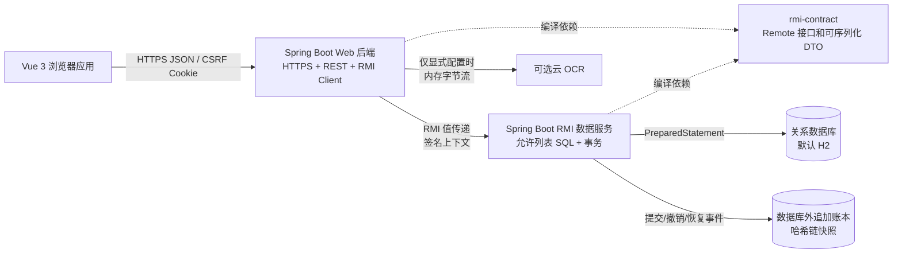
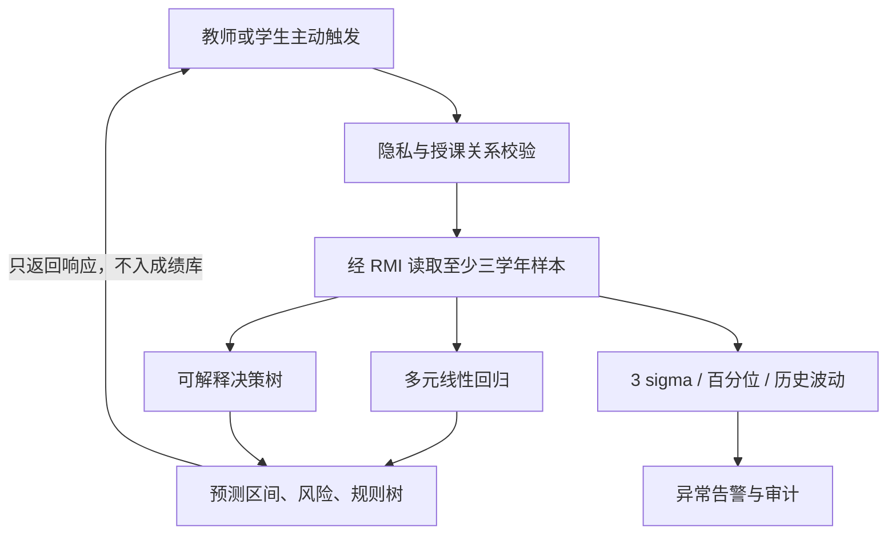
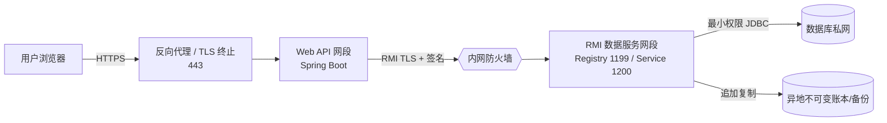

# 整体架构说明

## 1. 项目概述

本项目是面向教师、学生和管理员的高校成绩管理系统。它不是把数据库 CRUD 直接暴露给浏览器，而是把网络入口、领域业务和数据执行拆成可独立部署的边界：Vue 浏览器应用负责交互；Spring Boot Web 后端负责 HTTPS、认证授权、业务规则和远程命令组装；独立 Spring Boot RMI 服务负责结构化 SQL 生成、事务、数据库访问和数据库外完整性账本。

系统的优先目标如下：

1. 完整实现教师录入与分析、学生查询与预警、管理员组织权限与撤销管理。
2. 通过 Java RMI 展示“物理上分布、逻辑上统一”，数据库只对 RMI 数据服务开放。
3. 在浏览器、Web 服务、RMI 边界和持久化层分别实施安全控制，降低单层失守后的静默改分风险；同时明确逐行 HMAC、数据库审计和外部账本各自能检测的范围。
4. AI 只提供异常提示和按需预测，不自动修改正式成绩，也不持久化个人预测结果。
5. 默认使用 H2 文件数据库降低课程演示门槛，同时把 SQL 方言和数据源配置隔离，为主流数据库迁移保留边界。

## 2. 总体组件

浏览器绝不连接 RMI、数据库或 OCR 密钥。Web 后端绝不建立本地数据库连接。RMI 数据服务是数据库凭据的唯一持有者，这个约束既形成清晰的分布式对象边界，也避免“RMI 不可用时偷偷改走本地数据库”破坏架构。

## 3. 工程模块

| 模块 | 运行形态 | 职责 | 明确不负责 |
| --- | --- | --- | --- |
| `web-frontend` | Node/Vite 开发服务器；生产静态资源 | 页面、角色路由、表单校验、批量录入、打印、状态反馈 | SQL、可信授权、保存 JWT、保存 OCR 临时文件 |
| `web-backend` | Spring Boot Web JVM | REST、JWT/CSRF、RBAC/权限/资源所有权、成绩计算与加密、统计、AI、RMI 客户端、统一错误 | 直接 JDBC、接受裸 SQL、信任前端主体编号 |
| `rmi-contract` | 普通 Java JAR | 四类 Remote 接口、结构化命令、调用上下文、恢复证据、签名规范 | Spring、JDBC、业务页面 |
| `rmi-server` | 独立 Spring Boot 非 Web JVM | RMI 注册与导出、请求验签和防重放、二次授权、schema 允许列表、安全 SQL、批事务、数据库与外部账本 | 浏览器会话、JWT、页面 DTO |

四个远程服务名由 `RmiBindings` 统一定义：查询、操纵、健康检查和完整性证据。查询和操纵接口分别保留课程要求指定的 `String[][]` 与 `boolean` 返回类型，分页总数通过独立 `count` 方法取得。

## 4. 分布式对象设计

### 4.1 统一数据表达

REST 领域请求由 Web 后端转换为只包含资源键、字段键、过滤条件、排序、分页和操作枚举的 DTO。传输对象不包含 SQL 片段。核心协议分为：

- `SelectRequest`：表资源、返回字段、过滤器、排序和页码；
- `MutationCommand`：`INSERT`、`UPDATE`、`DELETE`、字段值和过滤器；
- `TransactionRequest`：幂等键、稳定业务语义指纹和多条写命令；
- `IdempotencyProbe`：用原幂等键与语义指纹查询事务是否已完整提交；
- `InvocationContext`：请求号、主体、角色、时间戳、随机数和 HMAC 签名；
- `RecoveryQuery`/`RecoveryRecord`：只供受权管理员读取外部原始证据。

前端字段使用 camelCase，REST DTO 使用领域名称；领域服务通过 `RemoteTableSupport` 和 `RemoteDataGateway` 把领域字段映射为结构化 RMI DTO。RMI 服务端的 `SchemaRegistry` 再把稳定资源键映射为真实表、严格只读领域视图和 JDBC 类型。数据库重命名因此不会泄漏到浏览器。历史课程目录使用只包含 `CLOSED` 开课班的 `teacher_history_courses` 视图；历史成绩详情使用只包含已结课开课班 `SUBMITTED` 成绩的 `teacher_course_historical_grades` 视图。两者都以完全相同的业务过滤条件执行数据库 `COUNT` 与分页 SELECT，返回精确总数并避免先取 500 条再在内存截断；历史成绩只解密当前页。两个视图均无写角色，RMI 还校验签名教师主体与 `teacher_id` 过滤条件，阻止跨教师读取。

### 4.2 安全 SQL 生成

课程要求的“自动拼接 SQL”在本系统中解释为“自动生成 SQL 结构”，而不是拼接不可信值：

1. 表、列、操作符和排序方向必须存在于 `SchemaRegistry`；
2. SQL 标识符只取自注册表，用户输入不能成为标识符；
3. 所有值变成 `?` 占位符，由 JDBC 根据字段类型绑定；
4. 字符串字面包含查询由 `CONTAINS` 统一转义 `%`、`_` 与转义字符，不把用户输入解释为通配表达式；
5. 页长有硬上限；`UPDATE`/`DELETE` 必须有过滤条件；
6. 多条写命令在 RMI 服务端同一事务执行，任一失败全部回滚。

这种实现同时满足自动 SQL、字段类型处理和 SQL 注入防御，比手工判断字符串后加单引号更可靠。

### 4.3 调用可靠性

- 查询是只读操作；遇到 `RemoteException` 时网关使缓存 stub 失效并返回 `503 RMI_UNAVAILABLE`，后续请求再重新查找，不在同一次调用内自动重试。
- 写请求携带前端生成的 UUID 幂等键；前端遇到超时或 `503 RMI_UNAVAILABLE` 这类结果未知响应时保留原键。Web 后端先根据稳定业务输入计算 SHA-256 语义指纹，再通过 `transactionCompleted` 查询 RMI 数据库中的同事务记录，确认同键同语义已提交便直接返回当前结果；尚未提交才继续校验可变状态和执行。这样即使首次请求已提交但响应丢失，也不会因版本/状态已经变化而误报冲突或重复落库。
- RMI 幂等记录同时绑定数据库可核验主体、幂等键和语义指纹；同键异语义失败关闭。指纹排除每次 AES-GCM 加密都会变化的 nonce 与密文，避免同一业务重试被错误识别成不同请求。
- `false` 表示服务端已经确定整个事务回滚；连接中断等结果未知情况抛出远程异常，由 Web 层返回服务不可用，而不是谎报业务失败。
- 注册端口和远程对象端口都固定且可配置，便于 IDEA 双进程、容器和防火墙部署。
- `HealthInterface` 同时供启动检查和 Spring Actuator 健康状态使用。

## 5. 领域架构

### 5.1 教师成绩生命周期

教师先选择本人开课班和评分方案。批量成绩在 Web 后端完成范围、权重和所有权校验，逐条计算总评并使用 AES-GCM 加密，然后作为一个事务发送给 RMI 服务。草稿可以继续编辑；提交后教师不能直接覆盖。管理员小撤销后状态回到草稿，大撤销删除业务记录但不删除外部证据。

教师历史页先按课程号/名称、学年和学期分页检索本人已结课开课班，也可通过 `GET /api/teacher/history-courses/{offeringId}` 直接读取本人某个已结课开课班，而不依赖该记录是否仍在目录当前页。选定课程后，详情接口在数据库中按课程、当前教师和可选学年精确计数并稳定分页，只把当前页密文送入 Web 后端校验、解密和展示。

### 5.2 学生数据隔离

学生接口没有可指定目标学生的公共参数。服务端从认证主体解析学生身份并强制加入过滤条件，只返回已提交成绩。补考原始卷面分可由教师和受权管理员查看，学生计分展示使用 `min(补考卷面分, 60)`，例如 `58/60`。

### 5.3 管理与审计

角色决定默认权限，用户权限表提供细粒度覆盖。重要写操作同时要求角色、权限、资源关系和业务状态满足条件。权限保存由 Web 服务按最终有效权限校验依赖，例如成绩写入/提交依赖课程与成绩读取、风险分析依赖对应的读取/分析能力、小撤销依赖成绩读取；前端联动不能替代这项可信校验。所有用户、角色和权限表写入还会在 RMI 的同一数据库事务内锁定管理员角色并重新计算最终有效权限，事务只有在仍存在至少一名启用、拥有 `ADMIN` 角色且同时具备 `USER_MANAGE` 与 `PERMISSION_MANAGE` 的账号时才能提交，避免并发请求分别通过 Web 预检后共同移除最后管理员。

管理员可按课程、学生和状态分页检索可撤销成绩，并跨页选择真实成绩 ID。提交、小撤销、大撤销、恢复、权限修改和登录风险都会写结构化数据库审计；成绩关键操作另写数据库外链式快照。`LARGE_BATCH` 大撤销和 `ORIGINAL_RESTORE` 原始恢复已强制采用双人复核：发起人与审批人必须是不同管理员，且审批目标由 RMI 服务再次核对；申请列表同时返回复核人、意见和时间，形成可追踪的审批证据。

## 6. AI 架构

AI 能力位于 Web 后端独立分析服务，不在 RMI 数据执行层：

线性模型捕捉平时/实验与期末的线性关系；决策树给出可读条件；规则检测负责确定性边界。模型结果是辅助判断，不是成绩，不允许自动提交或覆盖分数。个人预测只返回学生本人和授课教师。异常告警可以持久化，因为它是审计任务，而不是预测成绩。

## 7. 安全架构

### 7.1 分层防护

| 层 | 控制 |
| --- | --- |
| 浏览器 | Vue 默认文本转义、无 `v-html`、JWT 不进入 Web Storage、路由仅改善体验而不作为可信授权 |
| HTTPS/REST | TLS、JWT HttpOnly Cookie、CSRF、登录限速、严格输入校验、安全响应头、统一小信息量错误 |
| 业务服务 | RBAC、细粒度权限、资源所有权、状态机、页长/上传限制、敏感日志脱敏 |
| RMI | 调用 HMAC、时间窗、nonce 防重放、JEP 290 序列化过滤、固定允许类、远端角色校验、生产 TLS/网络隔离 |
| 持久化 | 最小数据库账号、参数化 SQL、事务、AES-GCM 成绩密文、HMAC 完整性、数据库审计、外部哈希链 |

JWT 只作为已签名的短期会话索引：每个令牌带唯一 `jti`，认证过滤器在每次请求中通过 RMI 重新读取账号状态、当前角色和权限，因此禁用账号或撤销权限会作用于已有会话；RMI 不可用时该刷新保持 `503`，不降级信任令牌旧声明。注销后的 `jti` 拒绝表位于单个 Web JVM 内存，重启会丢失且多实例不共享，生产必须迁移到带 TTL 的共享存储。

### 7.2 密钥

仓库只提交变量名和示例配置，不提交真实 JWT、RMI、AES、数据库或证书秘密。开发模式首次运行时使用加密安全随机数生成权限受限的 `runtime` 文件；生产配置通过环境变量或外部秘密管理系统提供，并应在缺失时失败关闭。不同用途从不同主密钥派生或使用独立密钥，避免一把密钥同时承担加密、签名和会话职责。

### 7.3 完整性与恢复

AES-GCM 保护单条成绩密文并绑定成绩 ID；额外 HMAC 使读取时能够在解密前快速拒绝成绩密文、nonce 或完整性标签篡改。数据库外账本每一项包含前项哈希、关键事件、主体、时间和受保护快照；管理员链校验只从链首重算现存条目的序号、前哈希和 HMAC，不自动把数据库行与账本逐项比对。数据库行删除，以及状态、版本、选课或方案等未纳入成绩 HMAC 的元数据修改，不会由链校验自动发现。恢复是新的敏感事件，因此不能重写旧块，而是追加一个恢复块。

这里的账本是课程范围内的教学型私有哈希链，不宣称具有 Hyperledger/Ethereum 多组织共识能力。缺少外部 head/count 锚点时，账本整文件缺失或合法尾部截断会表现为有效空链/短链；生产系统应外部锚定链头和条目数，并将链副本异地写入真正的联盟链或不可变对象存储。

成绩变更、数据库历史、审计/幂等记录与审批消费位于同一个本地数据库事务。外部文件账本在流程中同步追加并失败关闭，但不参加数据库 XA；因此账本追加成功后若最终 DB commit 极少见地失败，可能留下孤立账本项。生产实现应改用 transactional outbox 和异地追加器消除这一窗口。

## 8. 部署视图

开发环境可在同一电脑启动两个 JVM 和一个 Vite 进程，但边界与远程调用保持不变。生产建议拓扑如下：

仅反向代理对公网开放。RMI registry、RMI service 和数据库端口只允许指定主机互访。开发模式允许显式关闭 Secure Cookie/RMI TLS 以方便本机调试，但生产 profile 必须失败关闭，且这种差异会在启动日志和 README 中明确。

## 9. 可用性与演进

- 数据查询统一分页，避免一次导出全校成绩；打印只打印当前受权数据。
- Web 层通过健康检查暴露 RMI 可用性，RMI 不健康时写操作不接受。
- 外部 OCR 是可选适配器；上传入口和配置的供应商 URL 都必须是 HTTPS，未配置时返回明确的 `503`，可接受图片低于 multipart 内存阈值并受大小、类型和超时限制。
- H2 适合课程演示，不适合多节点生产；更换数据库时由 JDBC URL、驱动和方言配置完成，必须为目标数据库补集成测试。
- 登录限速和 nonce 缓存在单机内存；多实例部署时应迁移到 Redis 或共享安全存储。
- 教学型账本能验证现存链条的内容和链接，但不执行数据库对账，也不替代外部锚点、异地备份、密钥轮换、WAF、IDS 或专业联盟链。
