# 系统模型图

本文使用 Mermaid 保存可版本管理的模型源文件。图中的模块、表、远程接口、状态和关键类均以源码为依据；课程提交时可由支持 Mermaid 的 Markdown 工具导出 PNG/PDF。

## 1. 总用例图

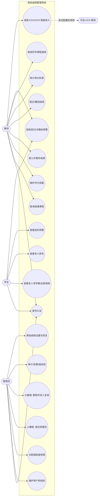

所有角色都必须先完成身份认证。页面是否显示某个操作只是体验控制，真正的角色、权限和资源所有权校验均在 Web 后端与 RMI 数据服务再次执行。

## 2. 分布式组件图

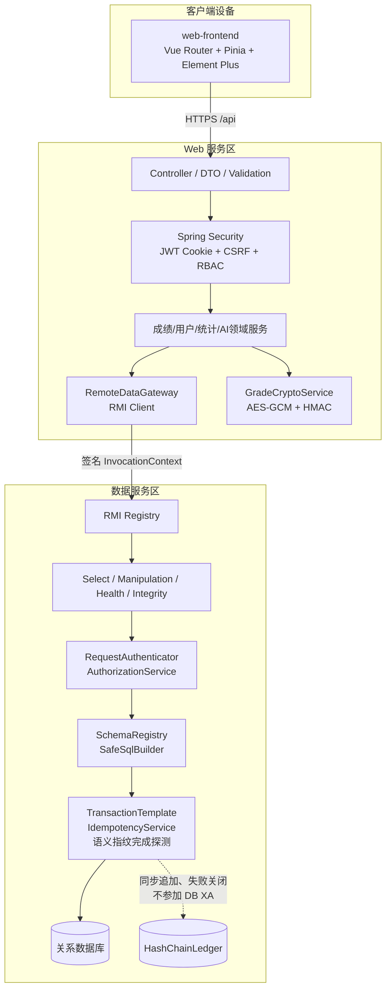

## 3. 部署图

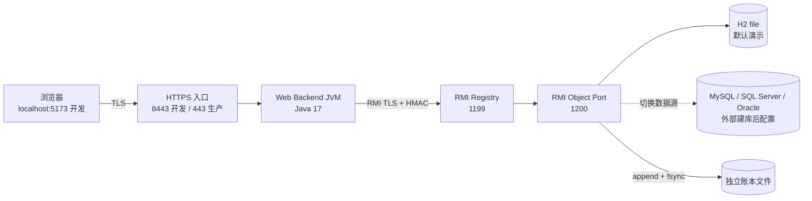

开发环境可以把所有节点放在一台电脑，但 Web JVM 与 RMI JVM 始终是两个进程。生产环境只开放 HTTPS 入口，1199、1200 和数据库端口均置于私网允许列表。

## 4. 成绩状态图

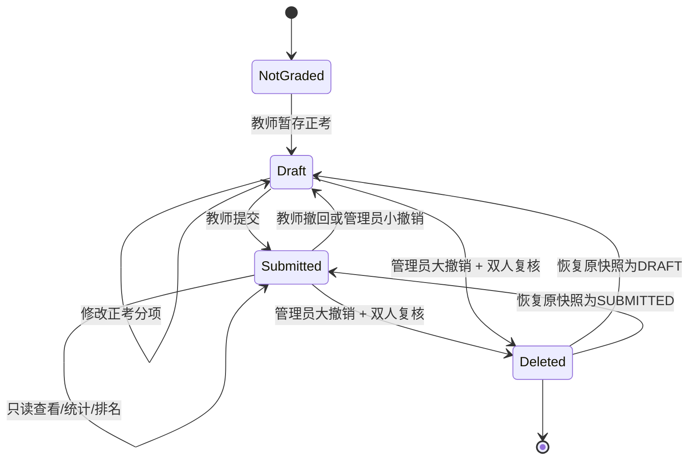

关键不变量：正考只有草稿可由教师修改；外层正考已提交后，补考只能经专用状态信封修改。`MAKEUP_CLEAR` 仅接受已有卷面分的补考 `DRAFT`，清空分数后仍保留可编辑的 `DRAFT`；每次有效变更都写历史和外部账本，重复空清请求不写入。大撤销删除业务成绩，但账本证据不能删除；恢复是新事件，不改写旧链。

## 5. 关键时序图

### 5.1 登录与 CSRF

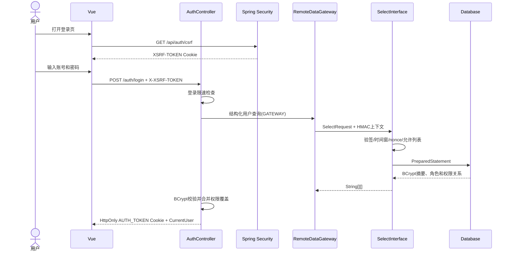

### 5.2 成绩暂存与提交

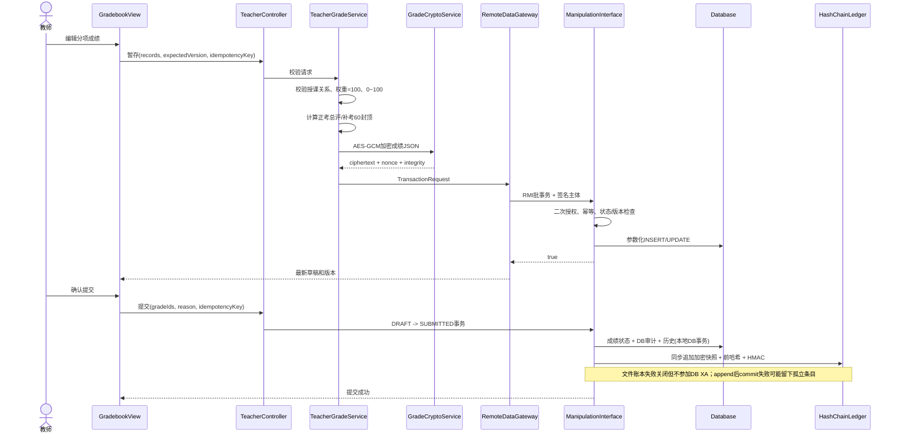

### 5.3 大撤销双人复核

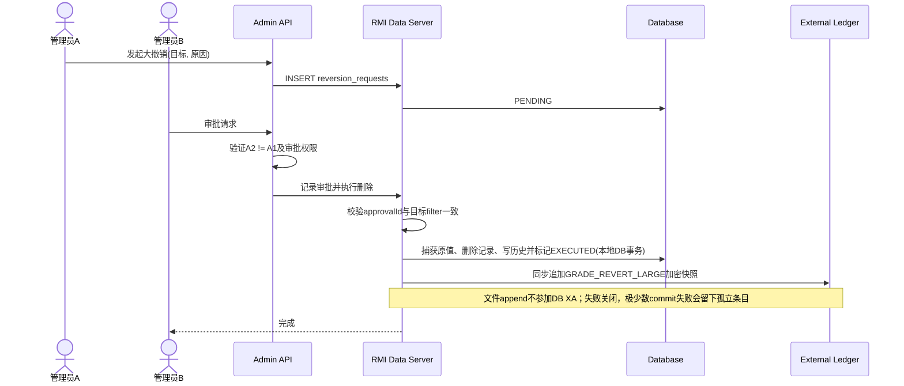

### 5.4 篡改发现与恢复

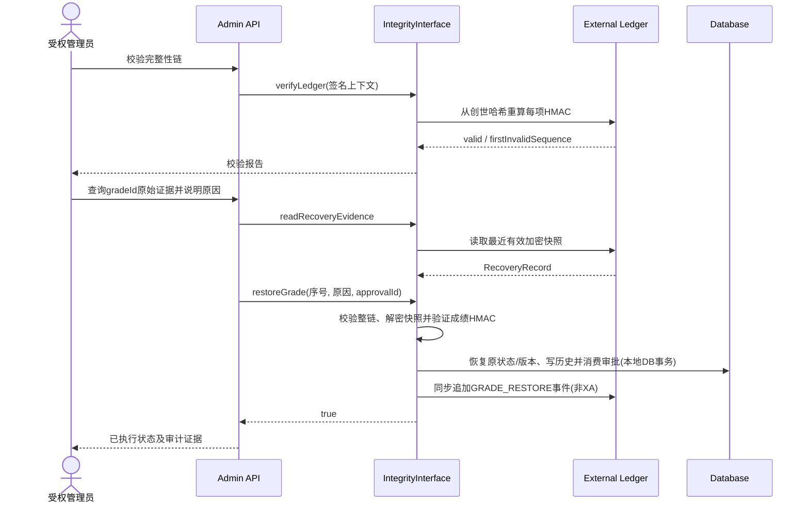

## 6. 数据模型

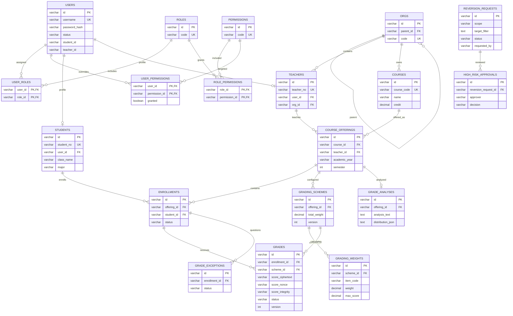

`AUDIT_LOGS`、`ALERTS`、`GRADE_HISTORY` 和 `IDEMPOTENCY_RECORDS` 是基础设施表：它们分别保存数据库审计、安全告警、成绩版本证据和写请求结果。数据库外 `HashChainLedger` 不在 ER 图内，因为它故意不依赖同一个数据库。

## 7. 安全数据流与信任边界

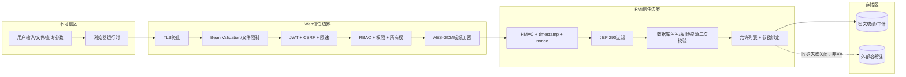

安全测试需要逐个穿越这些边界，而不能只验证登录。例如 SQL 注入测试必须证明载荷到达 JDBC 后仍然是参数；越权测试必须证明 Web 与 RMI 两层都拒绝；成绩密文篡改测试要证明读取解密失败，账本篡改测试要证明现存链条的 HMAC/链接校验失败。`verifyLedger()` 不自动把数据库行与账本对账，数据库删除或非加密元数据修改需结合数据库审计、备份和外部锚点发现。

## 8. 源码一一对应类图

以下四张图以 `src/main` 为边界：每个 Java 顶级类、接口、记录或枚举在图中恰有一个同名节点；前端每个 TypeScript/Vue 生产模块也恰有一个节点。DTO 容器中的嵌套记录和实现类中的私有辅助类型列在 8.5，避免把源码中真实存在的嵌套类型误画成独立顶级文件。测试类不属于生产架构，分别由对应被测类承接。

### 8.1 `rmi-contract` 全量类图

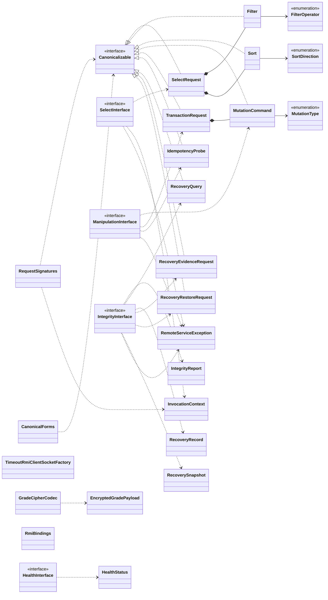

### 8.2 `rmi-server` 全量类图

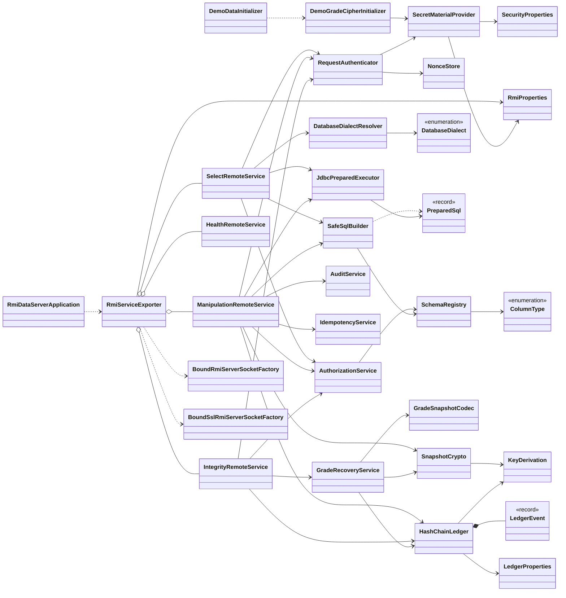

### 8.3 `web-backend` 全量类图

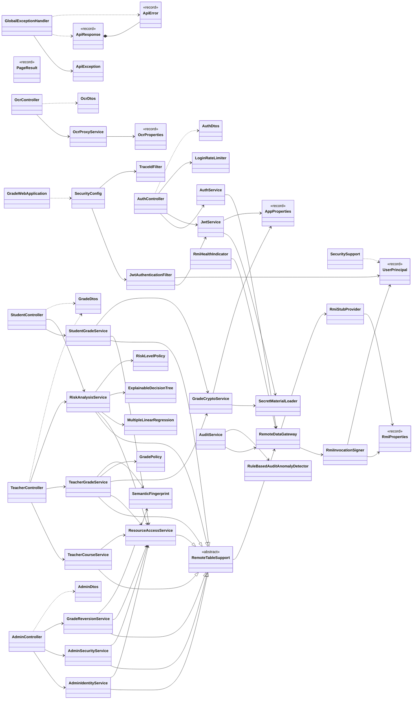

### 8.4 `web-frontend` 全量模块关系图

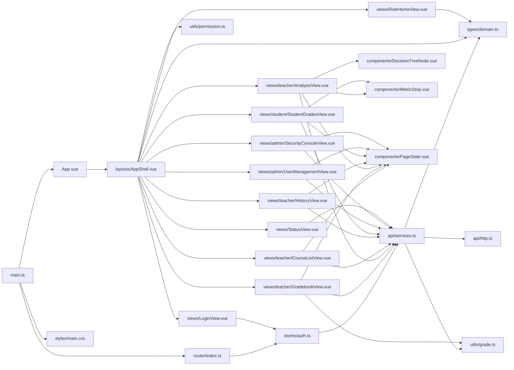

### 8.5 嵌套类型归属

下表补齐顶级类图中的嵌套类型；名称采用 `宿主.嵌套类型`，与 Java 二进制名的所有权严格一致。

| 宿主 | 嵌套类型 |
| --- | --- |
| `SchemaRegistry` | `ColumnDefinition`、`TableDefinition` |
| `ManipulationRemoteService` | `Approval`、`ReversionKind`、`MutationFailure` |
| `GradeRecoveryService` | `Approval` |
| `IdempotencyService` | `Row` |
| `AuthorizationService` | `Identity`、`OwnershipCheck` |
| `HashChainLedger` | `ParsedLedger`、`StoredEntry` |
| `DemoGradeCipherInitializer` | `DemoGrade` |
| `AppProperties` | `Security`、`Crypto` |
| `RmiStubProvider` | `Stubs` |
| `RemoteDataGateway` | `InternalRole` |
| `LoginRateLimiter` | `AttemptWindow` |
| `GradeCryptoService` | `ProtectedGrade` |
| `ExplainableDecisionTree` | `Sample`、`Split`、`Node`、`Decision`、`Model` |
| `MultipleLinearRegression` | `Prediction`、`Model` |
| `TeacherGradeService` | `WeightRule`、`GradePayload`、`GradeObservation`、`MakeupScoreAnomaly` |
| `StudentGradeService` | `GradePayload`、`ScoreRecord`、`AcademicTerm` |
| `RiskAnalysisService` | `Component`、`TrainingSample`、`ModelBundle`、`GradePayload` |
| `GradeReversionService` | `CanonicalCursor`、`GradePayload` |
| `AuthDtos` | `LoginRequest`、`CurrentUser`、`Csrf` |
| `OcrDtos` | `Recognition` |
| `GradeDtos` | `CourseView`、`HistoryCourseView`、`WeightItem`、`WeightScheme`、`SaveWeightsRequest`、`GradeEntryInput`、`ExamType`、`BatchDraftRequest`、`BatchActionRequest`、`GradeView`、`GradeHistoryView`、`Statistics`、`AnalysisNoteRequest`、`SavedAnalysis`、`CourseHistoricalGrade`、`StudentGradeView`、`StudentOverview`、`Ranking`、`FailureWarning`、`RiskAssessment`、`PredictionInput`、`PredictionBatchRequest`、`Prediction`、`RegressionSummary`、`DecisionTreeNode`、`PredictionBatchResult` |
| `AdminDtos` | `UserView`、`CreateUserRequest`、`UpdateUserRequest`、`OrganizationView`、`OrganizationRequest`、`RolePermissions`、`PermissionView`、`UpdateRolePermissionsRequest`、`UserPermissionOverrides`、`ReversionScope`、`ApprovalDecision`、`CreateReversionRequest`、`ReviewRequest`、`ReversionView`、`AdminGradeView`、`AuditLogView`、`AlertView`、`IntegrityView`、`RestoreOriginalRequest`、`SmallReversionRequest`、`RecoveryEvidence`、`RecoverySnapshotView` |

前端 `.vue` 单文件组件在编译后会生成框架内部组件类，但设计模型以源码模块为单位，不把 Vue 编译器生成物重复计入。`services.test.ts`、`grade.test.ts`、`permission.test.ts` 以及 Java `src/test` 类是验证模型，不是运行时生产类，故不进入上述生产类图。
