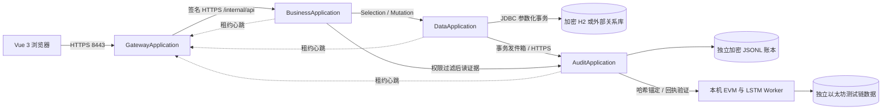

# 整体架构与分布式对象设计

## 项目概述

知序面向教师录入、学生查询与教务管理员审核。领域核心为教学班课程、选课关系、版本化成绩、教学分析、人员权限和不可静默改写的审计证据。Java 服务独立进程运行，前端通过单一 HTTPS 地址访问系统。

## 运行组件

### common

`Protocol` 定义值对象和两种远程接口；`RpcClient` 负责发现、签名、调用和错误映射；`InternalSecurity` 验证服务身份、时间窗、随机数；`Settings` 读取环境变量及随机配置；`Crypto` 提供 AES-GCM/HMAC/SHA-256。通用模块不包含领域权限或数据库操作。

### gateway

`RegistryController` 维护服务实例租约，允许的服务地址来自 `SERVICE_HOSTS`，禁止凭证、查询串和任意外部地址注册。`GatewayController` 收集路径、方法、查询参数、请求体到统一信封对象，过滤客户端伪造的服务认证头，重签后调用业务服务。`WebConfiguration` 提供静态页面与安全响应头。

网关不解析成绩算法，不持有成绩数据库连接。它既是浏览器统一入口，也是小规模服务发现中台。没有直接引入 Spring Cloud：四个教学服务使用轻量租约足以验证分布式对象职责，额外部署注册中心与配置中心会增加本地运行门槛。业务规模扩大时可将发现实现换成 Spring Cloud Consul/Eureka，网关换成 Spring Cloud Gateway，不修改 `Protocol` 和业务规则。

### business-service

`ApiController` 是 Web 业务路由；`AuthService` 从共享数据服务验证会话和 CSRF；`CourseService` 管理访问归属、系数与选课；`GradeService` 实现成绩状态机；`AnalyticsService` 完成统计/异常/模型训练；`AdminService` 负责人员和审计复核。`RemoteRepository` 将领域需求转成查询或操纵对象，业务模块完全没有 JDBC 依赖。

### data-service

`SchemaCatalog` 定义白名单表、列和类型，并初始化教学数据库结构。`SqlCompiler` 只拼接已验证的标识符，全部实际值使用 `?` 绑定。`TransactionService` 在一项事务中执行多表操作、检查每条影响行数、写入加密审计发件箱。成绩载荷解密仅发生在授权业务服务的签名查询中。

JDBC `ResultSet` 分页用于保持数据库可移植性。它会扫描到 offset，适合教学数据；大型数据库应使用方言分页及索引，不将此实现视为大规模报表引擎。主键和唯一索引由数据库保证；引用关系由业务服务校验，生产迁移应补充显式外键和版本化 DDL。

### audit-service / chain-worker

审计进程持有与业务库独立的 AES 密钥和 HMAC 密钥。每条审计包含操作人、操作类型、资源、时间、每行维护前后的快照。账本记录密文、前序哈希、当前哈希、签名、EVM 交易号。验证不访问业务数据库，管理员可在业务成绩密文损坏时查看原始分数。

链工具将账本哈希作为 EVM 交易数据提交，检查交易回执成功；持久化交易列表与链数据库。校验时核对数量、交易号、链上 input 和收据状态，能够发现账本中间修改与尾部截断。链上只放哈希，不放明文成绩。

## 远程对象契约

`Selection(table, fields, where, orderBy, offset, limit)`：`where` 使用字段到精确匹配值的映射。查询不携带 SQL 文本，也不混合数据操纵。`SelectInterface.select` 返回 `String[][]`，列顺序与 `fields` 一致。

`Operation(type, table, values, where, expectedCount)`：`type` 为 INSERT/UPDATE/DELETE；UPDATE/DELETE 必须提供主键；`where.version` 实现 CAS；整数和小数在服务器转换后绑定。

`Mutation(operations, actor, action, resource, requestId)`：同一业务请求可包含 courses、grades、users、sessions 等多表操作。成功返回 true；任何条目失败则整体回滚并返回 4xx/5xx。`requestId` 为关联字段，当前未建立持久去重表，不能把它描述成已实现任意请求幂等。

多表关联查询在业务服务通过课程/学生主键组合多个类型化查询完成，前端不提交 JOIN 或 SQL。当前协议不暴露任意条件表达式，这是主动收窄的安全边界。

## 一致性和扩容

### 数据事务

每次成绩写入同时检查课程版本和成绩版本。课程版本把权重改变、选课变更、提交/撤销、成绩批次修改串行化，避免用户读到旧权重后错误提交。只有持久化 CAS 成功才提交整个事务，适用于多个业务实例竞争。

### 网络审计

数据库维护和发件箱同事务完成，随后网络发送；审计服务按事件 ID 去重。不可跨数据库与文件/EVM 实现原子提交，因此使用发件箱最终一致性。审计不可达时已有事务保留待发送事件；下一次敏感写入先刷新并要求待发送为零，拒绝继续积累。登录会话可继续读写，不依赖链可用性。

EVM 锚定与账本落盘之间存在故障窗口。当前验证失败时停止敏感写入，避免悄悄忽略差异。部署文档给出恢复流程，不把这称作跨链强事务。不要在另一台机器复制同一账本目录同时开启写实例；当前审计写者为单实例。

### 高可用边界

业务服务可多实例无本地会话，网关轮询选择未过期实例。网关重启后服务重新注册；短暂不可用会返回 503。网关和审计是单实例教学组件；数据服务在本机 H2 模式也是单实例。生产扩容应先替换注册中心和数据库，再将审计改为领导者单写或消息队列顺序消费。当前代码没有宣称已完成多机容灾。

## 智能模块

统计检测可解释且独立于预测。正考分布按完整成绩生成；补考极端值、历史偏差、低分百分位可同时产生多项提醒。保存成绩后触发异常审计，管理员在日志中复核。

Weka 线性模型拟合 `finalExam ~ regular + lab`，REPTree 学习非线性条件。训练使用目标学期之前同课程代码的已提交记录；最后一年留作时间验证，RMSE 报告仅代表演示数据。展示的区间为 `预测总评 ± 1.96 × 验证RMSE × 期末权重` 的经验近似，不能解释成经过校准的严格置信区间。

LSTM 输入为长度 12 的操作序列，特征是上海时区小时比例、五分钟同操作者密度及批量规模、拒绝访问标记。12 单元 LSTM 接 sigmoid 二分类层。384 条合成序列，320 训练、64 验证。模型不写入正式成绩，不具有生产安全事件检测准确率承诺。
