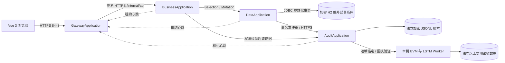
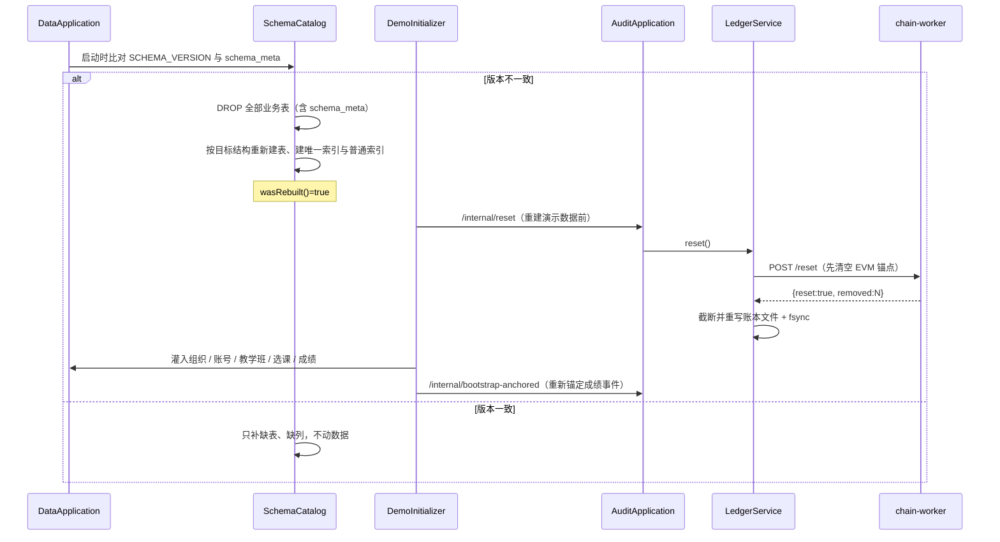

# 整体架构与分布式对象设计

## 项目概述

知序面向教师录入、学生查询与教务管理员审核。领域核心为教学班课程、选课关系、版本化成绩、教学分析、人员权限和不可静默改写的审计证据。Java 服务独立进程运行，前端通过单一 HTTPS 地址访问系统。

## 运行组件

```mermaid
flowchart LR
    Browser[Vue 3 浏览器] -->|HTTPS 8443| Gateway[GatewayApplication]
    Gateway -->|签名 HTTPS /internal/api| Business[BusinessApplication]
    Business -->|Selection / Mutation| Data[DataApplication]
    Data -->|JDBC 参数化事务| DB[(加密 H2 或外部关系库)]
    Data -->|事务发件箱 / HTTPS| Audit[AuditApplication]
    Business -->|权限过滤后读证据| Audit
    Audit --> Ledger[(独立加密 JSONL 账本)]
    Audit -->|哈希锚定 / 回执验证| Chain[本机 EVM 与 LSTM Worker]
    Chain --> EVM[(独立以太坊测试链数据)]
    Business -.租约心跳.-> Gateway
    Data -.租约心跳.-> Gateway
    Audit -.租约心跳.-> Gateway
```

### common

`Protocol` 定义值对象和两种远程接口；`RpcClient` 负责发现、签名、调用和错误映射；`InternalSecurity` 验证服务身份、时间窗、随机数；`Settings` 读取环境变量及随机配置；`Crypto` 提供 AES-GCM/HMAC/SHA-256。通用模块不包含领域权限或数据库操作。

### gateway

`RegistryController` 维护服务实例租约，允许的服务地址来自 `SERVICE_HOSTS`，禁止凭证、查询串和任意外部地址注册。`GatewayController` 收集路径、方法、查询参数、请求体到统一信封对象，过滤客户端伪造的服务认证头，重签后调用业务服务。`WebConfiguration` 提供静态页面与安全响应头。

网关不解析成绩算法，不持有成绩数据库连接。它既是浏览器统一入口，也是小规模服务发现中台。没有直接引入 Spring Cloud：四个教学服务使用轻量租约足以验证分布式对象职责，额外部署注册中心与配置中心会增加本地运行门槛。业务规模扩大时可将发现实现换成 Spring Cloud Consul/Eureka，网关换成 Spring Cloud Gateway，不修改 `Protocol` 和业务规则。

### business-service

`ApiController` 是统一信封入口：解析路径/方法/查询/请求体，调用 `AuthService` 验证会话与 CSRF，按 `Routes.handles()` 声明的路径把请求交给唯一匹配的领域路由实现，并把 403 记成 `ACCESS_DENIED` 审计事件；`CourseService` 管理访问归属、系数与选课；`GradeService` 实现成绩状态机；`AnalyticsService` 完成统计/异常/模型训练；`AdminService` 负责人员和审计复核；`OrganizationService` 负责三级组织与范围匹配；`SelectionService` 负责选课批次与选课规则。`RemoteRepository` 将领域需求转成查询或操纵对象，业务模块完全没有 JDBC 依赖。

### 组织域与选课域

组织与选课是本轮新增的两个业务域，按「路由只做 HTTP 语义、领域服务只做规则、仓库只做远程值对象」三层划分：

|层|组织域|选课域|
|---|---|---|
|路由|`OrganizeRoutes`（`/organizations*`）|`SelectionRoutes`（`/selections*`）；课程维度的批量选课挂在 `CoreRoutes` 的 `POST /enrollments/batch`|
|领域服务|`OrganizationService`：层级与上级归属、编号生成 `nextId`、重名与级联删除、范围匹配|`SelectionService`：批次发布、时间窗口、选课规则、批次批量处理、按课程批量选课（`batchByCourse`）、开课人数结算|
|复用方|`CourseService`、`AdminService`、`CoreRoutes` 通过它解析编号并渲染名称|复用 `OrganizationService.inScope`/`resolveOwn` 做范围与班级解析，复用 `CourseService` 的课程归属校验|
|数据表|`colleges`、`majors`、`classes`|`course_selections`、`enrollments`、`enrollment_records`|

组织域不持有数据库连接，也不拼接 SQL：它只通过 `RemoteRepository.find`/`findOne`/`mutate` 访问 `SchemaCatalog` 白名单里的表。选课域同样如此，所有写入都组装成 `Protocol.Operation` 后一次性提交，因此自动进入审计发件箱。这样「组织编号 → 显示名称」只实现一次（`OrganizationService.names`/`displayName`/`nameField`），课程目录、人员列表、教学班名单与选课范围展示全部复用它，前端不需要自己维护编号表。

#### 组织编号只有一种：主键 id（第三轮修正）

组织域只维护一个编号——主键 `id`，它同时是组织对外的编号：

|编号|生成者|作用|
|---|---|---|
|主键 `id`|`OrganizationService.nextId`：层前缀 + 2 位号段 + 3 位本级序号（`C01001`、`M0100x`、`B0100x`）|表主键、`users`/`courses` 的组织引用、审计 resource、接口寻址与页面展示|

第二轮的「显示编号 `code`」在第三轮被取消，`OrganizationService` 随之删除了 `nextCode`/`maxCode`/`codeOf`。`OrganizeRoutes.save` 现在的行为是：新增分支由 `OrganizationService.save` → `nextId` 生成主键，修改分支只用请求体里的 `id` 定位对象、响应回显同一个主键，因此**编号不可修改由服务端保证**，前端组织管理表单里已经没有「编号」输入框（只在列表里把主键编号作为只读文本展示）。取消第二层编号的代价很小、收益明确：主键已是可读编号，演示数据与既有引用全都在用它；而多一层编号要多占前端一个只读字段、后端一套生成与复核逻辑（还要处理历史脏数据与 `99` 上限），两套编号的语义差别反而带来沟通成本。`colleges`/`majors`/`classes` 表里遗留的 `code` 列保留在结构中以免再触发一次整库重建，接口用 `copy.remove("code")` 保证它不出现在响应里；`classes` 的 `counselor` 列在结构版本 3 中删除，组织域的保存、列表与下拉都不再涉及该字段。

#### 批量选课的归属（第二轮）

按课程维护名单的能力放在选课域而不是课程域：`CoreRoutes` 只把 `POST /enrollments/batch` 转发给 `SelectionService.batchByCourse`，规则、目标学生去重、流水写入与事务组装都在选课域完成。理由是它与批次批量选课共用同一张 `enrollment_records` 流水、同一组 `ADMIN_ASSIGN`/`ADMIN_REMOVE` 动作与同一套 `enrollments` 复用逻辑（唯一索引要求已退课的行用 `UPDATE` 而不是 `INSERT`），把这些放在两个域里会立刻产生第二份实现。课程域保留的是单人入口 `CourseService.enroll`（`POST /enrollments`），它同样补写了这两类流水，因此「教务代选代退都能在选课记录里查到」对单人和批量一致。

#### 重修状态的归属（第四轮）

重修在选课域里是**派生状态**而不是实体字段：`courses`、`enrollments`、`course_selections` 三张表都没有「是否重修」列，判定由 `SelectionService.failedCodes`（学生端「我的选课」「选课台」与教务端批次课程列表）与 `CourseService.failedCodesBefore`（教师端名单）从**历史成绩**推导——更早学期、同一课程代码、成绩 `state=SUBMITTED` 且有效分 < 60。课程实体上没有任何重修字段，课程名也不参与判定，因此「重修」不会随课程被复制或改名而失真。两处实现共用同一口径，批量场景先一次性读入 `course_id|student_id` 成绩索引再比对，避免逐门课查询；`Models.effective` 仍是唯一的总评/补考封顶算法。

职责边界刻意保持单一：

- `OrganizationService` 回答「这个编号是否存在、层级是否合法、删除是否有引用、学生是否落在选课范围内」；
- `SelectionService` 回答「这个学生现在能不能选或退这门课」，包含窗口、范围、开关、已有成绩、已通过课程、课程代码冲突与学分上限，并给出该生本学期这门课是否属于重修（`retake`/`retakeLabel`/`retakeCount`）；
- `CourseService` 用同一口径给教师名单标注重修学生（`roster` 的 `retake`/`retakeLabel`）；
- `OrganizeRoutes`、`SelectionRoutes` 只把查询参数与请求体字段翻译成服务调用，并按 `ApiController.page` 统一分页返回。

判责集中带来一个已知代价：组织服务被多个域依赖，任何签名变化都会影响课程与人员维护，因此它的公共方法（`resolveOwn`、`names`、`listAll`、`inScope`、`split`）保持了稳定的静态或纯函数形态，便于单独测试。

### data-service

`SchemaCatalog` 定义白名单表、列和类型，并初始化教学数据库结构。`SqlCompiler` 只拼接已验证的标识符，全部实际值使用 `?` 绑定。`TransactionService` 在一项事务中执行多表操作、检查每条影响行数、写入加密审计发件箱。成绩载荷解密仅发生在授权业务服务的签名查询中。

#### 结构版本驱动的重建流程

本轮把数据库初始化改为「结构版本驱动」：`SchemaCatalog.SCHEMA_VERSION` 与库中 `schema_meta` 记录的版本不一致时删除全部业务表并按目标结构重建，随后 `DemoInitializer` 重灌演示数据。重建会连带影响审计侧，因此流程是三个组件协同的，顺序不能颠倒：

```mermaid
sequenceDiagram
  participant Data as DataApplication
  participant Cat as SchemaCatalog
  participant Demo as DemoInitializer
  participant Audit as AuditApplication
  participant Ledger as LedgerService
  participant Chain as chain-worker
  Data->>Cat: 启动时比对 SCHEMA_VERSION 与 schema_meta
  alt 版本不一致
    Cat->>Cat: DROP 全部业务表（含 schema_meta）
    Cat->>Cat: 按目标结构重新建表、建唯一索引与普通索引
    Note over Cat: wasRebuilt()=true
    Demo->>Audit: /internal/reset（重建演示数据前）
    Audit->>Ledger: reset()
    Ledger->>Chain: POST /reset（先清空 EVM 锚点）
    Chain-->>Ledger: {reset:true, removed:N}
    Ledger->>Ledger: 截断并重写账本文件 + fsync
    Demo->>Data: 灌入组织 / 账号 / 教学班 / 选课 / 成绩
    Demo->>Audit: /internal/bootstrap-anchored（重新锚定成绩事件）
  else 版本一致
    Cat->>Cat: 只补缺表、缺列，不动数据
  end
```

三次触发条件任一成立即重建：结构版本不一致、显式重建开关（`-Dcampus.reset-db=true` 或 `CAMPUS_RESET_DB=true`）、业务表为空（首次启动）。`wasRebuilt()` 让初始化器知道结构刚刚被清空，因此即使库里已经没有数据也会重新灌入。

结构版本第二轮升到 `3`，对应「`classes` 去掉 `counselor` 列」这一无法用补列修复的变化（旧库会保留该列与相关约束）。演示数据同时扩充为多学院规模：`DemoInitializer` 写入 4 学院 / 8 专业 / 16 班级 / 65 账号 / 32 教学班，并预置一个 2026-1 的进行中选课批次；灌数结束时调用 `verifyOrganizationIntegrity()` 逐行校验「专业属于学院、班级属于专业、管理员无组织」，任何一行不合法直接抛异常中止启动，避免脏数据静默入库。

先清链再清账本是硬要求：账本里保存的是已删除成绩行的快照，旧锚点与新链毫无关系，若账本已空而锚点仍在，重新锚定会因 `Anchor conflict`（同一下标不同哈希）失败。链锚点清除失败时只打印日志并继续重建账本——「账本与数据库一致」优先于「链上锚点连续」。

必须明确边界：`POST /reset` 让账本可以被合法清空，**只适用于本机演示重建**，生产环境不得暴露该端点；整库重建也只适用于演示与教学环境，生产库必须改用迁移管理工具。

Windows 一键启动使用 `scripts/start.ps1`（PowerShell 会把 `-Dcampus.reset-db=true` 这类参数拆坏，脚本以参数数组直接调用 `java`），Linux/macOS 使用 `scripts/start.sh`。

JDBC `ResultSet` 分页用于保持数据库可移植性。它会扫描到 offset，适合教学数据；大型数据库应使用方言分页及索引，不将此实现视为大规模报表引擎。主键和唯一索引由数据库保证；引用关系由业务服务校验，生产迁移应补充显式外键和版本化 DDL。

### audit-service / chain-worker

审计进程持有与业务库独立的 AES 密钥和 HMAC 密钥。每条审计包含操作人、操作类型、资源、时间、每行维护前后的快照。账本记录密文、前序哈希、当前哈希、签名、EVM 交易号。验证不访问业务数据库，管理员可在业务成绩密文损坏时查看原始分数。

链工具将账本哈希作为 EVM 交易数据提交，检查交易回执成功；持久化交易列表与链数据库。校验时核对数量、交易号、链上 input 和收据状态，能够发现账本中间修改与尾部截断。链上只放哈希，不放明文成绩。

## 前端外壳与选课入口

前端是 Vue 3 单页应用，不依赖路由库：`App.vue` 用一个 `page` ref 切换视图，由 `nav` computed 按「角色 + 权限」生成侧栏项，`LoginView` 之外的页面组件按 `v-if` 挂载。

第二轮与第三轮对前端外壳做了若干调整，都属于展示层而不改变领域边界：

|调整|实现位置|说明|
|---|---|---|
|导航顺序与入口合并|`App.vue` 的 `nav`/`adminSelectionTabs`/`selectionTab`|管理员顺序固定为课程成绩、统计分析、人员与权限、组织管理、选课管理、安全审计（安全审计最后）；「网上选课」与「课程与选课」合并为唯一的「选课管理」，页内三标签页|
|身份行显示组织|`App.vue` 的 `identityParts`/`identityLine`|「角色 · 学院 · 专业 · 班级」，逐项过滤 `null`/空串（管理员只有角色）；`title`/`aria-label` 给出完整文本|
|侧栏宽度拖动调节|`App.vue` 的 `sidebarWidth`/`sidebarResizing`/`sidebarIconOnly`/`sidebarCompact`/`sidebarStyle`/`startSidebarResize`/`resetSidebarWidth`、模板里的 `.sidebar-resizer`；`style.css` 的 `.app-shell { --sidebar-width }`|第三轮取代了第二轮的折叠按钮：侧栏右边缘是可拖拽手柄，宽度 68–420px、默认 216px；`<118px` 自动进入仅图标档（隐藏文字、保留 `title`/`aria-label`），118–167px 为紧凑档；宽度持久化在 `localStorage.campus.sidebarWidth`，双击手柄复位；拖动期间 `body.resizing-sidebar` 关闭过渡与文本选择|
|去硬编码学院名|`App.vue` 顶栏、页脚与登录页标语|顶栏只显示 `pageName`，页脚为「知序 · 高校成绩管理」；学院名称一律来自 `/me` 与 `/organizations/options`|

侧栏宽度的实现方式是单一 CSS 变量：`.app-shell` 默认 `--sidebar-width: 216px`，`.sidebar` 的宽度与 `.main-shell` 的左边距都由它驱动（`@media (max-width: 1150px)` 把默认值降为 180px），拖动时只改这一个值，因此布局不会出现两处宽度不同步；`@media (max-width: 760px)` 隐藏手柄，因为小屏侧栏本来就是横向导航条。宽度是纯前端显示偏好，不进后端、不影响权限与请求内容。

按课程选课弹窗是唯一新增的写操作界面：`openEnrollment(course)` 读取 `GET /roster?courseId=`（当前名单）与 `GET /organizations/students?size=300`（学生候选，需要 `ORG_ADMIN`），提交 `POST /enrollments/batch` 后刷新名单与课程列表，并把 `added`/`skipped`/`removed` 与 `failed` 明细展示给管理员。学生名单接口的权限口径没有为本轮放宽：若当前账号缺少 `ORG_ADMIN`，前端捕获 403 后降级提示「学生列表不可用，仍可按班级整班处理」，仍可通过班级名称完成整班选课——这条降级路径不改变服务端的鉴权结论。

## 远程对象契约

`Selection(table, fields, where, orderBy, offset, limit)`：`where` 使用字段到精确匹配值的映射。查询不携带 SQL 文本，也不混合数据操纵。`SelectInterface.select` 返回 `String[][]`，列顺序与 `fields` 一致。

`Operation(type, table, values, where, expectedCount)`：`type` 为 INSERT/UPDATE/DELETE；UPDATE/DELETE 必须提供主键；`where.version` 实现 CAS；整数和小数在服务器转换后绑定。

`Mutation(operations, actor, action, resource, requestId)`：同一业务请求可包含 courses、grades、users、sessions 等多表操作。成功返回 true；任何条目失败则整体回滚并返回 4xx/5xx。`requestId` 为关联字段，当前未建立持久去重表，不能把它描述成已实现任意请求幂等。

多表关联查询在业务服务通过课程/学生主键组合多个类型化查询完成，前端不提交 JOIN 或 SQL。当前协议不暴露任意条件表达式，这是主动收窄的安全边界。

## 一致性和扩容

### 数据事务

每次成绩写入同时检查课程版本和成绩版本。课程版本把权重改变、选课变更、提交/撤销、成绩批次修改串行化，避免用户读到旧权重后错误提交。只有持久化 CAS 成功才提交整个事务，适用于多个业务实例竞争。

### 网络审计

数据库维护和发件箱同事务完成，随后网络发送；审计服务按事件 ID 去重。不可跨数据库与文件/EVM 实现原子提交，因此使用发件箱最终一致性。审计不可达时已有事务保留待发送事件；下一次敏感写入先刷新并要求待发送为零，拒绝继续积累。登录会话可继续读写，不依赖链可用性。

EVM 锚定与账本落盘之间存在故障窗口。当前验证失败时停止敏感写入，避免悄悄忽略差异。部署文档给出恢复流程，不把这称作跨链强事务。不要在另一台机器复制同一账本目录同时开启写实例；当前审计写者为单实例。

### 高可用边界

业务服务可多实例无本地会话，网关轮询选择未过期实例。网关重启后服务重新注册；短暂不可用会返回 503。网关和审计是单实例教学组件；数据服务在本机 H2 模式也是单实例。生产扩容应先替换注册中心和数据库，再将审计改为领导者单写或消息队列顺序消费。当前代码没有宣称已完成多机容灾。

## 智能模块

统计检测可解释且独立于预测。正考分布按完整成绩生成；补考极端值、历史偏差、低分百分位可同时产生多项提醒。保存成绩后触发异常审计，管理员在日志中复核。

Weka 线性模型拟合 `finalExam ~ regular + lab`，REPTree 学习非线性条件。训练使用目标学期之前同课程代码的已提交记录；最后一年留作时间验证，RMSE 报告仅代表演示数据。展示的区间为 `预测总评 ± 1.96 × 验证RMSE × 期末权重` 的经验近似，不能解释成经过校准的严格置信区间。

`AnalyticsService.predict` 的样本口径与预测对象是两个不同的集合，`/predict` 的可用性同时取决于二者：

|环节|口径|不满足时|
|---|---|---|
|训练样本|同一课程代码、**学期严格更早**、`state=SUBMITTED`、载荷同时含 `regular`/`lab`/`finalExam`；年份取学期前 4 位（同年两个学期算 1 年）|年份 < 3 或样本 < 24 → 422「至少需要 3 年、24 条完整历史成绩，当前数据不足，未生成预测」；训练异常 → 422 `MODEL_FAILURE`|
|预测对象|该课程**当前**成绩行中「已有平时与实验、期末未录入」的学生（`regular`/`lab` 非空、`finalExam` 为空）；学生只看本人，教师看全课|`results` 为空数组（接口仍 200，表示「这门课没有期末未考的学生」，例如已出分的历史课程）|
|预测期间的成绩行|演示数据给可预测的学生写入**暂存（`DRAFT`）**成绩（只有平时与实验），它只作为预测输入，不算通过/挂科、不进学业记录、不参与重修判定|—|

演示数据为此分两层构造（都在 `DemoInitializer`）：**历史样本教学班只写成绩、不写选课**（`SAMPLE_LAYERS`/`SAMPLE_COURSES`，2020-1 至 2023-2 共 91 个，任课教师是非真实账号 `seed-history`）——一旦这些历史班也带选课记录，它们自己就变成「有学生选课、需要可预测」的课程，又得再往前补 3 个年份，形成无限回归；**缓考样本池**则为每门已提交成绩的正课补 1 名「有平时与实验、缺期末」的学生，保证每门课都有预测对象。启动自检 `verifyPredictionCoverage()` 对**每一门有 ACTIVE 选课的课程**校验「≥3 个更早年份 + ≥24 条样本 + 本班至少 1 人缺期末」，不满足直接中止启动——把「用户点开页面才发现数据不足」提前成「启动即失败」，这是把数据依赖变成显式契约的做法。因此**预测只对进行中的课程有意义**：对已出分的历史课程调用会得到 200 + 空 `results`，前端据此给出改选当前学期课程的引导。

LSTM 输入为长度 12 的操作序列，特征是上海时区小时比例、五分钟同操作者密度及批量规模、拒绝访问标记。12 单元 LSTM 接 sigmoid 二分类层。384 条合成序列，320 训练、64 验证。模型不写入正式成绩，不具有生产安全事件检测准确率承诺。
