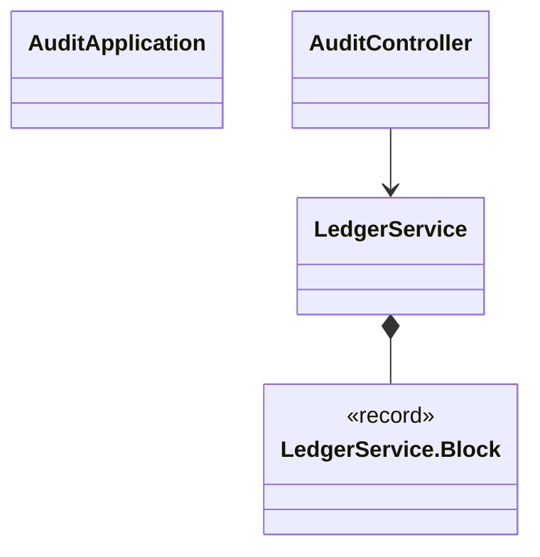
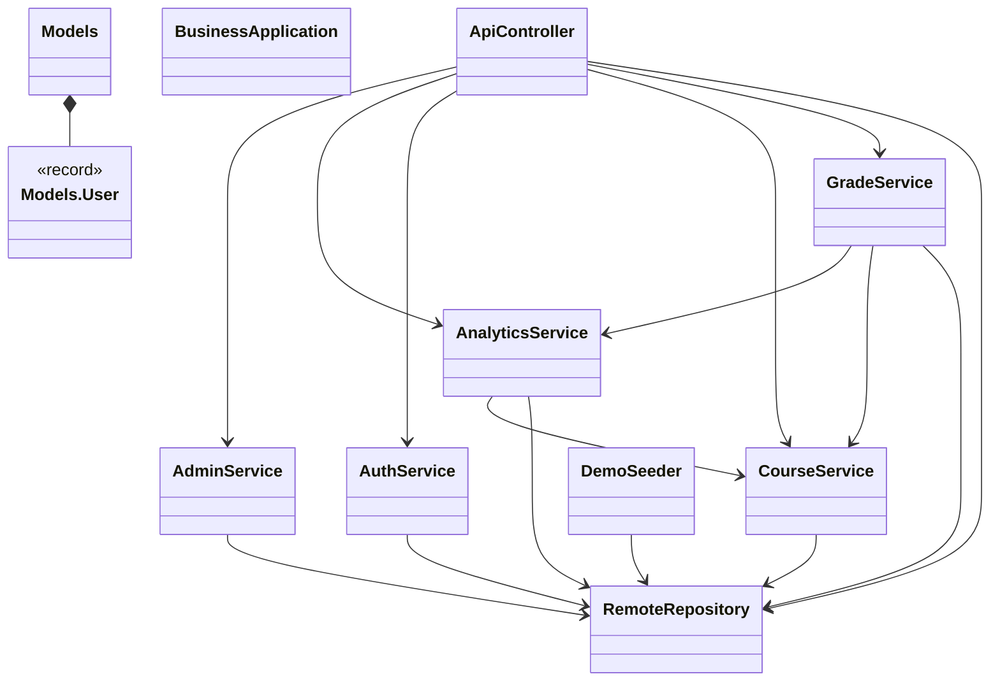
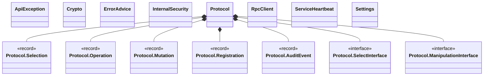
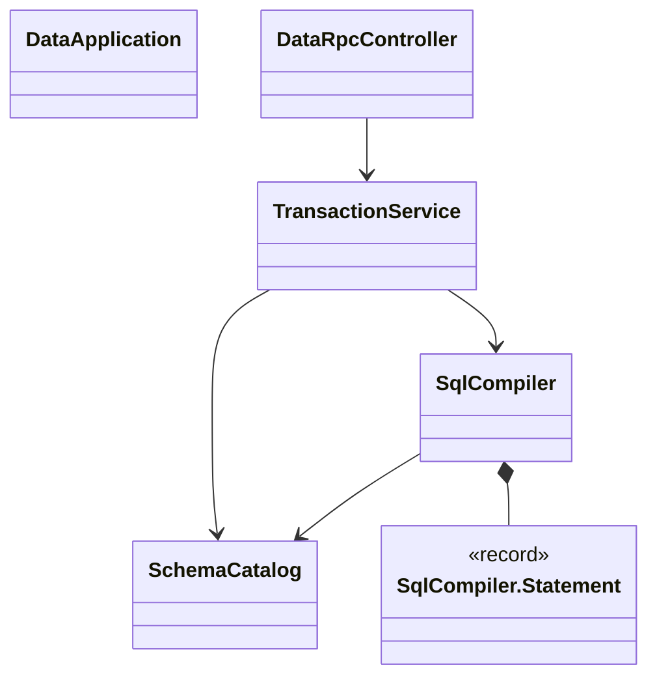
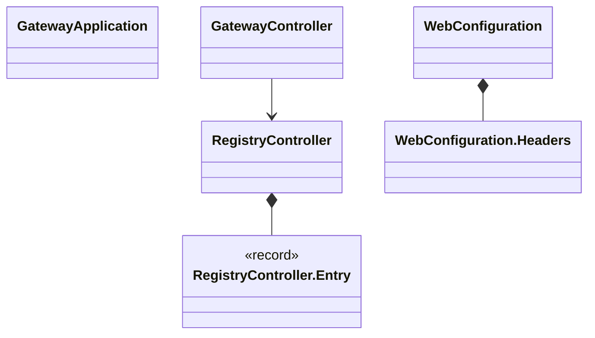

# 与源码对应的完整类型图

本文件由 JDK 语法树生成。每个节点对应一个真实命名类型；字段引用关系只表示代码依赖，不假造继承。完整方法签名见 classes.md。

## edu.campus.audit

## edu.campus.business

## edu.campus.common

## edu.campus.data

## edu.campus.gateway

