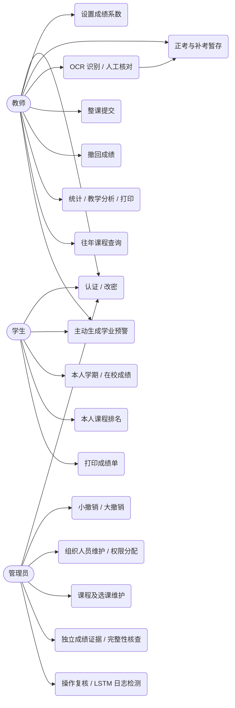
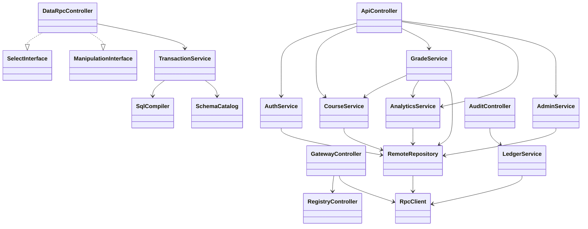
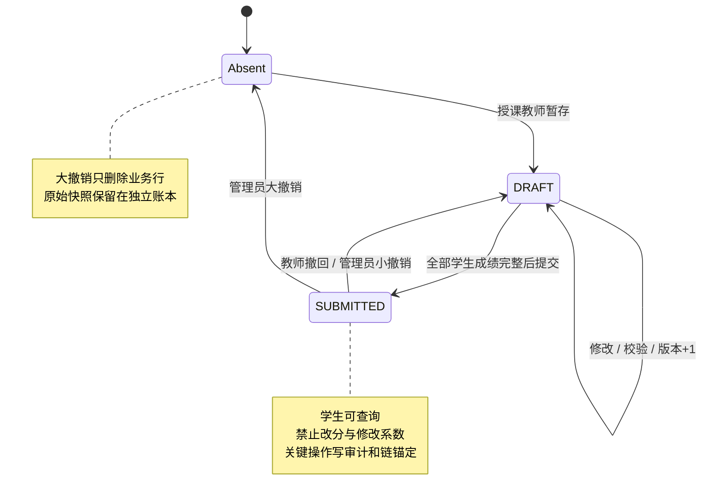
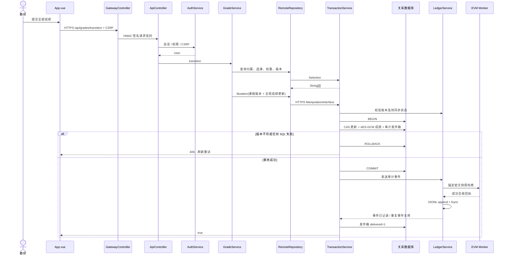
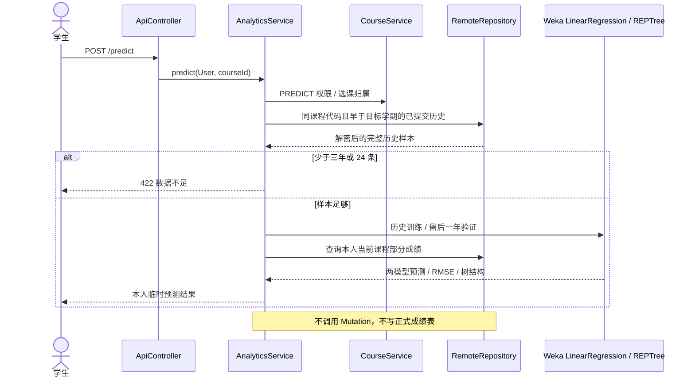
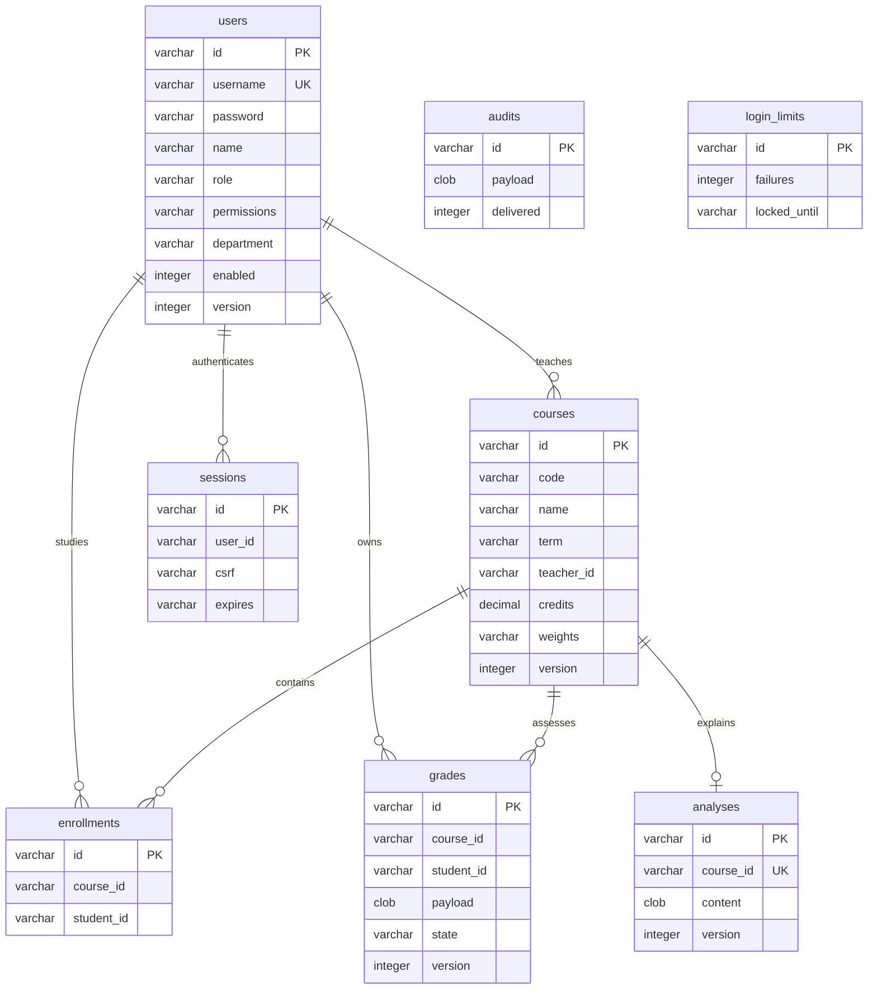
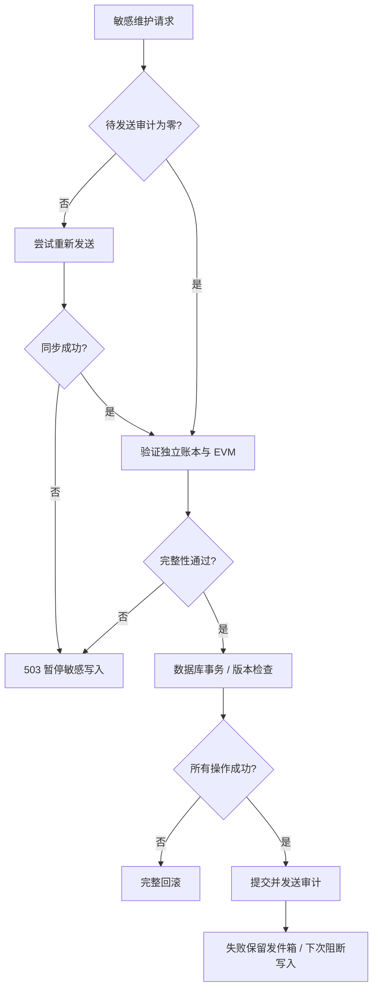

# 程序设计模型

## 模型与代码的一致性

完整类图在 [class-diagrams.md](class-diagrams.md)，由 JDK `JavacTask` 解析真实 Java 语法树产生；方法/字段清单在 [classes.md](classes.md)，JSON 清单在 `source-inventory.json`。执行 `node scripts/generate-docs.mjs --check` 可验证源码与文档是否一致。

本文件的 use case、状态、部署、时序图描述行为，不表示新增 Java 类。ER 图节点严格对应 `SchemaCatalog` 的八张实际数据表。代码采用远程值对象与 JDBC，并没有不存在的 `StudentEntity` 或 `GradeRepository` JPA 类。

## 用例模型

## 核心类协作图

图中 `SelectInterface`、`ManipulationInterface` 为 `Protocol` 的真实嵌套接口。它们使用 HTTP JSON Webservice 进行值传递，Java 业务对象不共享进程内存。

## 成绩状态图

`Absent` 是业务行不存在的概念状态，并非数据库枚举值；真实 `grades.state` 仅 DRAFT / SUBMITTED。

## 提交与审计时序

## 查询与预测时序

## 数据库 ER 图

关系线为业务引用，当前初始化 DDL 未声明 FOREIGN KEY。`enrollments(course_id,student_id)` 与 `grades(course_id,student_id)` 有组合唯一索引。`sessions.id` 保存会话令牌 SHA-256；`login_limits.id` 保存登录账号 SHA-256；`grades.payload`、`audits.payload` 为 AES-GCM 密文。`weights` 和成绩载荷为结构化 JSON，具体成绩项在 [API 文档](api.md) 中定义。

## 故障响应活动图

