# 程序设计模型

## 模型与代码的一致性

完整类图在 [class-diagrams.md](class-diagrams.md)，由 JDK `JavacTask` 解析真实 Java 语法树产生；方法/字段清单在 [classes.md](classes.md)，JSON 清单在 `source-inventory.json`。执行 `node scripts/generate-docs.mjs --check` 可验证源码与文档是否一致。

本文件的 use case、状态、部署、时序图描述行为，不表示新增 Java 类。ER 图节点严格对应 `SchemaCatalog` 的十三张实际数据表。代码采用远程值对象与 JDBC，并没有不存在的 `StudentEntity` 或 `GradeRepository` JPA 类。

## 用例模型

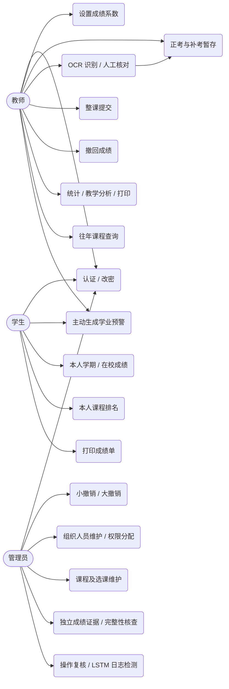
```mermaid
flowchart LR
  Teacher([教师]) --> Login(认证 / 改密)
  Student([学生]) --> Login
  Admin([管理员]) --> Login
  Teacher --> Weights(设置成绩系数)
  Teacher --> Entry(正考与补考暂存)
  Teacher --> OCR(OCR 识别 / 人工核对)
  OCR --> Entry
  Teacher --> Submit(整课提交)
  Teacher --> Withdraw(撤回成绩)
  Teacher --> Stats(统计 / 教学分析 / 打印)
  Teacher --> History(往年课程查询)
  Teacher --> Predict(主动生成学业预警)
  Student --> Predict
  Student --> Transcript(本人学期 / 在校成绩)
  Student --> Rank(本人课程排名)
  Student --> Print(打印成绩单)
  Admin --> Revoke(小撤销 / 大撤销)
  Admin --> Users(组织人员维护 / 权限分配)
  Admin --> Course(课程及选课维护)
  Admin --> Integrity(独立成绩证据 / 完整性核查)
  Admin --> Audit(操作复核 / LSTM 日志检测)
```

## 核心类协作图

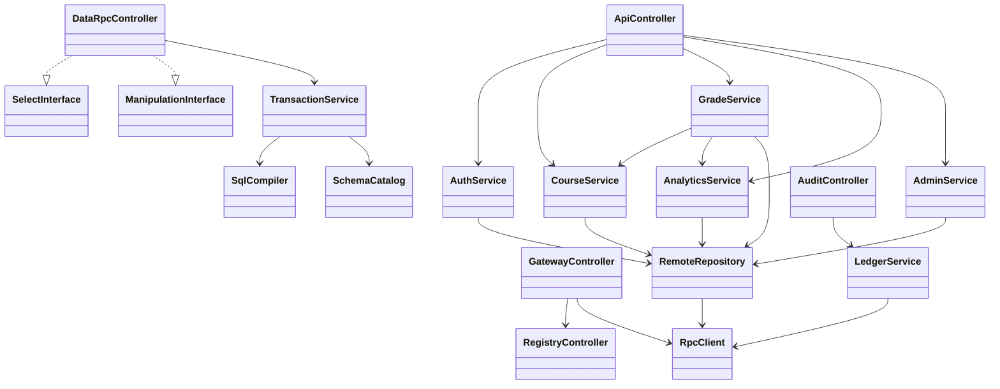
```mermaid
classDiagram
  GatewayController --> RegistryController
  GatewayController --> RpcClient
  ApiController --> AuthService
  ApiController --> CourseService
  ApiController --> GradeService
  ApiController --> AnalyticsService
  ApiController --> AdminService
  GradeService --> CourseService
  GradeService --> AnalyticsService
  GradeService --> RemoteRepository
  AuthService --> RemoteRepository
  CourseService --> RemoteRepository
  AnalyticsService --> RemoteRepository
  AdminService --> RemoteRepository
  RemoteRepository --> RpcClient
  DataRpcController ..|> SelectInterface
  DataRpcController ..|> ManipulationInterface
  DataRpcController --> TransactionService
  TransactionService --> SqlCompiler
  TransactionService --> SchemaCatalog
  AuditController --> LedgerService
  LedgerService --> RpcClient
```

图中 `SelectInterface`、`ManipulationInterface` 为 `Protocol` 的真实嵌套接口。它们使用 HTTP JSON Webservice 进行值传递，Java 业务对象不共享进程内存。

## 新增用例模型（组织管理与网上选课）

组织管理与选课的参与者仍是教师、学生与管理员，但管理员内部按权限细分：只有持 `ORG_ADMIN` 的账号看到组织管理页面，只有持 `SELECTION_ADMIN` 的账号看到「选课管理」页面（第二轮起，课程与选课、选课批次、选课记录合并为同一页面的三个标签页）；学生只要持 `SELECTION_ENROLL` 就能进入选课中心。第二轮的增量用例见下一节，这里保留第一轮的用例全貌。

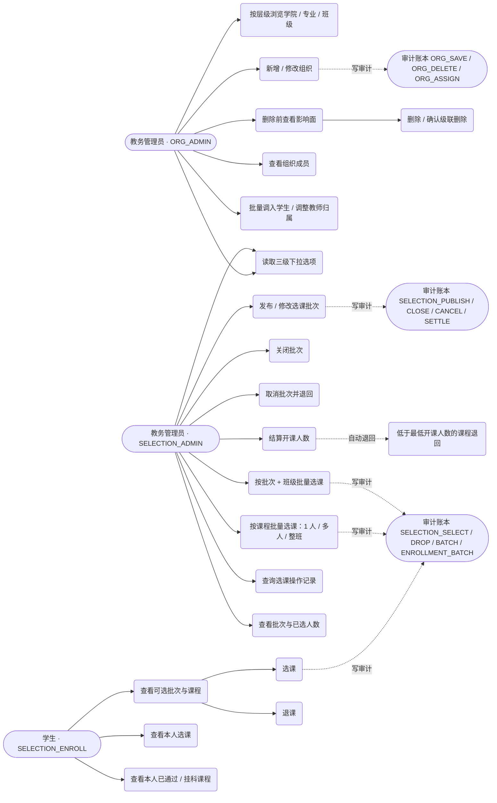
```mermaid
flowchart LR
  OrgAdmin([教务管理员 · ORG_ADMIN]) --> OrgList(按层级浏览学院 / 专业 / 班级)
  OrgAdmin --> OrgSave(新增 / 修改组织)
  OrgAdmin --> OrgImpact(删除前查看影响面)
  OrgImpact --> OrgDelete(删除 / 确认级联删除)
  OrgAdmin --> OrgMembers(查看组织成员)
  OrgAdmin --> OrgAssign(批量调入学生 / 调整教师归属)
  OrgAdmin --> OrgOptions(读取三级下拉选项)

  SelAdmin([教务管理员 · SELECTION_ADMIN]) --> Publish(发布 / 修改选课批次)
  SelAdmin --> PublishClose(关闭批次)
  SelAdmin --> PublishCancel(取消批次并退回)
  SelAdmin --> Settle(结算开课人数)
  SelAdmin --> Batch(按课程批量选课：1 人 / 多人 / 整班)
  SelAdmin --> BatchByPublish(按批次 + 班级批量选课)
  SelAdmin --> Records(查询选课操作记录)
  SelAdmin --> SelList(查看批次与已选人数)
  SelAdmin --> OrgOptions

  Student([学生 · SELECTION_ENROLL]) --> Available(查看可选批次与课程)
  Available --> Select(选课)
  Available --> Drop(退课)
  Student --> Mine(查看本人选课)
  Student --> Transcript2(查看本人已通过 / 挂科课程)

  OrgSave -.写审计.-> Audit2([审计账本 ORG_SAVE / ORG_DELETE / ORG_ASSIGN])
  Publish -.写审计.-> Audit3([审计账本 SELECTION_PUBLISH / CLOSE / CANCEL / SETTLE])
  Select -.写审计.-> Audit4([审计账本 SELECTION_SELECT / DROP / BATCH / ENROLLMENT_BATCH])
  Batch -.写审计.-> Audit4
  BatchByPublish -.写审计.-> Audit4
  Settle -.自动退回.-> Refund(低于最低开课人数的课程退回)
```

`ORG_ADMIN`、`SELECTION_ADMIN` 属于 `ADMIN` 角色；`SELECTION_ENROLL` 属于 `STUDENT` 角色（见 `Models.PERMISSIONS`）。教师不参与选课页面的读写，只通过 `/courses` 看到自己的教学班，通过 `/roster` 看到名单。

## 组织层级类协作图

组织域只有 `OrganizationService` 一个领域服务，其他服务复用它解析与渲染名称；选课域同样复用 `OrganizationService.inScope` 做范围判定。三个路由实现通过 `Routes.handles()` 把路径注册给 `ApiController`。

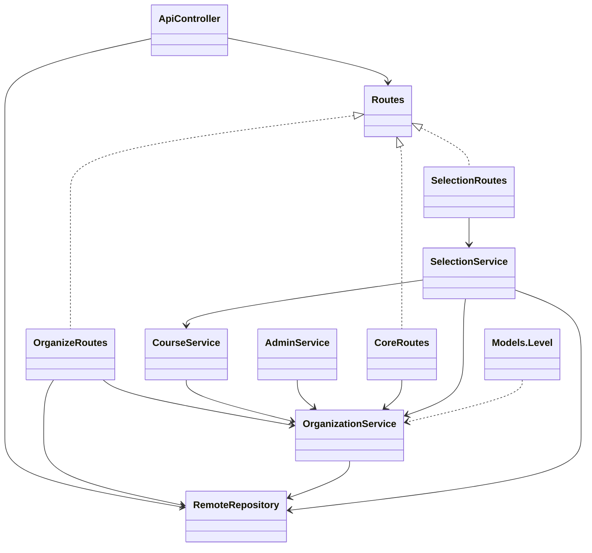
```mermaid
classDiagram
  ApiController --> Routes
  ApiController --> RemoteRepository
  Routes <|.. CoreRoutes
  Routes <|.. OrganizeRoutes
  Routes <|.. SelectionRoutes
  OrganizeRoutes --> OrganizationService
  OrganizeRoutes --> RemoteRepository
  OrganizationService --> RemoteRepository
  CourseService --> OrganizationService
  AdminService --> OrganizationService
  CoreRoutes --> OrganizationService
  SelectionRoutes --> SelectionService
  SelectionService --> RemoteRepository
  SelectionService --> OrganizationService
  SelectionService --> CourseService
  Models.Level ..> OrganizationService
```

`Models.Level` 是 `Models` 的嵌套枚举，承载三级的标签（`label`）、表名（`table`）、编号前缀（`prefix`）与深度（`depth`），并由 `parent()`/`parentField()`/`isRoot()` 描述层级关系；编号格式由 `Models.codePattern`/`validCode`/`levelOfCode` 统一定义，避免每处各写一遍正则。

## 选课状态图

选课有两套状态：`course_selections` 描述批次，`enrollments` 描述单个学生与教学班的关系。批次没有 `DRAFT`——`POST /selections/save` 保存后直接就是 `OPEN`（见 `Models.SELECTION_STATUS`）。

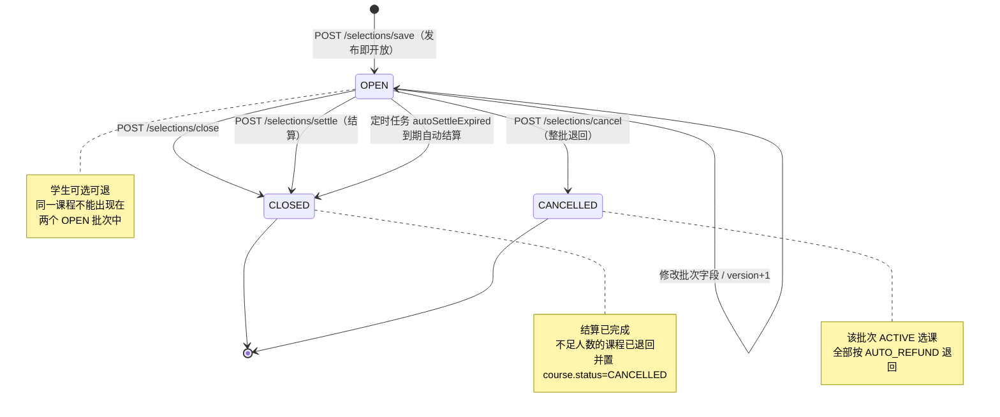
```mermaid
stateDiagram-v2
  [*] --> OPEN: POST /selections/save（发布即开放）
  OPEN --> OPEN: 修改批次字段 / version+1
  OPEN --> CLOSED: POST /selections/close
  OPEN --> CLOSED: POST /selections/settle（结算）
  OPEN --> CLOSED: 定时任务 autoSettleExpired 到期自动结算
  OPEN --> CANCELLED: POST /selections/cancel（整批退回）
  CLOSED --> [*]
  CANCELLED --> [*]
  note right of OPEN
    学生可选可退
    同一课程不能出现在
    两个 OPEN 批次中
  end note
  note right of CLOSED
    结算已完成
    不足人数的课程已退回
    并置 course.status=CANCELLED
  end note
  note right of CANCELLED
    该批次 ACTIVE 选课
    全部按 AUTO_REFUND 退回
  end note
```

`close`、`settle`、`autoSettleExpired` 都只允许从 `OPEN` 出发（`requireOpen` 否则 409「选课未开放」）；`cancel` 额外拒绝重复取消（409「选课已取消」）。因此不存在 `CLOSED → OPEN` 或 `CANCELLED → OPEN` 的恢复路径，重新开放需要新建批次。

学生与教学班的关系状态只有 `ACTIVE` 与 `DROPPED`（`Models.ENROLLMENT_STATUS`）：

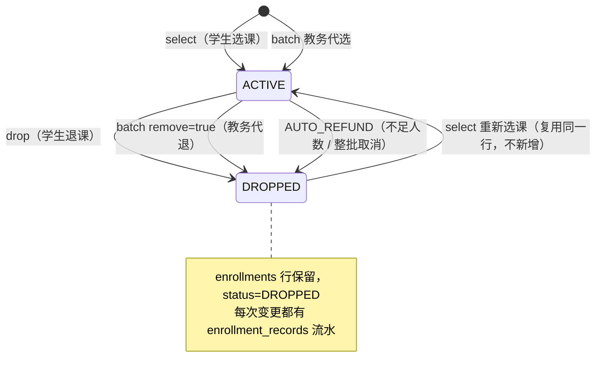
```mermaid
stateDiagram-v2
  [*] --> ACTIVE: select（学生选课）
  [*] --> ACTIVE: batch 教务代选
  ACTIVE --> DROPPED: drop（学生退课）
  ACTIVE --> DROPPED: batch remove=true（教务代退）
  ACTIVE --> DROPPED: AUTO_REFUND（不足人数 / 整批取消）
  DROPPED --> ACTIVE: select 重新选课（复用同一行，不新增）
  note right of DROPPED
    enrollments 行保留，
    status=DROPPED
    每次变更都有 enrollment_records 流水
  end note
```

`enrollments(course_id,student_id)` 是组合唯一索引，所以退课后重新选课走的是 `UPDATE`（复用既有行）而不是 `INSERT`——`SelectionService.select` 会用 `StudentState.enrollment(courseId)` 判断该行是否已存在。`course_selections.status` 与 `enrollments.status` 都用 `Set.of` 声明白名单，业务代码里全部用常量比较，不做字符串前缀判断。

## 选课与自动退回时序

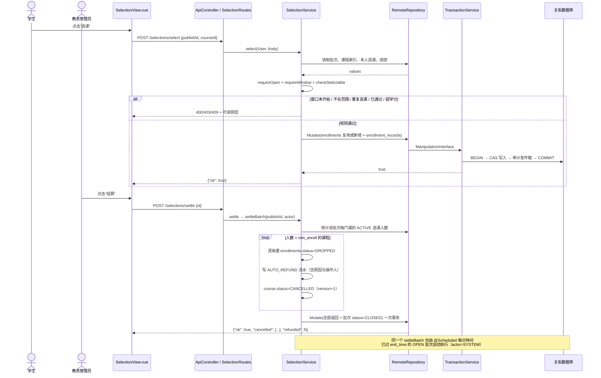
```mermaid
sequenceDiagram
  actor Student as 学生
  actor Admin as 教务管理员
  participant Vue as SelectionView.vue
  participant API as ApiController / SelectionRoutes
  participant Sel as SelectionService
  participant Repo as RemoteRepository
  participant Data as TransactionService
  participant DB as 关系数据库
  Student->>Vue: 点击“选课”
  Vue->>API: POST /selections/select {publishId, courseId}
  API->>Sel: select(User, body)
  Sel->>Repo: 读取批次、课程索引、本人选课、成绩
  Repo-->>Sel: values
  Sel->>Sel: requireOpen + requireWindow + checkSelectable
  alt 窗口未开始 / 不在范围 / 重复选课 / 已通过 / 超学分
    Sel-->>Vue: 400/403/409 + 可读原因
  else 规则通过
    Sel->>Repo: Mutate(enrollments 复用或新增 + enrollment_records)
    Repo->>Data: ManipulationInterface
    Data->>DB: BEGIN → CAS 写入 → 审计发件箱 → COMMIT
    Data-->>Sel: true
    Sel-->>Vue: {"ok": true}
  end
  Admin->>Vue: 点击“结算”
  Vue->>API: POST /selections/settle {id}
  API->>Sel: settle → settleBatch(publishId, actor)
  Sel->>Repo: 统计该批次每门课的 ACTIVE 选课人数
  loop 人数 < min_enroll 的课程
    Sel->>Sel: 逐条置 enrollments.status=DROPPED
    Sel->>Sel: 写 AUTO_REFUND 流水（含原因与操作人）
    Sel->>Sel: course.status=CANCELLED（version+1）
  end
  Sel->>Repo: Mutate(全部退回 + 批次 status=CLOSED) 一次事务
  Repo-->>Vue: {"ok": true, "cancelled": [...], "refunded": N}
  Note over Sel,DB: 同一个 settleBatch 也由 @Scheduled 每分钟对<br/>已过 end_time 的 OPEN 批次自动执行（actor=SYSTEM）
```

结算的判定顺序是「先算人数、再决定退回」：`buckets` 按批次 `course_ids` 建桶，只统计 `publish_id` 等于本批次且 `status=ACTIVE` 的选课记录；因此手工结算与定时结算的结果完全一致，不存在两套逻辑。退回时同步把课程 `status` 置为 `CANCELLED`，但**不删除**任何 `enrollments` 行，只是把状态改成 `DROPPED`——历史与唯一索引都不受影响。

## 第二轮 / 第三轮模型增量（组织编号、无辅导员、选课入口合并）

### 组织编号就是主键 id

组织对象只有一个编号：业务主键 `id`（`C`/`M`/`B` + 2 位号段 + 3 位本级序号，如 `C01001`、`M01001`、`B01001`）。它同时承担库内引用、审计 resource、接口寻址与页面展示，第三轮已删除第二轮的「显示编号 `code`」。编号由后端在新建时生成，之后只读：

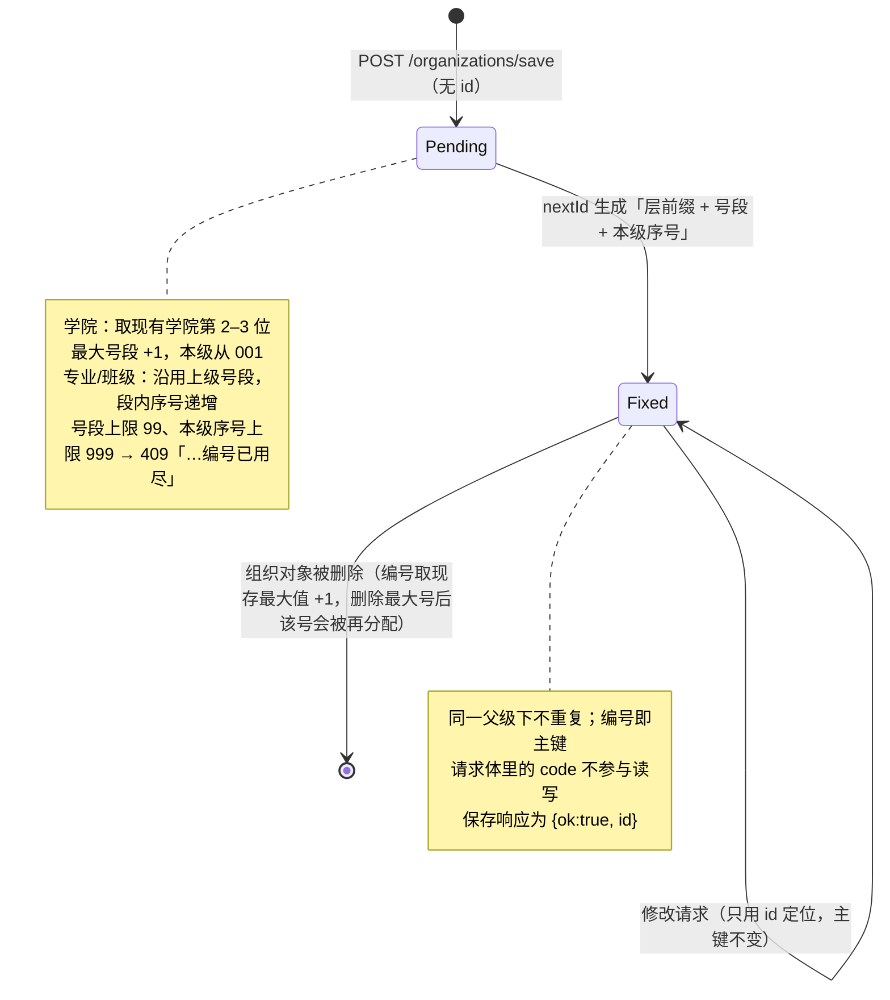
```mermaid
stateDiagram-v2
  [*] --> Pending: POST /organizations/save（无 id）
  Pending --> Fixed: nextId 生成「层前缀 + 号段 + 本级序号」
  Fixed --> Fixed: 修改请求（只用 id 定位，主键不变）
  Fixed --> [*]: 组织对象被删除（编号取现存最大值 +1，删除最大号后该号会被再分配）
  note right of Pending
    学院：取现有学院第 2–3 位最大号段 +1，本级从 001
    专业/班级：沿用上级号段，段内序号递增
    号段上限 99、本级序号上限 999 → 409「…编号已用尽」
  end note
  note right of Fixed
    同一父级下不重复；编号即主键
    请求体里的 code 不参与读写
    保存响应为 {ok:true, id}
  end note
```

|编号|生成方式|唯一性范围|可否修改|用途|
|---|---|---|---|---|
|`id`（主键，唯一编号）|`OrganizationService.nextId`：层前缀 + 2 位号段 + 3 位本级序号|同一父级下不重复（层前缀区分层级）|否，只在新建时生成|`colleges`/`majors`/`classes` 主键、`users`/`courses` 的组织引用、审计 resource、页面展示与人工沟通|

`resolveOwn` 按 `id` 与 `name` 解析组织。`OrganizeRoutes.list/options` 在返回前显式 `copy.remove("code")`：`colleges`/`majors`/`classes` 表里第二轮遗留的 `code` 列仍在表结构中（避免再触发一次整库重建），但接口不再读写它，`OrganizationService` 也不再提供 `nextCode`/`maxCode`/`codeOf`；`Models.MAX_CODE`/`parseCode`/`formatCode` 同样已无调用方。

### 班级模型去掉「辅导员」

`classes` 的列固定为 `id, major_id, college_id, name, grade_year, code, enabled, version`——`counselor` 已从结构、字段白名单（`RemoteRepository.FIELDS`）、保存逻辑与前端表单中一并移除，`SchemaCatalog.SCHEMA_VERSION` 因此升到 `3`。班级的 `college_id` 仍由 `major_id` 推导（`OrganizeRoutes.save` 里读取专业行的 `college_id`），三级归属只有一份真相；`/organizations` 的班级项在返回前显式 `copy.remove("counselor")`，即使旧库残留该字段也不会泄漏到前端。

管理员账号的组织字段是「合法的全空」：`AdminService.saveUser` 对 `ADMIN` 写空串，`CoreRoutes.me` 对空值返回 `null`，前端身份行据此只显示角色。

### 合并后的「选课管理」用例

管理员的选课相关能力合并为一个侧栏入口「选课管理」（`key = selection`），页内按标签切换；原先独立的「批量选课」界面移除，改为每门课程行上的「选课」按钮弹窗：

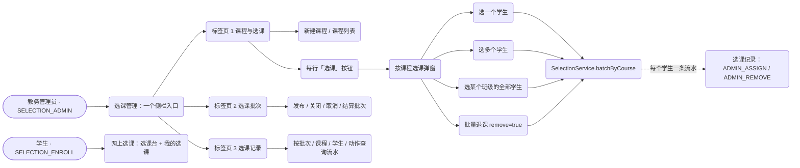
```mermaid
flowchart LR
  SelAdmin([教务管理员 · SELECTION_ADMIN]) --> Page(选课管理：一个侧栏入口)
  Page --> Tab1(标签页 1 课程与选课)
  Page --> Tab2(标签页 2 选课批次)
  Page --> Tab3(标签页 3 选课记录)
  Tab1 --> NewCourse(新建课程 / 课程列表)
  Tab1 --> EnrollBtn(每行「选课」按钮)
  EnrollBtn --> Dialog(按课程选课弹窗)
  Dialog --> One(选一个学生)
  Dialog --> Many(选多个学生)
  Dialog --> WholeClass(选某个班级的全部学生)
  Dialog --> RemoveAction(批量退课 remove=true)
  One --> BatchSvc(SelectionService.batchByCourse)
  Many --> BatchSvc
  WholeClass --> BatchSvc
  RemoveAction --> BatchSvc
  BatchSvc -. 每个学生一条流水 .-> Records(选课记录：ADMIN_ASSIGN / ADMIN_REMOVE)
  Tab2 --> Publish(发布 / 关闭 / 取消 / 结算批次)
  Tab3 --> Query(按批次 / 课程 / 学生 / 动作查询流水)
  Student([学生 · SELECTION_ENROLL]) --> StudentPage(网上选课：选课台 + 我的选课)
```

前端由 `App.vue` 的 `adminSelectionTabs`（`courses` / `publish` / `records`）与 `selectionTab` 控制标签切换；`SelectionView.vue` 同时服务两种视角——独立使用时渲染学生选课台（自带 `enroll` / `publish` / `records` 标签），被 `App.vue` 内嵌时通过 `view` 属性（`:view="selectionTab"`，并以 `:key` 强制重建）只渲染教务的批次或记录区块。课程列表与每行的「选课」按钮由 `App.vue` 渲染。同一份 `POST /selections/batch`（按批次 + 班级）接口保留，但不再是独立界面。

### 按课程批量选课时序

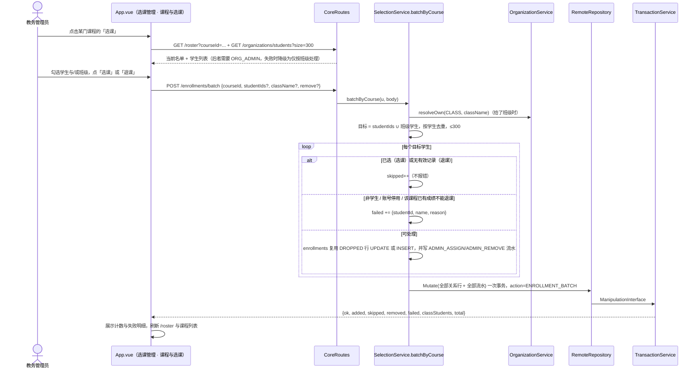
```mermaid
sequenceDiagram
  actor Admin as 教务管理员
  participant Vue as App.vue（选课管理 · 课程与选课）
  participant API as CoreRoutes
  participant Sel as SelectionService.batchByCourse
  participant Org as OrganizationService
  participant Repo as RemoteRepository
  participant Data as TransactionService
  Admin->>Vue: 点击某门课程的「选课」
  Vue->>API: GET /roster?courseId=... + GET /organizations/students?size=300
  API-->>Vue: 当前名单 + 学生列表（后者需要 ORG_ADMIN，失败时降级为仅按班级处理）
  Admin->>Vue: 勾选学生与/或班级，点「选课」或「退课」
  Vue->>API: POST /enrollments/batch {courseId, studentIds?, className?, remove?}
  API->>Sel: batchByCourse(u, body)
  Sel->>Org: resolveOwn(CLASS, className)（给了班级时）
  Sel->>Sel: 目标 = studentIds ∪ 班级学生，按学生去重，≤300
  loop 每个目标学生
    alt 已选（选课）或无有效记录（退课）
      Sel->>Sel: skipped++（不报错）
    else 非学生 / 账号停用 / 该课程已有成绩不能退课
      Sel->>Sel: failed += {studentId, name, reason}
    else 可处理
      Sel->>Sel: enrollments 复用 DROPPED 行 UPDATE 或 INSERT，并写 ADMIN_ASSIGN/ADMIN_REMOVE 流水
    end
  end
  Sel->>Repo: Mutate(全部关系行 + 全部流水) 一次事务，action=ENROLLMENT_BATCH
  Repo->>Data: ManipulationInterface
  Data-->>Vue: {ok, added, skipped, removed, failed, classStudents, total}
  Vue->>Vue: 展示计数与失败明细，刷新 /roster 与课程列表
```

与批次维度的 `POST /selections/batch` 相比，按课程批量选课**不要求批次处于 `OPEN`**，也不检查 `allow_add`/`allow_drop`：它的场景是教务在课程界面上直接维护名单。反复选课由 `enrollments(course_id,student_id)` 唯一索引 + 「已选则计入 `skipped`」共同兜底——已退课的行会被复用（`UPDATE` 回 `ACTIVE`）而不是插入第二行；单个学生不满足规则只进入 `failed`，不影响同批的其他人。`publishId` 未给出时由 `SelectionService.batchPublish` 按课程学期自动匹配包含该课程的 `OPEN`（其次 `CLOSED`）批次，两者都找不到就留空，流水仍照常写入。

## 重修状态模型（第四轮）

重修不是课程属性：同一课程号在**后续学年重新开设**的教学班与原来的教学班是**同一门课**（同一 `code`、不同 `term`，例如 `CS102`「程序设计基础」在 2023-1 与 2024-1 各有一个教学班，名称、学分与权重一致），被单独标记的只是「这名学生这次是在重修」这一状态。判定依据**只来自历史成绩**，`courses` 表上没有任何重修字段：

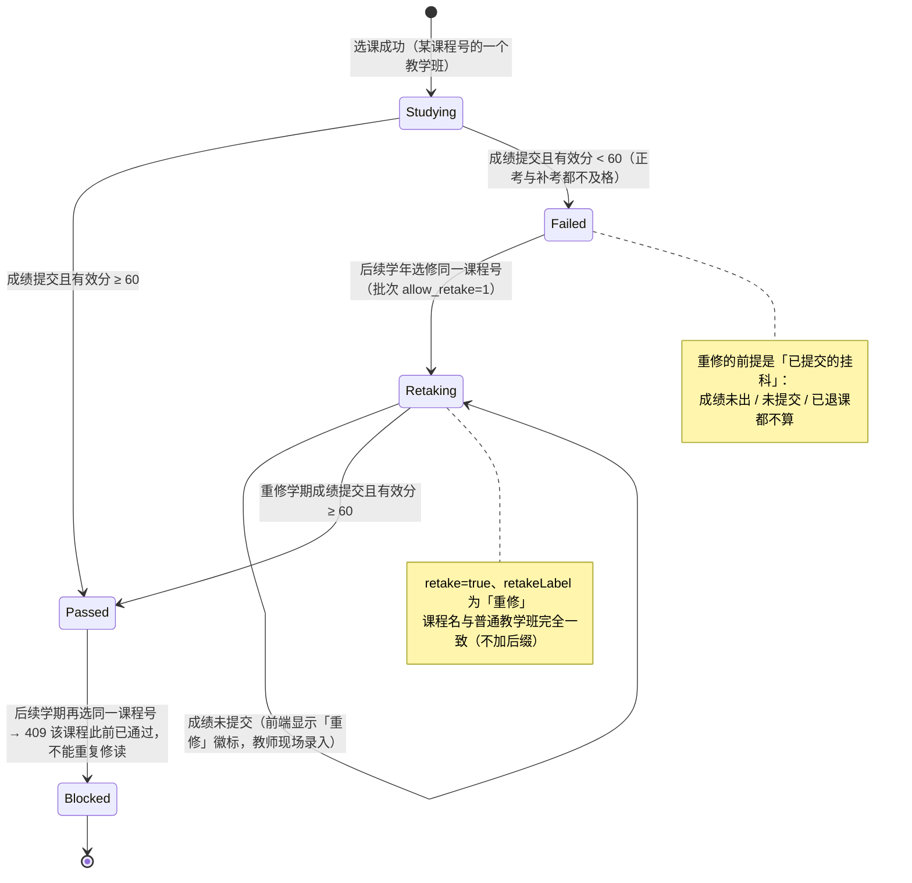
```mermaid
stateDiagram-v2
  [*] --> Studying: 选课成功（某课程号的一个教学班）
  Studying --> Passed: 成绩提交且有效分 ≥ 60
  Studying --> Failed: 成绩提交且有效分 < 60（正考与补考都不及格）
  Failed --> Retaking: 后续学年选修同一课程号（批次 allow_retake=1）
  Retaking --> Retaking: 成绩未提交（前端显示「重修」徽标，教师现场录入）
  Retaking --> Passed: 重修学期成绩提交且有效分 ≥ 60
  Passed --> Blocked: 后续学期再选同一课程号 → 409 该课程此前已通过，不能重复修读
  Blocked --> [*]
  note right of Retaking
    retake=true、retakeLabel 为「重修」
    课程名与普通教学班完全一致（不加后缀）
  end note
  note right of Failed
    重修的前提是「已提交的挂科」：
    成绩未出 / 未提交 / 已退课都不算
  end note
```

判定输入与结论（`SelectionService.FailedCodes.retakeIn` 与 `CourseService.failedCodesBefore` 使用同一口径）：

|历史情形|是否算重修|说明|
|---|---|---|
|更早学期、同一 `code`、成绩 `state=SUBMITTED`、有效分 < 60|**是**|本条记录 `retake=true`、`retakeLabel="重修"`|
|更早学期、同一 `code`、成绩 `SUBMITTED`、有效分 ≥ 60|不是|已通过；此后再选同 `code` 直接 409「该课程此前已通过，不能重复修读」|
|更早学期、同一 `code`、成绩未出或未提交|不是|正在修读，不能当成重修；首次修读必须保持「非重修」|
|本学期、同一 `code` 的另一个教学班|不是重修|属于 409「本学期已选择同一课程代码的其他教学班」；仅当此前挂科且批次 `allow_retake=1` 才放行|
|`enrollments.status = DROPPED` 的记录|不参与|退课不构成修读历史|

`FailedCodes` 按课程号只保留**最早**的挂科学期（`add(code, term)` 取更早者），`retakeIn(code, term)` 判断该挂科学期是否早于本条记录的学期，因此：

- 同一课程号连续多个学期重修只显示为「重修」，不会因为多次挂科而升级成别的状态；
- 判定与「本条记录来自哪个教学班」无关，只与 `code` 和学期先后有关；
- 批量场景（我的选课、选课台、批次课程列表、教师名单）一次读入成绩索引 `course_id|student_id` 复用，避免逐条查询。

三端下发的字段：

|端|接口|字段|
|---|---|---|
|学生|`GET /selections/my`|每条记录 `retake`(boolean)、`retakeLabel`（`"重修"` 或 `null`）|
|学生|`GET /selections/available`|每门可选课程 `retake`、`retakeLabel`|
|教师|`GET /roster?courseId=`|每条名单记录 `retake`、`retakeLabel`|
|教务|`GET /selections`|批次课程列表里每门课程 `retakeCount`(int)|

前端在「我的选课」、选课台课程行、教师成绩表学生单元格与按课程选课弹窗里用 `.badge.amber` 显示「重修」徽标；**课程名保持原样**，页面没有任何「课程名 + 重修」的拼接。

### 学业记录里的重修状态（第五轮）

学生端「我的成绩」的数据来自 `GET /transcript`，它只含 **已提交（`SUBMITTED`）** 的成绩，因此判定比选课侧更简单：同一个 `code` 在**更早学期**还有一条记录，本学期这条就是重修。

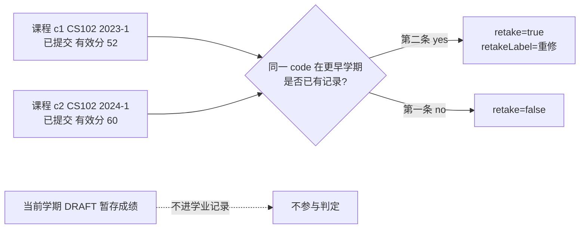
```mermaid
flowchart LR
  A[课程 c1 CS102 2023-1<br/>已提交 有效分 52] --> C{同一 code 在更早学期<br/>是否已有记录?}
  B[课程 c2 CS102 2024-1<br/>已提交 有效分 60] --> C
  C -->|第二条 yes| R[retake=true<br/>retakeLabel=重修]
  C -->|第一条 no| N[retake=false]
  D[当前学期 DRAFT 暂存成绩] -.不进学业记录.-> X[不参与判定]
```

|记录|学业记录里是否出现|`retake`|
|---|---|---|
|已提交成绩（`SUBMITTED`）|是|同 `code` 有更早学期记录时为 `true`|
|暂存成绩（`DRAFT`，只有平时/实验）|否|不参与（教师还没提交，学业记录看不到）|
|已退课|否|不参与|

判定依据的可靠性来自两处约束：选课规则禁止「已通过」后再次修读同一课程号，演示数据的 `verifyTranscriptIntegrity()` 又保证「跨学期同代码的前一次必是挂科」，所以同一代码出现第二次必然意味着第一次没通过。学业记录按**学期倒序**、同学期按课程代码排序返回，前端在课程名后加 `.badge.amber`「重修」徽标，课程名本身不变。

「我的成绩」的统计口径也按重修调整（前端 computed）：已获课程按 `code` 去重后统计已通过门数；已获学分按 `code` 去重、只取通过的那次（重修不重复计学分）；未通过课程统计的是**至今仍未通过**的课程代码数（已重修通过的不再算未通过）。

### 预测样本与预测对象（第五轮）

学业预警（`AnalyticsService.predict`）的输入、门槛与输出对象是三个不同的集合，容易混：

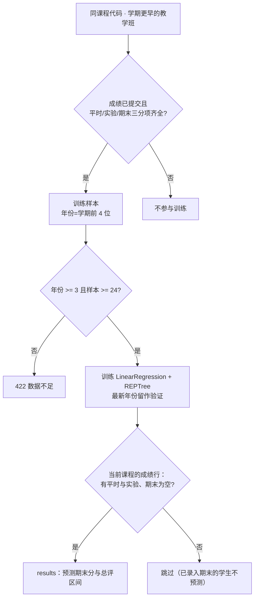
```mermaid
flowchart TD
  H[同课程代码 · 学期更早的教学班] --> S{成绩已提交且<br/>平时/实验/期末三分项齐全?}
  S -->|是| T[训练样本<br/>年份=学期前 4 位]
  S -->|否| SKIP[不参与训练]
  T --> G{年份 >= 3 且样本 >= 24?}
  G -->|否| E[422 数据不足]
  G -->|是| M[训练 LinearRegression + REPTree<br/>最新年份留作验证]
  M --> P{当前课程的成绩行：<br/>有平时与实验、期末为空?}
  P -->|是| R[results：预测期末分与总评区间]
  P -->|否| SKIP2[跳过（已录入期末的学生不预测）]
```

|集合|口径|
|---|---|
|训练样本|同一课程代码、**学期严格更早**、`state=SUBMITTED`、载荷同时含 `regular`/`lab`/`finalExam`；年份取学期前 4 位（同年两个学期算 1 年）|
|门槛|年份 ≥ 3 且样本 ≥ 24，否则 422「至少需要 3 年、24 条完整历史成绩，当前数据不足，未生成预测」；训练异常再转 422「历史数据无法支持模型训练」|
|预测对象|该课程**当前**成绩行中「已有平时与实验、期末未录入」的学生（期末已录入的不预测）；学生只看本人，教师看全课|
|输出|`results[]` 的 `studentId`/`linearExam`/`treeExam`/`predictedTotal`/`treeTotal`/`low`/`high`/`warning`/`risk`，区间为「总评 ± 1.96 × 留出年份 RMSE × 期末权重」的经验近似|

**空结果与「数据不足」是两码事**：如果某门课的成绩都已录入期末（例如学生对自己已经出分的历史课程调用），接口返回 200 而 `results` 为空——没有预测对象，不是错误；只有年份/样本不足才是 422。因此预测只对**进行中的课程**有意义，前端把这条语义写进了提示文案。

演示数据为学业预警准备了两层样本（`DemoInitializer`）：

|层|做法|为什么|
|---|---|---|
|历史样本教学班（`SAMPLE_LAYERS`/`SAMPLE_COURSES`，2020-1 至 2023-2 共 91 个）|**有完整名单与成绩**：每班 8 条 `ACTIVE` 选课 + 8 条三分项齐全的已提交成绩（共 728 条），任课教师是 4 个 `enabled=0` 不可登录的史料教师账号 `ht2020`/`ht2021`/`ht2022`/`ht2023`|施工时担心「样本班有选课就会自己需要 3 个更早年样本」而一度只登记成绩；但 2020-1/2021-1/2022-1/2023-2 已是最早期次、没有更早学期可查，顾虑不成立。样本班的成绩进入对应样本学生自己的学业记录|
|缓考样本池（`PARTIAL_POOL_CLASS = B01006`）|为每门**已提交成绩的正课**补 1 名「有平时与实验、缺期末」的学生（暂存 `DRAFT` 成绩）|让每门课都存在预测对象，打开学业预警就能看到预测行|

启动时 `DemoInitializer.verifyPredictionCoverage()` 对**每一门有 ACTIVE 选课的课程**校验「≥3 个更早年份 + ≥24 条三分项齐全的已提交成绩 + 本班至少 1 人缺期末」，不满足直接中止启动（当前启动日志：64 门有选课的正课全部可预测）。遍历时**显式排除历史样本教学班**（`SAMPLE_COURSE_IDS`）：它们是数据里最早的期次，没有更早年份可查，纳入校验必然失败——这是校验口径的边界，不是数据缺陷。暂存 `DRAFT` 成绩不参与重修判定、不进入学业记录、不算通过/挂科，仅作为预测输入（详见 [安全文档](security.md) 的成绩状态边界）。

## 成绩状态图

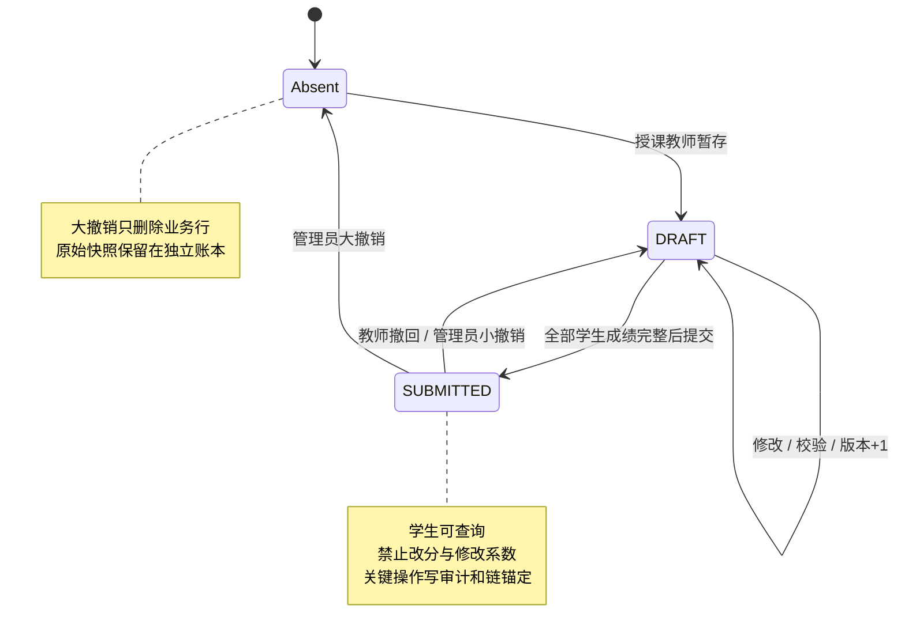
```mermaid
stateDiagram-v2
  [*] --> Absent
  Absent --> DRAFT: 授课教师暂存
  DRAFT --> DRAFT: 修改 / 校验 / 版本+1
  DRAFT --> SUBMITTED: 全部学生成绩完整后提交
  SUBMITTED --> DRAFT: 教师撤回 / 管理员小撤销
  SUBMITTED --> Absent: 管理员大撤销
  note right of SUBMITTED
    学生可查询
    禁止改分与修改系数
    关键操作写审计和链锚定
  end note
  note right of Absent
    大撤销只删除业务行
    原始快照保留在独立账本
  end note
```

`Absent` 是业务行不存在的概念状态，并非数据库枚举值；真实 `grades.state` 仅 DRAFT / SUBMITTED。

## 提交与审计时序

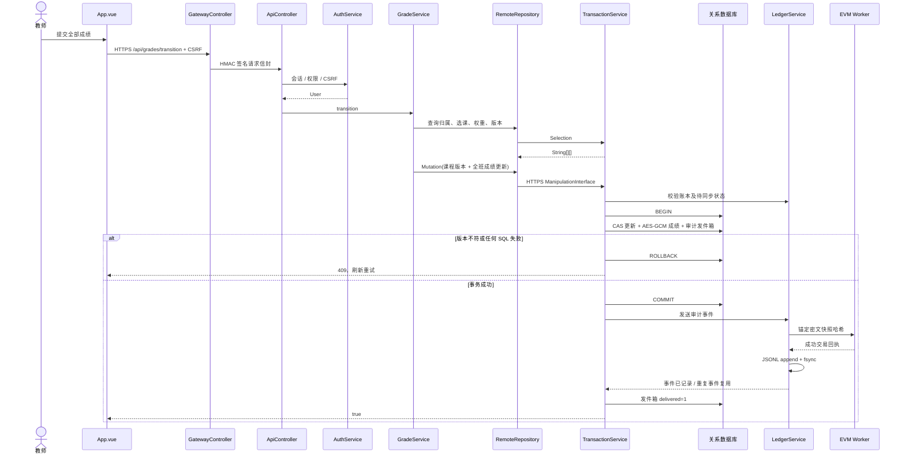
```mermaid
sequenceDiagram
  actor Teacher as 教师
  participant Vue as App.vue
  participant Gateway as GatewayController
  participant API as ApiController
  participant Auth as AuthService
  participant Grades as GradeService
  participant Repo as RemoteRepository
  participant Data as TransactionService
  participant DB as 关系数据库
  participant Ledger as LedgerService
  participant EVM as EVM Worker
  Teacher->>Vue: 提交全部成绩
  Vue->>Gateway: HTTPS /api/grades/transition + CSRF
  Gateway->>API: HMAC 签名请求信封
  API->>Auth: 会话 / 权限 / CSRF
  Auth-->>API: User
  API->>Grades: transition
  Grades->>Repo: 查询归属、选课、权重、版本
  Repo->>Data: Selection
  Data-->>Repo: String[][]
  Grades->>Repo: Mutation(课程版本 + 全班成绩更新)
  Repo->>Data: HTTPS ManipulationInterface
  Data->>Ledger: 校验账本及待同步状态
  Data->>DB: BEGIN
  Data->>DB: CAS 更新 + AES-GCM 成绩 + 审计发件箱
  alt 版本不符或任何 SQL 失败
    Data->>DB: ROLLBACK
    Data-->>Vue: 409，刷新重试
  else 事务成功
    Data->>DB: COMMIT
    Data->>Ledger: 发送审计事件
    Ledger->>EVM: 锚定密文快照哈希
    EVM-->>Ledger: 成功交易回执
    Ledger->>Ledger: JSONL append + fsync
    Ledger-->>Data: 事件已记录 / 重复事件复用
    Data->>DB: 发件箱 delivered=1
    Data-->>Vue: true
  end
```

## 查询与预测时序

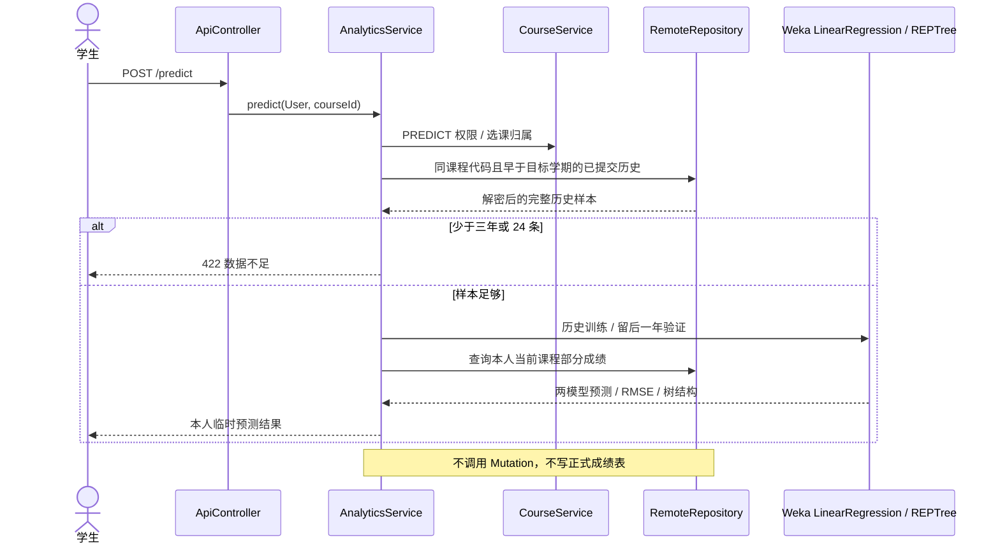
```mermaid
sequenceDiagram
  actor Student as 学生
  participant API as ApiController
  participant Model as AnalyticsService
  participant Course as CourseService
  participant Repo as RemoteRepository
  participant Weka as Weka LinearRegression / REPTree
  Student->>API: POST /predict
  API->>Model: predict(User, courseId)
  Model->>Course: PREDICT 权限 / 选课归属
  Model->>Repo: 同课程代码且早于目标学期的已提交历史
  Repo-->>Model: 解密后的完整历史样本
  alt 少于三年或 24 条
    Model-->>Student: 422 数据不足
  else 样本足够
    Model->>Weka: 历史训练 / 留后一年验证
    Model->>Repo: 查询本人当前课程部分成绩
    Weka-->>Model: 两模型预测 / RMSE / 树结构
    Model-->>Student: 本人临时预测结果
  end
  Note over Model,Repo: 不调用 Mutation，不写正式成绩表
```

## 数据库 ER 图

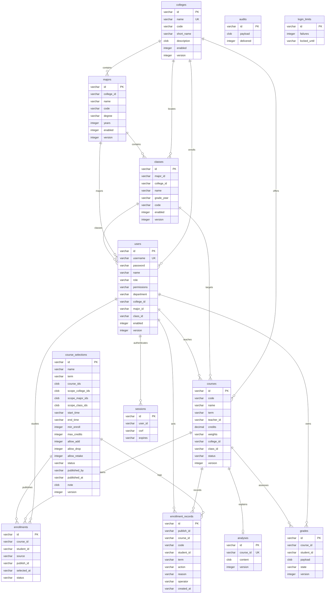
```mermaid
erDiagram
  colleges ||--o{ majors : contains
  colleges ||--o{ classes : locates
  majors ||--o{ classes : contains
  colleges ||--o{ users : enrolls
  majors ||--o{ users : majors
  classes ||--o{ users : classes
  colleges ||--o{ courses : offers
  classes ||--o{ courses : targets
  users ||--o{ courses : teaches
  users ||--o{ enrollments : studies
  courses ||--o{ enrollments : contains
  course_selections ||--o{ enrollments : publishes
  course_selections ||--o{ enrollment_records : logs
  courses ||--o{ enrollment_records : records
  users ||--o{ enrollment_records : acts
  users ||--o{ grades : owns
  courses ||--o{ grades : assesses
  courses ||--o| analyses : explains
  users ||--o{ sessions : authenticates
  users {
    varchar id PK
    varchar username UK
    varchar password
    varchar name
    varchar role
    varchar permissions
    varchar department
    varchar college_id
    varchar major_id
    varchar class_id
    integer enabled
    integer version
  }
  colleges {
    varchar id PK
    varchar name UK
    varchar code
    varchar short_name
    clob description
    integer enabled
    integer version
  }
  majors {
    varchar id PK
    varchar college_id
    varchar name
    varchar code
    varchar degree
    integer years
    integer enabled
    integer version
  }
  classes {
    varchar id PK
    varchar major_id
    varchar college_id
    varchar name
    varchar grade_year
    varchar code
    integer enabled
    integer version
  }
  courses {
    varchar id PK
    varchar code
    varchar name
    varchar term
    varchar teacher_id
    decimal credits
    varchar weights
    varchar college_id
    varchar class_id
    varchar status
    integer version
  }
  course_selections {
    varchar id PK
    varchar name
    varchar term
    clob course_ids
    clob scope_college_ids
    clob scope_major_ids
    clob scope_class_ids
    varchar start_time
    varchar end_time
    integer min_enroll
    integer max_credits
    integer allow_add
    integer allow_drop
    integer allow_retake
    varchar status
    varchar published_by
    varchar published_at
    clob note
    integer version
  }
  enrollments {
    varchar id PK
    varchar course_id
    varchar student_id
    varchar source
    varchar publish_id
    varchar selected_at
    varchar status
  }
  enrollment_records {
    varchar id PK
    varchar publish_id
    varchar course_id
    varchar code
    varchar student_id
    varchar term
    varchar action
    varchar reason
    varchar operator
    varchar created_at
  }
  grades {
    varchar id PK
    varchar course_id
    varchar student_id
    clob payload
    varchar state
    integer version
  }
  analyses {
    varchar id PK
    varchar course_id UK
    clob content
    integer version
  }
  sessions {
    varchar id PK
    varchar user_id
    varchar csrf
    varchar expires
  }
  audits {
    varchar id PK
    clob payload
    integer delivered
  }
  login_limits {
    varchar id PK
    integer failures
    varchar locked_until
  }
```

关系线为业务引用，当前初始化 DDL 未声明 FOREIGN KEY。`users(college_id)`、`users(major_id)`、`users(class_id)`、`courses(college_id)`、`courses(term)`、`enrollments(publish_id,student_id)` 建有普通索引；`colleges(name)`、`majors(college_id,name)`、`classes(major_id,name)` 为唯一索引，因此同一层内不允许同名组织。`enrollments(course_id,student_id)` 与 `grades(course_id,student_id)` 有组合唯一索引。`sessions.id` 保存会话令牌 SHA-256；`login_limits.id` 保存登录账号 SHA-256；`grades.payload`、`audits.payload` 为 AES-GCM 密文。`weights`、成绩载荷以及 `course_selections` 的 `course_ids`/`scope_*_ids` 为结构化文本：`SchemaCatalog.sqlType` 把 `_ids` 结尾的列、`note`、`description` 建成大文本类型（H2 `CLOB`、MySQL `TEXT`、SQL Server `NVARCHAR(MAX)`）。具体成绩项在 [API 文档](api.md) 中定义。

第二轮与第三轮对该 ER 图有两处修正：`classes` 去掉了 `counselor` 列（结构版本 3）；`colleges`/`majors`/`classes` 三张表的 `code` 列是**遗留列**——第二轮的「两位显示编号」在第三轮被取消，表结构里保留该列（避免再触发一次整库重建），但组织接口与 `OrganizationService` 都不再读写它，组织编号统一用主键 `id`（数据库唯一索引仍只在 `name` 上）。

选课域三张表的引用语义：`course_selections.course_ids` 是逗号分隔的课程主键集合，`scope_college_ids`/`scope_major_ids`/`scope_class_ids` 是逗号分隔的组织编号集合，空集合表示「不限」；`enrollments` 用 `(course_id,student_id)` 唯一索引保证同一学生不会重复选同一教学班，`status` 只有 `ACTIVE`/`DROPPED`；`enrollment_records` 只增不改，`action` 取值见 `Models.ENROLLMENT_ACTIONS`。`classes` 同时保存 `major_id` 与 `college_id`，学院取自专业，避免出现「班级归属的学院与专业归属的学院不一致」的第二种真相。

## 故障响应活动图

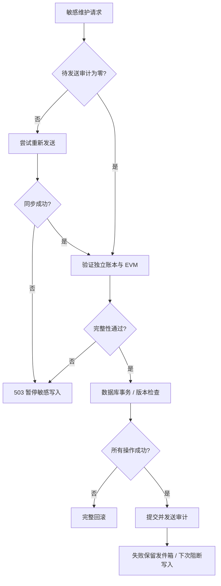
```mermaid
flowchart TD
  A[敏感维护请求] --> B{待发送审计为零?}
  B -->|否| C[尝试重新发送]
  C --> D{同步成功?}
  D -->|否| E[503 暂停敏感写入]
  D -->|是| F[验证独立账本与 EVM]
  B -->|是| F
  F --> G{完整性通过?}
  G -->|否| E
  G -->|是| H[数据库事务 / 版本检查]
  H --> I{所有操作成功?}
  I -->|否| J[完整回滚]
  I -->|是| K[提交并发送审计]
  K --> L[失败保留发件箱 / 下次阻断写入]
```
