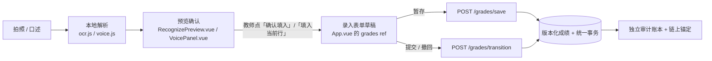
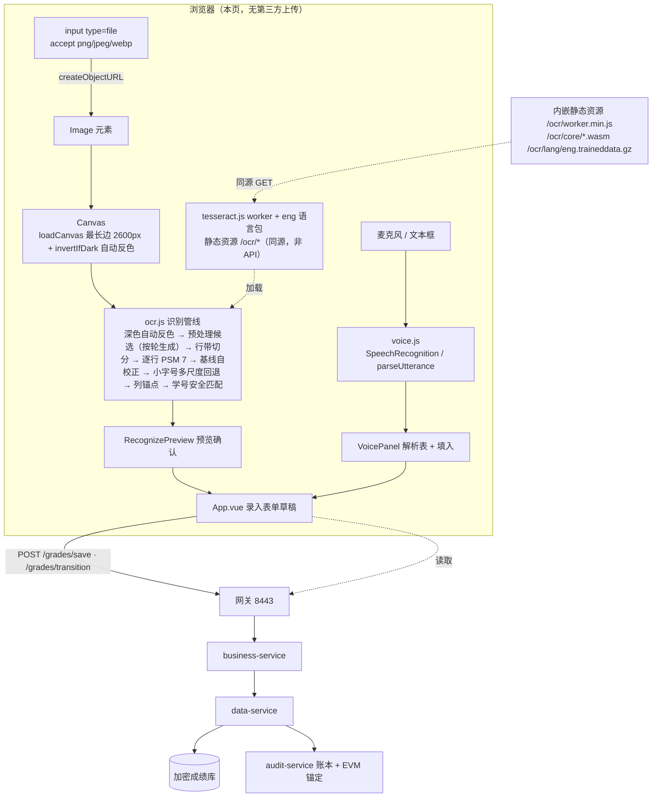

# 成绩录入辅助（图片识别 / 语音录入）设计

> 模块：`frontend/src/ocr.js`、`frontend/src/voice.js`、`frontend/src/components/RecognizePreview.vue`、`frontend/src/components/VoicePanel.vue`
> 证据：`.runtime/logs/ocr-voice-unit.json`（单元）、`.runtime/logs/ocr-voice-check.json`（浏览器端到端）、`test-results/ocr/manifest.json`（固定图集）
> 本文中的函数名、参数与数字都以当前 `frontend/src/ocr.js`、`frontend/src/App.vue` 与上述 JSON 证据为准（关键处标注行号或 JSON 字段名）。

## 一、功能概要

|功能|解决的问题|界面入口|代码入口|
|---|---|---|---|
|成绩单图片识别（本地 OCR）|纸质成绩单上「学号 + 多列分数」需要手工逐个敲进表格，一节 40 人的课就是 200 余次键击|成绩表工具栏「识别成绩单」按钮（`data-testid="ocr-open"`）|`ocr.js` 的 `recognizeBest` → `buildPreview` → `mapColumns`|
|语音录入|教师盯着一行分数口述比逐格点选更快，且可以在走动中录入；录入对象可用「录入对象」下拉框或上一行/下一行按钮切换，不必回到表格点行|工具栏「语音录入」按钮（`data-testid="voice-open"`）与成绩表每行状态列的麦克风按钮（`data-testid="voice-<学号>"`）|`voice.js` 的 `parseUtterance` / `createVoiceSession` → `VoicePanel.vue`|

两条路径的产物都是同一种东西：**针对某一行学生的若干「成绩项 → 数值」**。它们都不直接落库，而是先写入 `App.vue` 的录入表单草稿，再走既有的暂存 / 提交 / 审计链路：



流程要点：

1. **识别只是「填表建议」**，与手工敲键写入同一份 `scores` 草稿，因此不存在第二套写入路径；
2. **必须人工确认**：识别结果先进入预览，教师逐格可改、整行可跳过，点确认才写进表单（浏览器断言「识别后表单尚未变化（需人工确认）」实测 `69 → 69`）；
3. **确认之后仍需暂存**，暂存走 `POST /grades/save`、提交走 `POST /grades/transition`，与手工录入完全一致，因此审计、版本冲突、补考规则都不需要改动。

## 二、总体架构



|边界|本设计中的事实|
|---|---|
|后端接口|**不新增任何接口**。识别与语音都是纯前端能力，结果最终仍走既有的 `POST /grades/save` 与 `POST /grades/transition`（见 [api.md](api.md) 的「成绩录入辅助（前端本地能力）」）|
|上行数据|图片只经 `URL.createObjectURL(file)` 在本页读取，用完在 `finally` 里 `URL.revokeObjectURL(url)`；整轮识别**没有任何图片上行请求**（浏览器断言「整轮识别没有任何图片上行请求」，通过条件为捕获到的「POST 且请求体含 PNG 字节」请求数为 0）|
|模型与 WASM|从本站 `/ocr/worker.min.js`、`/ocr/core`、`/ocr/lang` 加载（`recognizeVariants` 里的 `createWorker` 选项），随源码放在 `frontend/public/ocr/`，不走网关|
|语音音频|由浏览器厂商的 `SpeechRecognition` 处理，音频可能上行到厂商服务。界面要求教师点击「开始识别」逐次确认（不会自动开麦）；面板里那条固定隐私提示**已按用户要求删除**，因此这条事实只在本文第七节里说明，界面上不再有文案提示（图片侧的隐私威胁见 [security.md](security.md) 的威胁表）|

## 三、数据结构

### 3.1 `RecognizedRow`（`mapColumns` 的返回值，`App.vue` 里叫预览行）

|字段|类型|来源与含义|
|---|---|---|
|`type`|`"row"`|固定值，便于未来混入其它类型的预览项|
|`text`|`string`|该行带的整行 OCR 文本（`normalize` 后的结果）|
|`confidence`|`number`|行置信度，保留 1 位小数；来自 `lineConfidence`（按词宽度加权的平均词置信度）|
|`username`|`string`|匹配到的名册学号；未匹配为 `""`|
|`name`|`string`|匹配到的学生姓名；未匹配为 `""`（**中文姓名不作为匹配依据**，只用于展示）|
|`studentId`|`string`|名册中的学生主键 `id`|
|`matched`|`boolean`|是否在名册里找到了该学号（`Boolean(student)`）|
|`corrected`|`boolean`|学号是否经过混淆纠正或模糊匹配（`match.corrected`）|
|`cells`|`cell[]`|按 `components` 顺序排列的单元格，长度等于参与录入的成绩项数|
|`issues`|`string[]`|去重后的问题说明，见 3.3|

### 3.2 `cell`

|字段|类型|含义|
|---|---|---|
|`key`|`string`|成绩项键（`regular`/`attendance`/`homework`/`lab`/`midterm`/`finalExam`）|
|`label`|`string`|成绩项中文名（`平时`/`考勤`/`作业`/`实验`/`期中`/`期末`）|
|`column`|`number \| null`|该成绩项映射到的检测列下标；`null` 表示「不导入」|
|`value`|`number \| null`|最终写入表单的数值；超界（<0 或 >100）置 `null`|
|`raw`|`string`|该列 token 的原始文本，便于人工核对「识别成了什么」|
|`confidence`|`number`|该 token 的词置信度；没有 token 时为 `0`|
|`needsCheck`|`boolean`|`token 存在 && confidence < minConfidence`（默认 `minConfidence = 85`），界面上高亮为待核对|

### 3.3 `issues` 的全部取值（`mapColumns` 中产生）

|文案|触发条件|
|---|---|
|`未匹配到名册中的学号`|整行所有学号候选都让 `correctId` 返回 `null`（名册里没有任何候选命中）|
|`学号与名册有差异但无法确认，请人工核对`|`match.unverified === true`：有最接近的候选，但差异**无法被 `CONFUSION` 表解释**（如 `9→0`、`5→4`），且未开启 `allowDigitCorrection`（或差异不止一位数字）。**不写入任何学生**。注：`App.vue` 恒传 `ALLOW_DIGIT_CORRECTION = true`，所以在界面上这条实际只在"差异不止一位数字"时出现|
|`学号有多个相近候选，请人工确认`|`match.ambiguous === true`：最优候选与其它候选在"编辑距离 + 混淆解释力"上完全并列；此时会取第一个候选写入 `username`，由教师核对|
|`学号经自动纠正，请核对`|`match.corrected === true`：经混淆纠正或模糊匹配（含 `allowDigitCorrection` 放行的一位数字差异）得到|
|`` `${label} 分数超出 0–100` ``|该列识别出的数值 < 0 或 > 100（该格置空）|
|`未识别到分数`|该行 `value !== null` 的格子数为 0|
|`` `缺少 N 项分数` ``|`0 < 有效格子数 < components.length`，`N` 为差值|

三个学号类文案的判定顺序是 `unverified` → `ambiguous` → `corrected`（`frontend/src/ocr.js:1240-1243`）：一条行只会命中其中最先成立的那一条；`unverified` 与 `ambiguous` 的具体语义、以及它们如何影响"是否写入学生"见 4.9.2。

### 3.4 `preview`（`buildPreview` 的返回值）

|字段|类型|含义|
|---|---|---|
|`columns`|`number[]`|检测到的分值列锚点（数值 token 的**右边缘**中位数，见 `inferAnchors`）|
|`tokens`|`(token\|null)[][]`|每行每列的 token（由 `assignColumns` 得到），`App.vue` 原样保存进 `ocrPreview`|
|`rows`|`Array`|筛掉「没有任何分数形态 token」的行之后的候选行带|
|`previewRows`|`RecognizedRow[]`|即 3.1，`App.vue` 的 `ocrRows` computed 会再按当前列映射重算一遍|
|`summary`|`object`|`summarize` 的汇总，见 3.5|

### 3.5 `summary`（`summarize`）

|字段|含义|
|---|---|
|`rows`|预览行数|
|`usable`|可填入行数（`isRowUsable`：已匹配名册 **且** 至少一个格子有值）|
|`skipped`|`rows - usable`|
|`cells`|`rows × components.length`（总格子数）|
|`filled`|`value !== null` 的格子数|
|`suspicious`|`needsCheck` 为真的格子数|
|`columns`|参与录入的成绩项数|
|`coverage`|`cells / rows / max(1, components.length)`|

### 3.6 `App.vue` 侧的中间状态

|变量|内容|
|---|---|
|`ocrPreview`|`{ rows, tokens, variant, skew }`；`rows`/`tokens` 来自 `buildPreview`，`variant` 是最优候选 id（如 `gray` / `gray-raw`），`skew` 是**最终使用**的倾斜角（自校正后即为实测角，不是投影法原始估计 `coarseSkew`）|
|`ocrSheets`|检测到的列下标数组（`preview.columns.map((_, i) => i)`），供列映射下拉的「第 N 列」选项使用|
|`ocrColumnMap`|`defaultColumnMap(列数, 成绩项数)` 的结果；预览里改下拉时由 `@update:column-map` 写回|
|`ocrRows`|按当前 `ocrColumnMap` 重算的 `mapColumns` 结果，即预览表真正渲染的数据|
|`ocrStage` / `ocrProgress`|识别阶段与进度百分比，驱动进度条与中文文案（`OCR_STAGES`）|

## 四、识别管线（图片）

### 4.0 管线总览

```
loadCanvas(最长边 ≤ 2600px) → invertIfDark(平均灰度 < 110 且暗像素占比 > 55% 时整幅反色，见 4.1.1)
  → estimateSkew(缩略图 + 13 个候选角度的归一化投影平方和)  得粗估计 coarseSkew
  → buildVariants( 先按 options.scale 放大 → |skew| > 0.25 时按 -skew 双线性插值回转校正 → 按轮生成候选 )
      每轮 4 个候选：gray / otsu / adaptive（真自适应均值阈值）/ gray-up2（管线内再放大 2 倍）
      外加 1 个条件候选：gray-raw（未纠偏的原始图，仅当真的做了校正时追加，且 rawFirst 时排在最前）
  → 每个候选：toGray → stretch → (otsu | adaptiveThreshold)
  → segmentBands(水平投影，4 个阈值比例各切一次后按行数规模打分选最优)
  → 每个行带：cropBand → worker.recognize(PSM 7) → flattenWords + flattenLines → lineConfidence
  → variantQuality 决定是否提前换下一个候选（quality ≥ 55）
  → rankPasses 排序（usable 行数 → 已填格子数 → 均值置信度），取最优变体
  → estimateTiltFromRows(优先 baseline 斜率) 与当前角度比对，差 > 0.4° 就清空重跑一轮
  → 仍不完整时按 scaleSteps = [2, 3, 1.5] 放大重跑（小字号截图，见 4.1.2），一旦完整即停
  → 仍不完整时依次试 offset +1 / -1 / +2 / -2，一旦完整即停
  → detectColumns → inferAnchors → assignColumns → mapColumns → buildPreview
```

> `buildVariants` 每轮产出的实际候选数：未做纠偏时是 4 个（`gray` / `otsu` / `adaptive` / `gray-up2`）；做了纠偏时追加 `gray-raw` 共 5 个。`recognizeBest` 每轮只取前 `maxVariants`（默认 4）个——`rawFirst` 的轮次里被截掉的是末尾的 `gray-up2`。

### 4.1 变体：导出的 `VARIANTS` 常量与「按轮生成」的实际候选

`VARIANTS` 仍然导出，共 11 个固定条目（`frontend/src/ocr.js:48`），每个是「二值化方式 + 旋转角 + 放大倍数」的组合：

|id|标签|二值化|旋转|放大|针对场景|
|---|---|---|---|---|---|
|`gray`|灰度 + 对比度拉伸|Otsu|0°|1×|默认首选；打印件、曝光正常的拍照件|
|`otsu`|Otsu 二值化|Otsu|0°|1×|文字与背景灰度差明显但对比度被压缩的图|
|`adaptive`|自适应阈值（抗阴影）|自适应均值|0°|1×|**单侧阴影**（左暗右亮）——全局 Otsu 会把暗侧整片判成文字，行带切分随之失效|
|`gray-up2`|灰度 + 2 倍放大|Otsu|0°|2×|小字号 / 低分辨率图，放大后笔画更连续|
|`adaptive-up2`|自适应阈值 + 2 倍放大|自适应均值|0°|2×|既小字号又有阴影|
|`gray-rot+1` / `gray-rot-1`|灰度 ± 1°|Otsu|±1°|1×|倾斜估计偏 1° 以内时的细调|
|`gray-rot+2` / `gray-rot-2`|灰度 ± 2°|Otsu|±2°|1×|倾斜估计偏差较大时的细调|
|`otsu-rot+1` / `otsu-rot-1`|Otsu ± 1°|Otsu|±1°|1×|低对比 + 轻微倾斜的组合|

**但 `buildVariants(canvas, skew, offsets, options)` 不再逐个消费这 11 项**：它按「轮」生成候选，每轮产出下面这几项（`frontend/src/ocr.js:743-783`，四个 `push` 的顺序在 `770-779`）：

|候选 id|取自|二值化|几何变换|界面标签|
|---|---|---|---|---|
|`gray`|`VARIANTS[0]`|Otsu|先按 `options.scale` 放大 → `\|skew\| > 0.25` 时按 `-skew` 回转 → 叠加本轮 `offset`|灰度 + 对比度拉伸|
|`otsu`|`VARIANTS[1]`|Otsu|同上|Otsu 二值化|
|`adaptive`|就地新建 `{id:"adaptive", label:"自适应阈值（抗阴影）", binarize:"adaptive", scale:1}`|**自适应均值阈值**（积分图）|同上|自适应阈值（抗阴影）|
|`gray-up2`|就地新建 `{id:"gray-up2", binarize:"otsu", scale:2}`|Otsu|同上，并在最后再把画布放大 2 倍|灰度 + 2 倍放大|
|`gray-raw`|`VARIANTS[0]` 的 id/label 另起（`id: "gray-raw"`）|Otsu|**未纠偏、未叠 offset 的源图**（已按 `options.scale` 放大）|灰度 + 对比度拉伸（不纠偏）|

三点必须如实说明，否则会误读候选表：

1. **`gray` 与 `otsu` 的二值化完全相同**（都是 `otsu(stretch(gray))`，见 `recognizeRows` 的 `variant.binarize === "adaptive" ? … : otsu(stretched).binary`）。它们在这条管线里实际上是同一个候选的两套命名：`VARIANTS[1].binarize` 与 `VARIANTS[0]` 一样都是 `"otsu"`，`recognizeRows` 只按 `binarize` 分支，因此两者的像素结果一致（`scale` 都是 1、`angle` 也都是本轮 offset）。保留两个标签是为了让结果里能区分「按首选标签产出」与「按 Otsu 标签产出」，便于回归对照与排障；真正带来差异的是 `scale`、`angle` 与是否纠偏。
2. **`adaptive` 是真自适应候选，但它常常根本没被跑到**：`buildVariants` 现在确实产出一个 `binarize: "adaptive"` 的候选（`adaptiveThreshold`，积分图 O(W·H)），但 `recognizeVariants` 在**第一个候选**的 `quality >= 55` 时就结束本轮，而 `gray` 排在最前——`shadow-noise`、`clean-*` 等图集的证据里 `variants = 1`，说明它们只跑了 `gray`。因此**不能**用 `shadow-noise` 100% 来宣称"自适应阈值已验证"，它的收益要在对比度拉伸不够用的更极端阴影下才会体现（当前图集强度不足以让它胜出）。
3. **`gray-raw` 的存在本身就是一条设计结论**：`includeRaw`（默认 `true`）只在「确实做了回转校正」即 `base !== source` 时追加该候选。它的几何是错的（没有纠偏），但**没有第二次重采样**；最新一轮实测里 `skew-2deg` 的最优变体正是 `gray-raw`（`skew` 只估到 `0.41`，见 9.4），说明"旋转会损伤笔画"在本管线上是实测事实而不是理论担忧。倾斜很小时，不纠偏的原始图往往比纠偏图更好读——这正是保留该候选的理由。反过来，最新一轮 `skew-4deg` 的最优变体是 `gray`（`variants = 13`，多次纠偏/微调后胜出），也说明这条规律**因图而异**，不能反过来当成"纠偏一定更差"的依据。

两个灰度工具函数的职责：`stretch` 把灰度直方图的 2%~98% 分位映射到 0~255（`high - low < 16` 时原样返回，避免放大纯色噪声），`otsu` 用类间方差最大找全局阈值，`adaptiveThreshold` 用积分图做 O(W·H) 的自适应均值阈值（`radius = max(8, min(w,h)/12)`、`offset = 10`）。所有候选都先 `stretch` 再二值化。

尺寸上限：`loadCanvas` 把最长边压到 `MAX_EDGE = 2600`；行带数量上限 `MAX_ROWS = 200`；过矮行带阈值为 `MIN_ROW_HEIGHT = 12`。

### 4.1.1 深色背景自动反色：`invertIfDark`（`loadCanvas` 内置）

`loadCanvas(source, maxEdge = 2600)` 在把图等比缩放画到新 Canvas 之后，**多调用了一步 `invertIfDark(canvas)`**（`frontend/src/ocr.js:83-125`）。

截图的来源不一定是"白纸黑字"：暗色主题的编辑器、终端、深色表格截图是**亮字暗底**，而整条管线（Otsu 对前景/背景的假设、行带墨量投影、`stretch` 的分位拉伸）全都建立在"背景亮、文字暗"之上。不处理时，背景会被当成一大片墨：行带切分与列锚点同时错乱。本轮对照实验里，暗色主题截图在修复前只能勉强认出 2 行且缺列，反色后 3 行 9 个分数全部正确（实验口径见 4.12）。

判据（两个条件同时满足才反色，避免把"正常但偏灰的扫描件"误反转）：

|条件|取值|实现|
|---|---|---|
|整体平均灰度|`< 110`|按 `299/587/114` 加权逐像素求均值|
|暗像素占比|`> 55%`|灰度 `< 128` 的像素占比|

命中后逐像素做 `255 - v` 反色（R/G/B 三个通道，alpha 不动）并写回画布，函数返回 `true`；未命中返回 `false`（画布不变）。它只作用于 `loadCanvas` 的产物——`recognizeSheet`/`recognizeBest` 收到已经是 Canvas 的入参时不会二次调用（`source?.tagName === "CANVAS"` 分支直接使用），也就是说**反色只发生在"真实图片文件"这个入口**（`App.vue` 的 `recognize` → `loadImageElement` → `loadCanvas`）。

### 4.1.2 小字号的多尺度回退：`recognizeBest` 的 `scaleSteps` 与 `buildVariants` 的 `scale`

Excel / 网页截图里的字号常常只有 11–14px：原始像素太少，`80` 会被读成 `8`（个位残片），而这类丢位在列分配阶段表现为"缺分数"。本轮为此加了一条**尺度回退**：

|位置|事实|
|---|---|
|`buildVariants(canvas, skew, offsets, options)`|`options.scale`（默认 1，只有 `> 1` 才生效）**先放大再做倾斜校正**：`toCanvas(canvas, w × scale, h × scale)` 得到 `source`，然后才 `rotateCanvas(source, -skew)`。顺序很关键——"先旋转再放大"会让同一张图经历两次重采样，笔画被二次模糊|
|`recognizeBest` 的 `runPass(skew, offset, scale = 1)`|把 `scale` 传给 `buildVariants`，其余流程不变（仍然是 `includeRaw`、`rawFirst`、`slice(0, maxVariants)`、`variantQuality` 提前结束）|
|回退顺序|自校正之后、角度微调之前：`scaleSteps = options.scaleSteps ?? [2, 3, 1.5]`，跳过 `scale <= 1` 的项，逐个 `runPass(skew, 0, scale)`，**一旦"完整"就 break**；每一步都参与 `rankPasses` 排序，因此放大不一定胜出——它只是多了一批候选|
|"完整"的判据|`score.usable >= goodEnough && score.filled >= score.rows × max(1, components.length)`，与自校正/微调用的是同一个 `complete()`|
|代价|每一轮都要为新尺寸重新 `createWorker` + 逐行识别（`recognizeVariants` 每轮 `finally { worker.terminate() }`），因此触发回退的图的耗时明显更高：最新一轮 `skew-4deg` 即使 4/4 行都匹配到名册，仍因为 `filled >= rows × 列数` 不成立而把尺度回退与角度微调都试了一遍（`variants = 13`、约 16.7 s）|

这条回退是"针对 11–14px 小字号截图"的：对照组里 14px 小字（像 Excel 截图）3/3 行全对，11px 极小字仍有 1 行出现 `80→8` 这类丢位（见 4.12）。

### 4.2 倾斜估计：为什么必须归一化

`estimateSkew` 的做法是「试旋转」：对候选角度集合 `[-4, -3, -2, -1.5, -1, -0.5, 0, 0.5, 1, 1.5, 2, 3, 4]` 逐个把图（先在宽度超过 600px 时缩到 600px 的探针图，因为投影指标与分辨率无关）旋转、二值化，然后在纵向 8%~92% 的区间里统计每一行的墨量 `rowInk`，用

```
score = Σ rowInk² / (Σ rowInk)²
```

给该角度打分，取分数最高的角度。返回值是「图被顺时针旋转了多少度」，正值表示顺时针倾斜——校正时要反向旋转（`buildVariants` 里 `rotateCanvas(canvas, -skew)`）。

**为什么必须除以总墨量的平方**：如果不归一化，直接用 `Σ rowInk²`，那么旋转次数越多、重采样越多次的候选角度会被重采样噪声"奖励"——笔画被打散成孤立点后墨量分布更零散，行与行之间的对比反而被抬高，评分就会偏向被破坏得最厉害的角度。除以 `(Σ rowInk)²` 之后，评分的含义变成「墨量在行方向上的集中程度」，与总墨量无关，重采样噪声不再左右结果。

校正有一个死区：`|skew| > 0.25` 才真正旋转，避免为 0.1° 的估计做一次无意义的插值。

实测提醒：`estimateSkew` 在这批倾斜图集上估得偏小——最新一轮（`generatedAt = 2026-10-05T14:50:14.835Z`）`skew-2deg` 实测 `skew = 0.41`、`skew-4deg` 实测 `skew = 0.88`（`ocr-voice-check.json` 的 `accuracy[].skew`），都不是真实倾角。这既解释了为什么必须保留"自校正 + 微调"（见 6.2），也解释了为什么"不纠偏的 `gray-raw`"有时反而更好读（最新一轮 `skew-2deg` 的最优变体就是它）。**不要把 `accuracy[].skew` 当作"估计值与真值一致"的证据**，它是一个会随图集与随机性波动的量。这既解释了为什么必须保留"自校正 + 微调"（见 6.2），也解释了为什么"不纠偏的 `gray-raw`"有时反而更好读（最新一轮 `skew-2deg` 的最优变体就是它）。**不要把 `accuracy[].skew` 当作"估计值与真值一致"的证据**，它是一个会随图集与随机性波动的量。

### 4.2.0 候选顺序：纠偏时“未纠偏原图”排在最前（rawFirst）

做了倾斜校正时，`buildVariants` 生成的候选顺序是 **`gray-raw` → gray → otsu → adaptive → gray-up2**（`rawFirst` 为真时把 `raw` 插到最前；`recognizeBest` 的 `runPass` 正是传 `rawFirst: offset === 0`，因此只有第一轮的 offset 0 会把原图排在最前）。

原因：旋转要重采样、笔画会变糊；当倾斜很小或投影估计偏了 1° 时，原图往往比"纠正过的图"更好读——最新一轮实测里 `skew-2deg` 的最优候选就是 `gray-raw`（`skew` 只估到 `0.41`）。把它排在第一位还能保证它一定被评估到：`recognizeVariants` 只要某个候选的 `quality >= 55` 就结束本轮（`variants: 1` 的图集就是"只跑了第一个"），排在末尾的候选可能根本没跑；此外每轮只取前 `maxVariants`（默认 4）个，`rawFirst` 时被截掉的是 `gray-up2`。

### 4.2.1 rotateCanvas：旋转改为双线性插值（不再用最近邻）

`rotateCanvas(canvas, degrees)` 不再使用 `ctx.rotate` 配合最近邻采样，而是**逐像素双线性采样**（`frontend/src/ocr.js:225-275`）：

1. 输出画布尺寸按旋转后的外接矩形计算（`|w·cos| + |h·sin|` 与 `|w·sin| + |h·cos|`），先用 `#fff` 填满白底；
2. 对输出画布的每个像素求它在源图中的浮点坐标（绕两图中心做逆变换 `sx = cos·dx + sin·dy + cx`、`sy = -sin·dx + cos·dy + cy`）；落在源图外的像素直接留白；
3. 取该浮点坐标的 **4 邻域**（`(x0,y0)/(x1,y0)/(x0,y1)/(x1,y1)`，`x1`/`y1` 会被夹到边界内），先按 `wx` 在水平方向做两次线性插值得到 `top`/`bottom`，再按 `wy` 在垂直方向插值；`R/G/B` 三个通道各自计算，`alpha` 直接置 255。

**为什么必须换成双线性**：倾斜校正天然是"转过去再转回来"的两次重采样。最近邻在每次重采样里只取一个整数像素，笔画边缘会出现锯齿与断点；两次叠加后，1–2° 的旋转就足以让「87」这类数字丢笔画。双线性让笔画保持连续，代价是每像素 4 次采样——对千级像素的图仍是毫秒级。

`rotateCanvas` 有两个调用方：`estimateSkew`（对探针图逐个候选角度试旋转）与 `buildVariants`（按 `-skew` 纠偏、再叠加 `offset` 微调旋转）。测试脚本通过导出的 `__testRotate(canvas, degrees)` 访问它，用于验证"转过去再转回来"的一致性（`scripts/ocr-voice-unit.mjs`）。

### 4.3 行带切分：`segmentBands`（4 个阈值比例各切一次，按行数规模打分选优）

|步骤|规则|为什么|
|---|---|---|
|逐行统计墨量|`rows[y]` = 该行二值图中 `=== 0`（文字）的像素数|水平投影是「行与行之间必有空白」这一版面事实的最直接度量|
|规模估计|`strongRows` = 墨量 ≥ `maxInk × 25%` 的行数；`expectedLines = max(1, round(strongRows / 3))`（`maxInk` = 最大行墨量）|"整图大概有多少行文字"：表格行距通常远大于字号，直接按图高估会得到大量碎带，因此用"强墨行"数量除以 3 作为粗略规模|
|4 个候选阈值|对 `ratios = [0.06, 0.03, 0.12, 0.015]`（可用 `options.ratios` 覆盖）各算一次 `threshold = max(1, min(maxInk × ratio, p90 × ratio))`，其中 `p90` 是行墨量的 90% 分位|阈值不能一刀切：定高了，轻微倾斜会让相邻行在行间重叠、整表被切成一条巨带；定低了，"阴影 + 噪点"里的背景噪点会被当成文字、行带被切碎。两个上限同时取 `min` 是为了让特别"重"的一行（表格框线、粗体标题）不至于把阈值抬到切不出任何带|
|成带|连续活跃行（`rows[y] ≥ threshold`）构成一条带，`top`/`bottom` 为像素区间，`ink` 为该带总墨量|—|
|合并|若当前带高度 `< minHeight`，或与上一条带的间隔 `≤ 2px`，并入上一条带|上/下延的笔画（如 `4`、`9` 的长竖）会被切出一条极矮的带，不合并就会变成一行"幻觉数据"|
|过滤|高度 `< minHeight`，或 `ink < minBandInk` 的带丢弃，其中 `minBandInk = max(8, 总墨量 × 0.004)`|碎带过滤：噪点组成的矮带墨量极小，用"整图墨量的千分之四（下限 8）"而不是固定像素数，才能同时适配干净图与噪点图|
|截断|最多保留 `maxRows` 条|限制单图行数，避免异常输入拖垮浏览器|
|外扩|最终每带上下各扩 4px|给切图后的上下留白，避免笔画贴边被裁|
|选优|4 个候选里按 `score = (行数落在 [expectedLines/3, expectedLines×2] 内 ? 1000 : 0) − \|行数 − expectedLines\| + 行数 × 0.5` 取最高分|先保证"行数落在合理区间"，再"越接近期望越优"，同分时**行数多者优先**（宁可多切出几条由 `mapColumns` 判为未匹配，也不要漏掉真实数据行）|
|兜底|4 个候选全部切不出带时，回退用 `maxInk × 0.06` 再切一次|空结果无法参与打分，需要一个确定性的兜底|

`minHeight`（默认 `MIN_ROW_HEIGHT = 12`）与 `maxRows`（默认 `MAX_ROWS = 200`）仍然由 `options` 覆盖，语义未变；新增的是 `options.ratios` 与上表的自适应选优逻辑（`frontend/src/ocr.js:332-402`）。单元测试 `[4]` 用一张 100×100、3 条各 10px 高的手绘图验证切出 3 条带且顺序自上而下（`ocr-voice-unit.json` 的 `行带顺序自上而下` 明细里可见 `top: 6 / 36 / 66`，即外扩 4px 后的结果）。

### 4.4 逐行识别：PSM 7

- **不用整页版面分析**：表格框线会让 tesseract 的整页分割（PSM 3/6）把表格线当成文本结构，误判明显；本方案先用投影切出单行，再以 `tessedit_pageseg_mode: "7"`（单行文本）逐行识别，输入更窄、结果更稳。
- 每个候选只 `createWorker` 一次，逐行 `worker.recognize(cropBand(canvas, band), {}, { blocks: true, text: true })`，结束后 `finally { worker.terminate() }` 释放。
- `flattenWords` 把 `blocks → paragraphs → lines → words` 拍平成 `{text, confidence, x0, x1, y0, y1}`；`blocks` 为空时退化为整段文本一个词（置信度 0）。
- `flattenLines` 把 `blocks → paragraphs → lines` 拍平成 `{x, y, baseline}`：`x`/`y` 是 text line 外接框的中心，`baseline` 直接取自 tesseract 的 `line.baseline`（没有则为 `null`）。它是残余倾斜估计（4.9）的输入。
- `lineConfidence` 用词宽度加权平均置信度（宽度至少算 1），避免一个窄噪声词把整行置信度拉垮。

### 4.5 token 化：`rowTokens`

1. 按 `x0` 从左到右排序该行的词；
2. 对每个词做 `normalize`（全角/半角标点与括号统一成空格）后 `tokenize`（按空格切、去掉非数字字母 `.` `-` 的字符）；
3. 一个词被切成 N 段时，按词宽**等分**给每段估算 x 区间（`x0 + step×i` ~ `x0 + step×(i+1)`），保证后续列锚点比对仍有几何依据；
4. 每个 token 携带 `number`（能做数值解析的结果）与 `numeric`（能做**分数**解析的结果，见下）以及 `confidence`。

分数的形态判断是 `SCORE_SHAPE = /^\d{1,3}(?:\.\d+)?$/`：整数位最多 3 位。这条约束把 8 位学号排除在"分数列"之外——否则学号本身会被当成分数参与列分配。

### 4.6 列锚点推导：`inferAnchors`（用右边缘，不是左边缘）

- 只取「数值 token 数 ≥ `min(列数, 2)`」的行，按 token 数降序取前 12 行作样本；
- 第 `i` 个锚点 = 各样本第 `i` 个数值 token 的**右边缘**（`x1`）的中位数；样本该列有值比例不足 50% 时跳过该列；
- 列数不足时用已推得列的**中位间距**外推（无样本时按 240px 兜底）；
- 返回最后 `columnCount` 个锚点。

用右边缘而不是左边缘，是因为成绩单的分数列通常**右对齐**：`85` 与 `100` 的左边缘能差一个字宽，右边缘却基本重合。`rightEdge` 在 `x1` 非有限时退化为 `x0 + 20`。

### 4.7 列分配：`assignColumns`（容差与「缺值不前移」）

|规则|取值|理由|
|---|---|---|
|比较量|token 的**右边缘**与锚点之差|与锚点推导同一坐标系；右边缘由内部辅助函数 `rightEdge(token)` 统一给出：`x1` 有限时取 `x1`，否则退化为 `x0 + 20`|
|间距|相邻锚点的**中位间距** `gap`（`medianGap`）；单列时按 240px|以免个别异常列距带偏容差|
|常规容差|`max(36, gap × 0.35)`|太大时相邻列的残片会被吸过来；36px 是低分辨率图的下限保护|
|单位数容差|`max(18, gap × 0.12)`|由内部辅助函数 `singleDigit(token)`（token 文本里只剩 1 位数字）判定；OCR 把两位数拆开、只剩个位落在前一列附近时，它会被当成"前一列的低分"写进成绩——这是最危险的**静默错误**|
|占用|每个 token 只能被一个列消费（`used` 集合）|避免同一分数被重复计入两列|
|缺值|超出容差的列**留空**，后面的值不前移|串列会让整行分数系统性地错位一列，比留空危险得多；界面会以「缺少 N 项分数」提示教师核对|

> 注：本节取值以 `frontend/src/ocr.js` 的 `assignColumns` 为准（常规 `0.35 × gap`、单位数 `0.12 × gap`），单元测试覆盖了「个位残片不占用前一列」与「右对齐的一位分数落在正确列」两条边界。`rightEdge` 与 `singleDigit` 是模块内的两个小辅助函数（不导出）：前者把"分数列右对齐"这件事收敛成一处实现，`assignColumns` 与 `inferAnchors`/`fallbackAnchors` 共用它；后者只在容差选择时用一次。

### 4.8 残余倾斜的实测：`estimateTiltFromRows`（baseline 优先）

`estimateSkew` 是"看图猜角度"（投影法），会偏；`estimateTiltFromRows(rows)` 是"看识别结果量角度"，用于**自校正**（见 6.2）。它按两级取样本（`frontend/src/ocr.js:642-678`）：

|优先级|样本|筛选条件|聚合方式|
|---|---|---|---|
|1（优先）|tesseract 的 **text line baseline**|`line.baseline` 存在；`\|b.x1 − b.x0\| ≥ 60`（太短的基线容易受噪声影响）；`\|atan2(dy, dx)\| ≤ 12°`|至少 **2** 条样本时取算术平均，保留 2 位小数|
|2（兜底）|所有 text line 外接框的**中心点** `{x, y}`|`x`/`y` 来自 `flattenLines` 对 `line.bbox` 中心的计算|**最小二乘**直线拟合：`slope = Σ(x−x̄)(y−ȳ) / Σ(x−x̄)²`，`variance < 1` 时返回 `null`|
|—|两者的公共出口|外接框样本数 **< 6** 直接返回 `null`；拟合得到的角度 `\|angle\| > 12°` 也返回 `null`|—|

**为什么 baseline 优先**：baseline 是识别到的文字**基线**（起点/终点），它的斜率几乎就是这一行文字的倾斜；外接框还包含上下延伸的笔画（`4`/`9` 的长竖、字母上升部），会让斜率被稀释。单元/端到端脚本不直接调用它，但它是"自校正能救回 `skew-2deg`"这一实测结果的直接原因（原先 50%，现在 100%）。

返回 `null` 表示"样本不足，没有可信的实测角度"，此时 `recognizeBest` 不做自校正，直接进入微调轮次。

### 4.9 安全优先的学号匹配：`correctId` 的 `unverified` / `ambiguous` / `allowDigitCorrection`

这一节的立场是：**学号一旦认错人，成绩就记到别人头上，这比"标成未匹配、让教师手动填"危险得多**。因此 `correctId(raw, candidates, options)` 的每一步都偏向"宁可拦下来"。

|步骤|函数|规则|
|---|---|---|
|取候选|`idCandidates(tokens, idLength = 8)`|长度在 `[7, 9]` 的 token；相邻两 token 拼接后长度合法的也算（OCR 可能把学号切开）；另外把长度在 `[8, 10]` 的**纯数字** token 单独再试一遍（整体像学号就值得纠正）|
|归一|`compact` / `fixConfusion`|`compact` 只去分隔符；`fixConfusion` 再按 `CONFUSION` 表把 `O/o/Q/D → 0`、`I/l/\|/!/i → 1`、`Z/z → 2`、`B → 8`、`S/s → 5`、`G/b → 6`、`T → 7`、`A → 4`、`g/q → 9` 等替换成数字|
|判定 ①|`correctId`|**归一化后的精确匹配**（原样命中，或混淆纠正后命中）立即返回；后者带 `corrected = (cleaned !== fixed)` 与 `confusionHits`|
|判定 ②|`correctId`|编辑距离 ≤ `maxDistance`（`mapColumns` 传 1）的候选里取最优：**距离优先**，距离相同优先「差异能被已知混淆解释得更多」的那个（`confusionHits` 更大）|
|判定 ② 的并列|`correctId`|若最优解与其它候选**距离与 `confusionHits` 完全相同**（`tied.length > 1`），仍返回第一个候选，但额外标 **`ambiguous: true`** 并给出 `alternatives`（并列候选全表）|
|判定 ③|`correctId`|名册里没有任何候选命中（含距离超限）→ 返回 `null`，界面标「未匹配到名册中的学号」|
|编辑距离|`editDistance(a, b, limit = 3)`|**完整计算后截断**：`\|len(a) − len(b)\| > limit` 时直接返回 `limit + 1`，其余情况跑完整 DP，最后 `distance > limit ? limit + 1 : distance`|

### 4.9.1 安全规则：无法被混淆解释的差异默认不认人

`confusionHits(cleaned, candidate)` 统计 `cleaned → candidate` 中有几位差异**能被 `CONFUSION` 表解释**（例如 `2O23153O → 20231530` 有 2 处 `O→0`）。基于它，判定 ② 的最优解在返回前还要过一次闸门：

```
best.distance > 0 且 best.hits === 0            // 有差异，但一位都解释不了
  → 除非 allowDigitCorrection === true 且「差异仅一位数字」（等长、且不同的那几位都是 \d）
    否则返回 { username: null, unverified: true, candidate: best.candidate, distance, confusionHits: 0, corrected: false, fixed }
```

也就是说：

- **默认行为**：`9→0`、`5→4` 这类"纯数字位之差"**不自动填人**。成绩单上无法区分"OCR 看错一位"与"老师看错了学号"，而这两者的后果完全不同——前者只是要人工核对，后者会把成绩记到别人头上。返回的 `candidate` 与 `distance` 仍留给界面提示"最接近的是谁"，但 `username` 为 `null`，`mapColumns` 因此不会写任何学生。
- **显式开启**：传 `allowDigitCorrection: true` 且差异**确实只有一位数字**时才自动认人（仍带 `corrected: true`，界面文案是「学号经自动纠正，请核对」，不会被当成无歧义的精确匹配）。真实教务系统的学号常是连号（`20231530` / `20241530`），OCR 也常看错一位数字，所以 `App.vue` 里把这一条做成了显式常量：`const ALLOW_DIGIT_CORRECTION = true`（`frontend/src/App.vue:846`）。
- **两条底线不变**：仍然必须"命中名册"且"编辑距离 ≤ 1"，`allowDigitCorrection` 只放宽"差异必须能被混淆表解释"这一条。

### 4.9.2 `unverified` / `ambiguous` 的字段语义与去向

|字段|谁返回|含义|最终去向|
|---|---|---|---|
|`unverified: true`|`correctId`|有最接近候选，但差异无法被已知混淆解释，且未开启（或不满一位数字）自动纠正|`mapColumns` 记为 `matched: false`、`username: ""`，问题文案「学号与名册有差异但无法确认，请人工核对」|
|`ambiguous: true` + `alternatives: string[]`|`correctId`|最优解与其它候选在"距离 + 混淆解释力"上完全并列，无法区分|**会**写入 `username`（取第一个候选）并标 `corrected: true`，问题文案「学号有多个相近候选，请人工确认」，由教师在预览表里核对后再勾选|
|`candidate: string`|`correctId`|被拦下来时给出"最接近的名册学号"，仅用于提示|不写入任何学生，界面上只作为文案线索|
|`confusionHits: number`|`correctId`|该候选有多少位差异能被混淆表解释|排序次键，也是"是否放行"的判据|

`mapColumns` 逐个学号候选尝试匹配并**优先采用能拿到 `username` 的结果**（`corrected.username` 为真就 break，否则先记住第一个"有建议但拦下来"的结果用于提示）。问题文案的完整取值见 3.3。

### 4.9.3 `allowDigitCorrection` 的透传现状（以代码为准）

|调用点|是否透传|代码事实|
|---|---|---|
|`App.vue` → `recognizeBest`|**是**|`{ roster, components, goodEnough: 1, allowDigitCorrection: ALLOW_DIGIT_CORRECTION }`（`frontend/src/App.vue:867-879`）|
|`recognizeBest` → `scoreVariant`|**是**|`scoreVariant(variant, components, roster, { allowDigitCorrection: options.allowDigitCorrection })`|
|`scoreVariant` → `buildPreview` → `mapColumns`|**是**（随 `options` 下传）|`buildPreview(rows, components, roster, columnMap, options)` 把 `options.allowDigitCorrection` 交给 `mapColumns`|
|`App.vue` 的 `buildPreview(...)` 调用|**是**|`App.vue:882-888` 传了第 5 个参数 `{ allowDigitCorrection: ALLOW_DIGIT_CORRECTION }`，因此预览表的**重建**与选优阶段口径一致|

也就是说：**选优阶段**（`recognizeBest` 内部）与**预览重建阶段**（`App.vue` 的 `buildPreview`）**现在都用同一个常量** `ALLOW_DIGIT_CORRECTION = true`（`frontend/src/App.vue:846`），即两处都会放行"仅一位数字"的差异并标「学号经自动纠正，请核对」。**两条底线没有变**：仍必须命中名册、且编辑距离 ≤ 1；无法被混淆表解释、又不是"仅一位数字"的差异依旧返回 `unverified`（不认人）。如果将来要收紧成"预览阶段不自动认人"，把 `buildPreview` 的第 5 个参数去掉即可（识别与预览共用同一段 `mapColumns`，不需要改后端）。

### 4.9.4 为什么"精确匹配"必须排在"模糊匹配"之前

`20231530` 与 `20241530` 的编辑距离是 1。如果先做模糊匹配，一个笔画不清的 `20231530` 会被就近认成另一个学生。单元测试专门锁定了这条边界（「精确匹配优先于编辑距离为 1 的其它学号」），以及"同距离时优先混淆可解释"「多候选同距离时优先混淆能解释的」与"无法解释的数字位差异不认人"「数字位差异不被自动认人」「数字位差异标记为待人工确认」「无法确认的学号不写入任何学生」四条安全边界（`ocr-voice-unit.json`）。

> `editDistance` 里**不再有**"某一行最小代价已超过 limit 就提前返回"的剪枝。那个剪枝会在第一步就误判：`20231539` 与 `20241530` 首字符就不同，按"行最小值已 ≥ limit"去剪，这种"首字符不同、但整体只差 1"的对照会被直接算成超限，从而漏掉本该被识别为相近候选（进而标 `unverified` 或 `ambiguous`）的那条提示。现在只保留"长度差 > limit"这一条确定性剪枝，其余情况完整算完再截断。

### 4.10 结构化与问题标记

`detectColumns` 先把「没有任何分数形态 token」的行筛掉（表头、页脚、说明文字），再按 `maxNumericColumns`（所有行里数值 token 的最大个数）推导锚点并逐行 `assignColumns`；`buildPreview` 把它与 `mapColumns` 串起来，`App.vue` 与测试脚本走的是同一条路径（保证"界面看到的"和"测出来的"是同一段代码）。逐格与逐行的判定结果就是第三节的 `cell` 与 `issues`。

### 4.11 可解释性与容错原则

每一行都带 `issues` 与 `confidence`，任一行失败既不抛错也不中断整批：名册外学号（`dirty-unknown-student`）、整行无分数（`dirty-blank-row`）、缺列与超界分数（`dirty-missing-and-range`）三种脏数据图集实测字段级准确率均为 100%（超界分数按设计留空，计为「期望 null」）。学号侧的三条分支（未匹配 / 无法确认 / 多候选歧义）都不写库、不抛错，只把判断依据写进 `issues`，由第 4.9 节的规则与预览界面的人工确认共同兜底。

### 4.12 输入格式与版式支持（8 种输入的对照实验）

用户反馈"图片识别不能正确识别"后，本轮做了一次**对照实验**：用**同一门课的真实学生**渲染成绩单，分别改变字体大小、表头语言、背景明暗、表格线深浅与几何形变，共 8 种输入，每种都**走真实页面里的完整管线**（`recognizeBest` → `buildPreview` → `mapColumns`，`allowDigitCorrection: true`），逐格比对。

> 口径说明：这 8 种输入是**本轮为定位问题临时构造的对照组**，不是冻结在 `test-results/ocr/manifest.json` 里的 10 张固定图集（固定图集的准确率见 9.4，两者不要混用）。表中的"行全对"指该行学号匹配到名册、且该行所有成绩列都与期望一致。

|输入|结果|
|---|---|
|基准（30px 字）|3/3 行全对，约 1.2 s|
|14px 小字（像 Excel 截图）|3/3 行全对|
|11px 极小字|3 行里 2 行全对，中间一行出现 `80→8` 这类丢位|
|中文表头|3/3 行全对（中文表头不影响，因为只认数字并按列锚点定位）|
|深色背景截图|**修复后** 3/3 行全对（修复前只能认出 2 行且缺列，见 4.1.1）|
|表格线很浅|3/3 行全对|
|倾斜 3°|**修复后** 3/3 行全对（约 2.2–6.4 s）|
|透视（模拟拍照）|3/3 行基本对，个别列可能丢一位|

由此收敛出的支持范围（`App.vue` 的识别弹窗里也写了同样的提示，见 8.3）：

|类别|内容|
|---|---|
|支持|**一人一行**的成绩单：学号在最左列，成绩列在右边的数字表格。打印件、Excel / 网页截图、手机拍的纸面照片都可以；深色背景截图会自动反色（4.1.1）；小字号截图有尺度回退（4.1.2）|
|暂不支持|「学生放在列、成绩放成行」的**转置表**；**合并单元格跨多行的表头**；**手写分数**（会尽力识别，但必须人工核对）|
|使用建议|截图不要裁得太紧——**把表头与学号列留在画面内**；单张图不超过 **10 MB**（`App.vue` 的界面上限，超过直接报「图片不能超过 10 MB」）|

**"识别不到"最常见的原因不是格式，而是版式不是"一行一人"**：本方案靠「**学号定位行 + 列锚点定位列**」——`mapColumns` 只用 `roster.username` 做 `correctId`，再用 `assignColumns` 把每一行的数值 token 按右边缘贴到列锚点上。因此：

1. 如果把成绩单**转置**（学生变成列、成绩变成行），投影法切出来的是"一列学生的名字"，每一行里都没有"一个学号 + 若干分数"的结构，列锚点也无从推导；
2. 如果**只截了分数列、没带学号列**，图里就没有任何能对应到学生的键：`idCandidates` 找不到学号候选 → 整行 `matched: false` → `issues` 显示「未匹配到名册中的学号」，分数**不可能**被对应到任何学生（这是刻意的安全取向：宁可标成未匹配让人工核对，也不猜人）；
3. 这也解释了为什么"表格线很浅""中文表头"这类看起来像格式问题的输入其实是 100%：它们不影响"学号在最左列、成绩在右边"这个几何前提。

## 五、为什么不用中文语言包

|方案|本项目的取舍|
|---|---|
|引入 `chi_sim`（中文简体）语言包|**未引入**。成绩单上必须绝对正确的只有**学号与分数**（数字 + 少量 ASCII），中文表头（「平时」「实验」「期末」）对"数字定位"没有任何信息量，反而引入大量易混字形；列名映射在界面上由教师用下拉确认，比识别表头文字更可靠|
|使用 `eng` 语言包|**采用**。`recognizeVariants` 里固定 `createWorker("eng", 1, {...})`；语言包与 WASM 由本站 `/ocr/lang`、`/ocr/core` 提供，随源码放在 `frontend/public/ocr/`（各文件实际大小见下表）|
|中文姓名|**不作为匹配依据**。列名/姓名只用于展示，匹配只认学号（`mapColumns` 只用 `roster.username` 做 `correctId`）|

`frontend/public/ocr/` 的实际文件大小（`eng` 语言包与 WASM 核心，均为本地静态资源，不由前端打包进 JS bundle）：

|文件|字节|约|
|---|---|---|
|`lang/eng.traineddata.gz`|2 952 873|2.95 MB|
|`worker.min.js`|111 162|111 KB|
|`core/tesseract-core-lstm.wasm`|2 871 085|2.87 MB|
|`core/tesseract-core-simd-lstm.wasm`|2 871 377|2.87 MB|
|`core/tesseract-core-simd.wasm`|3 469 078|3.47 MB|
|`core/tesseract-core.wasm`|3 468 788|3.47 MB|
|四个 `*.wasm.js` 装载脚本|3 954 181 + 3 954 569 + 4 751 193 + 4 750 805|合计约 17.4 MB|

也就是说，**换/加一份语言包的成本并不只是一份 traineddata**：语言包本身是"每个额外语种都要再下一份"的增量，而 WASM 核心是共享的。用一个 `eng` 包换来"不依赖中文字形、少一层失败模式"是本项目主动选择的取舍；代价是无法识别手写中文姓名（见第十节）。

## 六、选优与多轮策略

### 6.1 两级选优

|层级|函数|打分口径|提前结束条件|
|---|---|---|---|
|候选内部|`recognizeVariants` + `variantQuality`|`平均行置信度 × (0.6 + 0.4 × min(1, 行数/8))`|`quality >= 55` 即停止试下一个候选（阈值写死在 `recognizeVariants` 里；`recognizeBest` 另有一个 `options.variantQuality`（默认 55）作为传入口径）|
|候选之间|`rankPasses` + `scoreVariant`|排序键依次为 `usable`（能匹配名册且有分数的行数）→ `filled`（已填格子数）→ `mean`（预览行平均置信度）|见 6.2|

`scoreVariant(variant, components, roster, options = {})` 的返回是 `{usable, rows, filled, mean, columns}`：`usable` 来自 `buildPreview` 的 `summary.usable`，`filled` 统计所有 `value !== null` 的格子，`mean` 保留 1 位小数。`rankPasses(passes)` 只做排序（不改数据），返回新数组，`recognizeBest` 每轮都用它取"当前最优"。

### 6.2 单轮 + 自校正 + 微调：`recognizeBest` 的停止条件

```
第 0 轮  runPass(skew = coarseSkew, offset = 0, scale = 1)   // coarseSkew = options.skew ?? estimateSkew(canvas)
   ↓ 若 top 存在：
   measured = estimateTiltFromRows(top.variant.rows)  // baseline 优先，见 4.8
   若 measured !== null 且 |measured − skew| > 0.4：
        skew = measured；corrected = true；清空 passes；重跑 runPass(skew, 0, 1)   // ← 自校正
   ↓ 完整判定：usable >= goodEnough 且 filled >= rows × max(1, components.length)
   若不完整，依次 runPass(skew, 0, scale) 试 scale = 2 → 3 → 1.5（跳过 <= 1 的项）：
       - 一旦完整就 break（尺度回退，针对 11–14px 小字号，见 4.1.2）
   若不完整，依次 runPass(skew, offset, 1) 试 offset = +1 → −1 → +2 → −2：
       - 一旦完整就 break（不再试后面的 offset）
   ↓ 最终 best = rankPasses(passes)[0]
```

|要点|代码事实|
|---|---|
|轮次结构|**1 轮粗估计 + 至多 1 轮自校正 + 至多 3 轮尺度回退 + 至多 4 轮角度微调**；每轮的候选由 `buildVariants(canvas, skew, [offset], { includeRaw: true, rawFirst: offset === 0, scale })` 生成，再 `slice(0, maxVariants)`（`maxVariants` 默认 **4**）|
|`goodEnough`|`options.goodEnough ?? 1`；`App.vue` 显式传 `goodEnough: 1`（能填一行就够用）|
|"完整"的定义|`score.usable >= goodEnough && score.filled >= score.rows × max(1, components.length)`，即"可填入行数达标 **且** 已填格子数覆盖全部行×列"|
|尺度回退|`options.scaleSteps ?? [2, 3, 1.5]`，只取 `> 1` 的项；与自校正、微调共用同一个 `complete()` 判据，一旦完整即停（详见 4.1.2）|
|微调的停手|**只在完整时 break**（`if (complete(entry)) break;`）。文档旧版写过的"该轮 `usable > 0` 就收手"在当前代码里**不存在**，因此"永远填不满"的图（含超界分或缺列）会把 4 个 offset 全部试完|
|返回字段|`{best, variants, skew, coarseSkew, corrected, passes, width, height}`；`best` 额外带 `usable`/`meanConfidence`/`score`。`skew` 是**最终使用**的角度（自校正后即为 `measured`），`coarseSkew` 是投影法的原始估计，`corrected` 表示是否发生过自校正，`passes` 是记录下来的变体结果条数|
|`options` 实参|`tesseract` / `goodEnough`（默认 1）/ `roster` / `components` / `allowDigitCorrection` / `maxVariants`（默认 4）/ `variantQuality`（默认 55）/ `skew` / `scaleSteps`（默认 `[2, 3, 1.5]`）。文档旧版写过的 `maxPasses` **在当前代码里不存在**；`options.rotationSets` 也**不再被读取**——它只残留在 `recognizeBest` 上方那段过时 JSDoc 里（`frontend/src/ocr.js:576`），实际微调序列写死为 `[1, -1, 2, -2]`，因此这两个参数都不要按它们配置期望|

### 6.3 实测耗时对照

来自 `.runtime/logs/ocr-voice-check.json` 的 `accuracy[].elapsedMs`（同样的 `recognizeBest` 代码路径，浏览器内计时）。下表取最近一次完整运行（`generatedAt = 2026-10-05T14:50:14.835Z`）的值，按耗时升序（**耗时是量级结论、不是稳定常数**：同一图集在不同运行里的最优变体与耗时都会变，`skew-4deg` 的跨轮对照见 9.4 第 2 点）：

|图集|最优变体|`variants` 条记录|耗时|
|---|---|---|---|
|`clean-6col`|`gray`|1|927 ms|
|`confusable-id`|`gray`|1|962 ms|
|`dirty-blank-row`|`gray`|1|1178 ms|
|`dirty-unknown-student`|`gray`|1|1185 ms|
|`shadow-noise`|`gray`|1|1294 ms|
|`clean-2col`|`gray`|1|1303 ms|
|`clean-3col`|`gray`|1|1406 ms|
|`skew-2deg`|**`gray-raw`**|1|2499 ms|
|`skew-4deg`|`gray`|**13**|**16780 ms**|
|`dirty-missing-and-range`|`gray`|16|29956 ms|

三点结论：

1. **清晰图第一轮第一候选就收工（约 0.9–1.4 秒）**，`variants = 1` 说明连第二个候选都没试（`variantQuality >= 55` 提前结束）；
2. `skew-4deg` 记录到 **13** 条候选结果、耗时约 16.7 秒：它走了"粗估计 → 自校正重跑 → 尺度回退 → 微调"这条更长的路径（`variants` 是历次 `runPass` 累积的候选记录数），最终胜出的是 `gray`。同一轮里 `skew-2deg` 的 `variants` 仍是 1、最优变体却是 **`gray-raw`（不纠偏的原始图）**——两条放在一起才是准确的结论：**"纠偏"与"不纠偏"各有胜出的时候，管线必须同时保留两类候选**，而不是把"倾斜校正得越准越好"当成默认前提（`skew` 只估到 `0.41` / `0.88`，见 4.2）；
3. `dirty-missing-and-range` 记录到 16 条候选结果、耗时 30.0 秒：该图集第 3 行有超界分 `120`（按设计留空）、第 2 行缺实验分，`filled >= rows × 列数` 这条"完整"条件永远不可能满足，于是尺度回退与角度微调被**反复尝试到穷尽**——**这是当前停止条件最贵的一种情形**（一个永远填不满的图不会被判为"完整"）。`skew`、`bestVariant`、`variants` 都落在证据文件里，便于排障时区分"没估准"还是"估准了但识别不出来"。

## 七、语音管线

### 7.1 中文数字文法

|能力|实现|示例（来自单元测试）|
|---|---|---|
|纯中文数字 0–999|`chineseToNumber`：`DIGITS`（零/〇/一/壹/二/两/贰/…/九/玖）+ `UNITS`（十/拾 = 10，百/佰 = 100）|`八十五 → 85`、`一百 → 100`、`十五 → 15`、`十 → 10`、`三 → 3`、`零 → 0`|
|阿拉伯数字 / 小数|`toNumber` 先试 `Number(text)`|`87 → 87`、`85.5 → 85.5`|
|中文小数|`toNumber` 的 `点` 分支|`八十五点五 → 85.5`|
|混合写法|`toNumber` 的 `^(数字前缀)(中文数字)(点...)?$` 分支：`head × 100 + tail`|`85点5 → 85.5`|
|无法解析|返回 `null`（`优秀 → null`）|不写入、不猜测|

### 7.2 字符级扫描：`scanUtterance`

语音识别给出的结果常常**没有空格**（「平时八十五实验九十二」），按空格切词会得到一个长 token，因此必须按字符流扫描。扫描规则（按优先级）：

1. **标点归一**：`，,。；;！!？?、` 统一替换成空格；
2. **成绩项名（最长匹配优先）**：把每个成绩项的 `label` 与 `aliases` 合成候选，按别名长度降序排序后，在当前位置做 `startsWith` 匹配（保证「平时成绩」优先于「平时」）；
3. **阿拉伯数字**：`^\d+(?:\.\d+)?`，随后紧跟的「分」一并吃掉；
4. **中文数字**：`^[零〇一壹二两贰三叁四肆五伍六陆七柒八捌九玖十拾百佰]+`，若后面紧跟「点」再吃一段小数（小数部分允许中文数字或阿拉伯数字），随后紧跟的「分」一并吃掉；
5. 都不匹配的字符累积进 `unknown`，遇到下一个可识别单元时 `flushUnknown` 成一条 `unknown` 语义单元。

输出是 `{type: "component" | "number" | "unknown", ...}` 的有序单元数组（`unit.value` 为数值、`unit.name` 为成绩项键）。

### 7.3 语义：具名可覆盖 / 裸数字只补空位

`parseUtterance(utterance, components, { defaults })` 分两遍：

|遍|处理|规则|
|---|---|---|
|第一遍|具名单元|向后最多看 2 个单元找紧随的数字；超过 0–100 记入 `rejected`（`{text, value, reason: "超出 0–100"}`）并**不写入**；合法则写入 `values[key]` 并入 `mentioned`|
|第一遍|裸数字|不在 0–100 的记入 `rejected`；合法的暂存为 `stray`|
|第二遍|裸数字补位|按 `components` 顺序，跳过 `mentioned` 的项与 `defaults` 里已有非空值的项，把 `stray` 依次填进剩下的项|
|收尾|未使用的数字|`unmatched = stray 中没用掉的值`，并往 `unknown` 里加一条 `` `未使用 ${值列表}` ``|

**为什么这样设计**：

- **具名可覆盖**：教师明确说出「期末九十九」时意图无歧义，可以覆盖已有分数（实测面板提示「已填入 期末 99（仍需暂存）」）；
- **裸数字只补空位、不覆盖**：口述「90 88 76」时无法确认说话人心里是哪一列。覆盖已有成绩属于**不可逆的误操作**，补空位是安全默认；用不掉的数字不静默丢弃，而是通过 `unmatched` 与界面文案明示——实测 `{"textarea":"90 88 76","updates":[],"unmatched":[90,88,76],"hint":"这些数字没有可用空位（该行已有成绩）：90、88、76。 要覆盖已有分数，请带上成绩项名称，例如「期末九十九」。"}`；
- **未提到的项保持 `defaults` 原值**：`期末九十九` 的口述不会清空平时与实验分（单元测试「未提到的列保持原值」）。

`toCellUpdates(parsed, components)` 把结果整理成待确认单元格（只回传 `mentioned` 里的项）：`{key, label, value}`。`VoicePanel.vue` 的解析表与 `apply` 事件用的都是它，`apply` 还会把整句 `utterance` 一起回传，便于上层记录"这句是怎么来的"。

### 7.4 Web Speech 接入与降级

|方面|实现|
|---|---|
|能力探测|`speechSupport(scope)` 检查 `SpeechRecognition \|\| webkitSpeechRecognition`；不支持时 `VoicePanel` 渲染 `data-testid="voice-unsupported"` 提示并只保留文本框|
|会话|`createVoiceSession({onResult, onError, onEnd}, scope)`：`lang = "zh-CN"`、`continuous = true`、`interimResults = true`、`maxAlternatives = 1`|
|结果|`onresult` 里 `isFinal` 的片段追加进文本框，非 final 的片段作为「识别中」临时文本显示|
|错误|`onerror` 把 `not-allowed` 映射成「麦克风权限被拒绝，请在浏览器地址栏允许后重试」，其它错误显示 `语音识别失败：<error>`|
|停止|`stop()` / `abort()` 都会置 `stopped = true`，之后 `onend` 不再回调 `onEnd`（避免"用户主动停止"被当成"浏览器自动结束"）|
|降级|文本框是**同一套解析逻辑**的另一个入口：`parseUtterance` 是纯函数、不依赖浏览器 API，所以浏览器不支持语音时"口述 → 结构化分数"的能力完全可用（单元测试直接在 Node 里跑它）|
|隐私|音频由浏览器的 `SpeechRecognition` 实现处理，**可能被送到厂商服务**，这不在本工程控制范围内。界面要求教师**逐次点击「开始识别」**才开麦（不会自动监听）；原先那条固定隐私提示已按用户要求删除，因此这条事实只在本文与设计说明里出现，界面上没有文案|

`COMPONENT_ALIASES` 是口语到成绩项的别名表：`regular`（平时/平时成绩/平时分/平时表现）、`attendance`（考勤/出勤/点名）、`homework`（作业/平时作业）、`lab`（实验/上机/实验分）、`midterm`（期中/期中考/期中考试）、`finalExam`（期末/期末考/期末考试/大考）、`makeup`（补考/补考成绩）。`buildVoiceComponents` 同时接受 `[["regular","平时"], ...]`（`App.vue` 的 `components` 常量）与 `[{key, label}, ...]`（`activeComponents` 派生对象）两种入参，避免调用方在两种形态间反复转换。

### 7.5 与表单的衔接

`App.vue` 的 `applyVoice({target, cells})` 先按 `roster.find(r => r.id === target.id)` 定位行，找不到再退回 `username` 匹配；仍找不到则报「当前行已不在名单中，请重新选择课程」而不静默丢弃。写入后提示「已填入 <学号> 的 N 项成绩，待暂存」，与 OCR 路径共享同一句「待暂存」的措辞。

### 7.6 切换录入对象（下拉框与按钮）

> 口径（本轮按用户决定调整）：**语音口令切行已整个移除**——`voice.js` 不再有 `parseNavigation`/`stripNavigation`（内部常量 `NAVIGATION_PATTERNS` 一并删除），`VoicePanel.vue` 也不再在识别回调里判口令。切换录入对象只保留**可视化路径**：面板里的「录入对象」下拉框、上一行/下一行按钮，以及成绩表每行状态列的麦克风按钮（它由 `App.vue` 的 `openVoice(row)` 处理，见 8.3）。

用户反馈"以前只能录第一行"。面板提供两条**等价**的可视化切换路径，加上成绩表行内的麦克风按钮，三者都只改"当前录入对象"，不碰任何分数：

|路径|界面元素|行为|
|---|---|---|
|下拉框|`data-testid="voice-target-select"`，选项文案 `第 N 行 · 学号 姓名`；`rows` 为空时禁用|`change` → `gotoRow(rows.find(row => rowKey(row) === value))`；选项来自父组件传入的 `rows`（`App.vue` 传的是整份 `rows`，即课程名册全部学生，实测 `options=9 rows=9`）|
|上一行 / 下一行按钮|`voice-prev`（`ChevronLeft`）/ `voice-next`（`ChevronRight`）|`stepRow(∓1)`：`currentIndex + delta` 后夹到 `[0, rows.length - 1]`，**不循环**；`currentIndex <= 0` 时 `voice-prev` 禁用，`currentIndex < 0 或 >= rows.length - 1` 时 `voice-next` 禁用|
|成绩表行内麦克风按钮|`data-testid="voice-<学号>"`（每行状态列，由 `App.vue` 渲染）|`openVoice(row)` 先记录当前行（优先用户点过的行，否则沿用上次的目标，再否则取 `rows[0]`）再打开面板；同一入口下工具栏「语音录入」按钮走 `openVoice(null)`|

当前行文案是 `voice-target`：`当前行：<学号 姓名>（第 i / N 行）`（`targetLabel` 取 `username || student_id`；`i` 用 `Math.max(1, currentIndex + 1)`，目标不在 `rows` 里时显示第 1 行且两个按钮都禁用）。

**语音与文本框通道都只负责"把口述/输入解析成分数"**，不再承担切行：`VoicePanel` 的识别回调把最终文本直接追加进 `transcript`（不做任何口令判断），文本框就是同一份 `transcript`（`v-model="transcript"`），placeholder 仍是 `例如：平时八十五 实验九十二 期末八十七；也可以直接说三个分数`。

换录入对象时只清"实时文本/错误提示"（`clearPending()`），**不动 `transcript`**：现实里教师常先说完分数再切行，切完行这几个数字还要接着解析（`apply()` 成功后才会清空 `transcript`）。

目标行状态由父组件持有：`gotoRow(row)` 只 `emit("select-target", row)`，`App.vue` 用 `@select-target="voiceTargetRow = $event"` 写回（见 8.3），面板自身不改任何名单数据。

浏览器端到端保留 4 条断言覆盖这些可视化路径（`ocr-voice-check.json` 的 `results[]`，实测全通过）：

|断言|证据里的 detail|
|---|---|
|「下一行」按钮切换录入对象|`20241530 → 20241531`|
|「上一行」按钮切回原对象|`20241531 → 20241530`|
|下拉框列出全部可录入学生|`options=9 rows=9`|
|下拉框可直接选中某名学生|`20241532 → 20241532`|

## 八、界面设计

### 8.1 `RecognizePreview.vue`（OCR 与语音共用的确认界面）

|区域|内容|交互|
|---|---|---|
|顶部统计|识别行数、可填入行数（`data-testid="usable-count"`）、分数个数（`filled-count`）、待核对个数（`suspicious-count`）；右侧徽标显示「N 行不会填入」或「全部可填入」|只读|
|列对应（`column-map`）|每个成绩项一个下拉：`不导入` 或 `第 N 列`；**仅当成绩项数 > 1 时显示**|`change` → `emit("update:columnMap", next)`|
|预览表|列：填入（复选框）、学号（+「已纠正」徽标）、姓名、各成绩项输入框、行置信度徽标（`>= 80` 绿 / `>= 60` 琥珀 / 否则红）、说明（`正常` 或逐条 `issues`）|输入框 `inputmode="decimal"`，改动只写本地副本；勾选框切换 `enabled`|
|待核对高亮|`cell.needsCheck` 的输入框加 `.cell-check`（浅黄底 + 琥珀边）|编辑该格后 `needsCheck = false`，并移除以该格标签开头的问题文案|
|整行跳过|未勾选的行加 `.row-skip`（降低不透明度）；有问题但勾选的行加 `.row-warn`|`toggleRow(row)`|
|空态|没有任何识别行时提示「没有识别到任何数据行，请换一张更清晰的照片」，`colspan = components.length + 5`|—|
|底部|左侧提示「未勾选的行不会写入表单，可稍后手工录入」；右侧「取消」与「确认填入（N 行）」|「确认填入」在 `busy` 或无可用行时禁用；点击后 `emit("confirm", ...)` 只带**已勾选且有值**的格子|

组件的职责边界（源码注释原文口径）：只负责「展示 + 编辑 + 勾选 + 汇报」，不认识 tesseract 也不调用后端；单元格编辑与整行跳过都只改本地副本，父组件收到 `confirm` 后才写入录入表单。因此「未经确认不入表单」这条约束在组件层面就成立，可被浏览器测试直接断言。

默认勾选规则：`enabled = row.matched && row.cells.some(cell => cell.value !== null)`——未匹配的行默认跳过（最新一轮实测 `skipped=3/5`，见 9.4 前的浏览器断言明细）。

### 8.2 `VoicePanel.vue`

|区域|内容|`data-testid`|
|---|---|---|
|录入对象|「录入对象」下拉框（选项 `第 N 行 · 学号 姓名`，`rows` 为空时禁用）+「当前行：<学号 姓名>（第 i / N 行）」（无目标时显示「未选择学生」）+ 上一行 / 下一行按钮（越界禁用）|`voice-target-select` / `voice-target` / `voice-prev` / `voice-next`|
|控件|支持时有「开始识别 / 停止识别」切换（`voice-mic`）；不支持时显示 `voice-unsupported` 提示；另有「清空」（`voice-reset`）；**本轮已删除原来的命令行提示文案**（「说「下一行」或「第 5 行」可切换录入对象」及其 `.voice-command-hint` 样式）|`voice-mic` / `voice-unsupported` / `voice-reset`|
|文本通道|`textarea`（`voice-text`，`v-model="transcript"`），占位文案给出分数示例（`例如：平时八十五 实验九十二 期末八十七；也可以直接说三个分数`）；**此处输入只参与分数解析、不触发切行**|`voice-text`|
|实时文本|非最终识别结果显示「识别中：…」|`voice-interim`|
|错误|麦克风权限 / 识别失败 / 不支持语音的提示|`voice-error`|
|解析表|`成绩项 → 识别值` 两列表格，只列 `mentioned` 的项；无结果时提示「没有解析出分数，请换一种说法」|`voice-result` / `voice-value`|
|越界提示|`rejected` 的文本 + 原因（`超出 0–100`）|`voice-rejected`|
|无法解析的词|`unknown` 列表|`voice-unknown`|
|没有空位提示|`unmatched` 存在时提示「这些数字没有可用空位（该行已有成绩）：… 要覆盖已有分数，请带上成绩项名称，例如「期末九十九」」|`voice-unmatched`|
|底部|左侧「已填入 …（仍需暂存）」（`apply()` 成功后显示，切行不再改写这句文案）；右侧「关闭」与「填入当前行」（`voice-apply`，无解析结果或无目标行时禁用）|`voice-applied` / `voice-apply`|

**本轮按用户要求删掉的两块 UI**（已核对模板中不存在，不要在别处再引用）：面板内重复的「语音录入」标题与它右侧的关闭图标（弹窗标题已有「语音录入」，底部仍保留「关闭」按钮），以及原来那条黄色提示框（语音识别由浏览器厂商提供、音频可能送到厂商服务）。相应地，`VoicePanel.vue` 里已经没有 `.voice-privacy` 这个样式与文案；隐私事实本身记在本文 2 节边界表与 7.4 节的「隐私」一行，"逐次点击开始识别"的行为没有变。

关闭面板会 `stopListening()` + `reset()`；切换目标行（`student_id`/`username` 变化）只调 `clearPending()`（清"实时文本/错误提示"、**保留待解析文本**，见 7.6）；组件卸载时再次 `stopListening()`，避免麦克风在后台继续工作。组件还挂了一个只读排障快照 `window.__voiceState`（`transcript`/`components`/`parsed`/`updates`/`target`/`rowCount`），浏览器测试用它核对"界面里真正生效的文本与解析结果"，而不是只从 DOM 反推内部状态。

### 8.3 `App.vue` 中的接线

|位置|内容|
|---|---|
|按钮可见性|`isTeacher && can('ENTRY') && !submitted`（「识别成绩单」「语音录入」「暂存」同一条件）；每行麦克风按钮同样条件|
|识别弹窗|文件输入 `accept="image/png,image/jpeg,image/webp"`；进度条 + 阶段文案（`OCR_STAGES`：`skew` 正在估计倾斜角…、`variant` 正在尝试多套预处理…、`recognize` 正在逐行识别…、`done` 识别完成）；错误显示在 `ocr-error`；未出结果且不忙时显示 `.ocr-tips` 三行说明——**支持的版式**（一人一行、学号在最左列、右边依次是成绩列；打印件 / Excel / 网页截图 / 手机拍照都可以，深色背景截图会自动反色）、**暂不支持**（转置表、合并单元格跨多行的表头、手写分数）与「识别在浏览器本地完成，图片不会上传服务器；结果需你确认后才写入表单」（与 4.12 同一口径）|
|识别流程|文件 > 10MB 直接报「图片不能超过 10 MB」；课程没有设置成绩系数时报「该课程还没有设置成绩系数，请先设置成绩项」；识别完成后提示「识别完成（<变体标签>）：共 N 行，可直接填入 M 行」|
|写入表单|`applyRecognized(rows)` 按 `username` 在 `roster` 里定位行，逐个 `score(row, key, {target: {value: String(cell.value)}})`（与手工输入走同一个函数，因此同样置 `dirty = true`），最后提示「已填入 N 人成绩，待暂存」并关闭弹窗|
|语音面板|`:components="ocrComponents"`（`activeComponents` 派生的 `{key, label}`）、`:rows="rows"`（整份课程名册，供「录入对象」下拉框与上一行/下一行按钮使用）、`:target="voiceTargetRow"`、`:row-defaults="voiceDefaults"`、`@select-target="voiceTargetRow = $event"`（面板切行后回写目标行）；`openVoice(row)` 打开面板前先记录当前行：优先用户点过的行，否则沿用上次的目标，再否则取 `rows[0]`（成绩表每行状态列的麦克风按钮传自己那一行，工具栏按钮传 `null`）。`voiceDefaults` 从当前行的 `grade.scores` 取值，供"裸数字补空位"判断哪些列是空的|

## 九、测试设计

### 9.1 三层

|层|脚本|实测|证据|
|---|---|---|---|
|纯函数单元|`node scripts/ocr-voice-unit.mjs`|**76 / 76 通过**（本轮移除"行切换口令"与"混合语句剥离"两节，改为 76 项），`generatedAt = 2026-10-05T14:48:56.167Z`|`.runtime/logs/ocr-voice-unit.json`|
|浏览器端到端|`node scripts/ocr-voice-check.mjs`|**40 / 40 通过**（本轮删除语音口令切行相关断言，保留 4 条可视化切行断言），`generatedAt = 2026-10-05T14:50:14.835Z`；基址 `https://127.0.0.1:5173`，教师 `t1102`，课程 `人工智能导论 · 2026-1`|`.runtime/logs/ocr-voice-check.json`|
|既有回归（基线，不受本轮功能影响）|`node scripts/feature-test.mjs`、`node scripts/browser-check.mjs`|201 / 201（`2026-10-05T12:53:45.611Z`；**演示数据重建前**的记录，本轮**未复跑**——脚本会在测试学期 `2027-2` 再次留下测试课程与测试批次）与 57 / 57（`2026-10-05T14:51:13.142Z`，**在重建后的演示数据上复跑**）|`.runtime/logs/feature-test.json`、`.runtime/logs/browser-check.json`|

单元层不需要浏览器与后端（`voice.js` 的解析函数是纯函数，`ocr.js` 的纯函数部分不碰 DOM）；端到端层用真实 Edge + 真实识别管线 + 真实页面数据，并把语音识别的 `SpeechRecognition` 换成桩（`FakeSpeechRecognition`），既能驱动 `start()`/`onresult`，又不接触真实麦克风。

**两层对"图"的用法不同，不能混用**：

|层|用的图|为什么|
|---|---|---|
|准确率统计（`ocr-voice-check.mjs` 的 `[2]` 段）|**固定图集** `test-results/ocr/*.png`（10 张，由 `generate-ocr-fixtures.mjs` 生成，名册用图集里出现过的 8 位学号临时构造）|只有期望值被冻结在 `manifest.json` 里，逐格比对才有意义；名册也刻意不绑定演示账号|
|交互断言（同脚本的 `[3]`/`[4]`/`[5]` 段）|**在浏览器里用当前课程真实学生动态渲染的成绩单**（`renderSheet(rows)`：Playwright 新开一页 `setContent` 同一套 HTML，再对 `<table>` 截图成 PNG 喂给文件输入）|演示学号与课程名册不一定重合，用固定图集做交互断言会因为"匹配不上名册"而假失败；动态渲染保证断言语料与页面名册天然一致，也不会因为演示数据变化而失效|

### 9.2 固定图集如何生成与标注

`node scripts/generate-ocr-fixtures.mjs`（`--force` 可强制重生成）：

1. 用本机 Chromium 内核浏览器（默认 `C:\Program Files (x86)\Microsoft\Edge\Application\msedge.exe`，可用 `BROWSER_EXECUTABLE` 覆盖）以**系统真实字体**渲染成绩单再截图——这样字形与真实打印件一致（等宽/无衬线、抗锯齿），像素点阵字体的人为误差不会混进测试结论；
2. 表头用英文缩写（`ID`/`REG`/`ATT`/`HW`/`LAB`/`MID`/`FIN`），既避免依赖中文字体，也正好验证「数字定位不依赖表头文字」这一设计前提；
3. 场景通过 CSS/噪声参数构造：`skew-2deg`/`skew-4deg` 用 `transform: rotate(Ndeg)`，`shadow-noise` 用线性渐变背景 + 900 个噪点；
4. 输出 `test-results/ocr/<name>.png` 与 `test-results/ocr/manifest.json`（每条含 `note`、`header`、`rows` 期望值、`width`/`height`、生成时间与浏览器路径）。

10 张图集（`manifest.json`，`generatedAt = 2026-10-05T11:55:17.101Z`）：

|图集|用例意图|行数|列数|
|---|---|---|---|
|`clean-3col`|正常打印体：学号 + 平时/实验/期末（带表格线）|4|3|
|`clean-2col`|正常打印体：学号 + 平时/期末（两项权重的课程，无表格线）|3|2|
|`clean-6col`|正常打印体：学号 + 六项系数全开（带表格线）|2|6|
|`skew-2deg`|倾斜 2°：验证按行锚定（不依赖严格水平）|4|3|
|`skew-4deg`|倾斜 4°：验证倾斜估计与校正能覆盖较大角度|4|3|
|`shadow-noise`|阴影 + 噪点：验证多策略预处理择优|4|3|
|`confusable-id`|学号 OCR 混淆：第 3 行学号末位印成字母 `O`，验证模糊纠正|3|3|
|`dirty-missing-and-range`|脏数据：第 2 行缺实验分、第 3 行平时分超界 120|3|3|
|`dirty-unknown-student`|名册外学号 `99999999`：整行标记「未匹配」，不抛错终止|3|3|
|`dirty-blank-row`|名册内学号但整行无分数：标记「未识别到分数」|3|3|

端到端脚本按图集的实际列数配成绩项（`fixtureCases`），避免把"没映射的列"算成错误；准确率段的**名册直接用图集里出现过的 8 位学号临时构造**（`window.__roster`），**不绑定演示账号**。`skew-4deg` 是随本批改动新增的第 10 张图（此前只有 9 张，`skew` 场景只有 2°），它的存在让"倾斜校正"这条能力第一次有了反向证据（见 9.4 第 2 点）。

### 9.3 准确率如何计算（字段级）

对每张图集的每一行期望数据、每一列：

```
total   += 1
want     = 期望值;  want > 100 → 视为 null（超界分按设计必须留空）
got      = 实际预览行中该学号该列的 value（该学号整行没识别到则为 null）
correct += (got === want) ? 1 : 0
accuracy = correct / total
```

即**字段级（格子级）准确率 = 正确格子数 / 总格子数**，与"整行是否识别出来"分开统计（另有 `matchedRows`/`expectedRows` 表示行匹配率）。两点口径必须说清楚：

- **超界分数按「期望留空」计入**：`dirty-missing-and-range` 里 120 分的期望是 `null`，识别出 120 但被正确拒绝同样算对；
- **缺值图的空分数格也是「期望 null」**：`dirty-blank-row` 第 2 行三个空分数格计入 `total`（9 个格子 = 3 行 × 3 列），因此该图集 `rows = 2`（只有 2 行被识别成数据行）但准确率仍是 100%。

清晰图集的合并口径：3 张 `clean-*` 图符合并计算，实测 `12 + 6 + 12 = 30 / 30 = 100%`；断言为「清晰打印体字段级准确率 ≥ 90%」与「清晰打印体行匹配率 ≥ 90%」（实测 9/9）。

### 9.4 逐图实测结果

下表取最近一次完整运行（`generatedAt = 2026-10-05T14:50:14.835Z`），字段全部来自 `.runtime/logs/ocr-voice-check.json` 的 `accuracy[]`：

|图集|字段级准确率|正确/总数|行匹配|耗时|`variants`|最优变体|
|---|---|---|---|---|---|---|
|`clean-6col`|**100%**|12/12|2/2|927 ms|1|`gray`|
|`confusable-id`|66.7%|6/9|3/3|962 ms|1|`gray`|
|`dirty-blank-row`|**100%**|9/9|2/3|1178 ms|1|`gray`|
|`dirty-unknown-student`|**100%**|9/9|3/3|1185 ms|1|`gray`|
|`shadow-noise`|**100%**|12/12|4/4|1294 ms|1|`gray`|
|`clean-2col`|**100%**|6/6|3/3|1303 ms|1|`gray`|
|`clean-3col`|**100%**|12/12|4/4|1406 ms|1|`gray`|
|`skew-2deg`|**100%**|12/12|4/4|2499 ms|1|**`gray-raw`**|
|`skew-4deg`|91.7%|11/12|4/4|16780 ms|13|`gray`|
|`dirty-missing-and-range`|**100%**|9/9|3/3|29956 ms|16|`gray`|

四行需要如实解释：

1. **`skew-2deg` 保持 100%（12/12）**：投影法只估到 `skew = 0.41`（真实倾斜 2°），第一轮显然不够；`estimateTiltFromRows` 用 tesseract 的 baseline 量出残余倾斜后清空重跑一轮（`corrected = true`），4 行全部匹配、12 个字段全对。这条是"自校正"机制最直接的收益，也说明**只靠投影法估角度是不够的**。本轮它的最优变体是 **`gray-raw`（不纠偏的原始图）**，`variants = 1`——即"纠偏后的第一候选质量不达标、反而是原图赢了"；
2. **`skew-4deg` 本轮是 91.7%（11/12）**：唯一 `missed` 是「`20231530#2: 期望 87 实际 37`」（个位残片，不是漏读），4 行全部匹配到名册；耗时 16.7 秒、`variants = 13`，说明它把尺度回退与角度微调都试了一遍，最终由 `gray` 胜出。**上一轮同一图集是 75%（9/12）、最优变体是 `gray-raw`**——两次运行的最优变体不同，这正说明"纠偏 vs 不纠偏"没有恒定赢家（见 6.3 结论 2）；引用这条数字时必须带上 `variants` 与最优变体，否则会被误读成"倾斜 4° 已经解决"；
3. **`confusable-id` 66.7% 不是学号匹配失败**：该图集 3 行全部匹配到名册（`matchedRows = 3/3`，浏览器断言「学号混淆（0→O）能被纠正并匹配」实测 `匹配 3/3`），学号 `2023153O` 被正确纠正成 `20231530`；丢的 3 个格子全部来自**写错学号的那一行本身的分数列**（`missed` 里 3 条都是 `2023153O#0/#1/#2`：期望 55/62/57，实际全为 `null`）。学号纠正能力正常，分数列没被读出来是另一回事；
4. **`shadow-noise` 100% 不能用来验证自适应阈值**：候选列表里现在**确实有**一个 `binarize: "adaptive"` 的候选（见 4.1 第 2 点），但该图集 `variants = 1`——`gray` 是每轮的第一个候选，它的 `quality >= 55` 直接结束了本轮，`adaptive` 根本没被评估。说明这张合成阴影图的对比度拉伸已经够用，而 `adaptiveThreshold` 的价值要在阴影更极端时才会体现——**不应据此宣称"自适应阈值没用"，也不应宣称"自适应阈值已验证"**。

### 9.5 端到端还断言了什么

除准确率外，浏览器层另有 **40** 项断言覆盖：按钮存在性、预览统计数字、**未点确认时表单不变**、确认后写入表单、坏行不影响其余行、行内麦克风切换目标行、**切换录入对象的 4 条（下拉框列出全部学生 / 下拉框直接选中 / 上一行按钮 / 下一行按钮）**、裸数字无空位提示、中文口述解析、越界拒绝、只提一项时其余列不动、`SpeechRecognition` 桩驱动真实接入路径、**整轮识别无图片上行请求**、无致命控制台错误。其中 `[3]`/`[4]`/`[5]` 三段全部走 `renderSheet(...)` **动态渲染**的成绩单（用当前课程真实学生），只有 `[2]` 段的准确率统计用固定图集（分工与原因见 9.1）。

## 十、已知边界与后续可做

|边界|现状（实测 / 代码事实）|后续可做|
|---|---|---|
|倾斜较大（约 4° 以上）|最新一轮：`skew-2deg` 字段级 **100%**（12/12，最优变体 `gray-raw`）、`skew-4deg` **91.7%**（11/12，最优变体 `gray`，`variants = 13`、约 16.7 s）；上一轮 `skew-4deg` 是 75%（9/12）且最优变体是 `gray-raw`。残余错误是个位残片（「期望 87 实际 37」）。两次运行的最优变体不同，说明"纠偏 vs 不纠偏"没有恒定赢家|不要继续加码旋转搜索：更值得做的是在行带/列分配层面处理残片，并让尺度回退与角度微调有更便宜的停止条件（"永远填不满"的图现在会试到穷尽）；倾斜明显超过 ~4° 时提示重拍|
|版式不是"一人一行"|**这是"识别不到"最常见的原因**：转置表、只截分数列没带学号列都无法把分数对应到学生（没有学号就没有行的键，`idCandidates` 找不到候选 → 整行 `matched: false`）。界面 `.ocr-tips` 与 4.12 都写明了这一点|要支持转置表需要另一套版面假设（列锚点变成行锚点），属于独立课题；当前更实际的做法是在界面更早地拦下来（例如"没有识别到任何学号"时直接提示版式要求）|
|11px 极小字与透视|对照实验里 11px 极小字 3 行里仍有 1 行出现 `80→8` 这类丢位；透视（模拟拍照）3 行基本对但个别列可能丢一位（见 4.12）|尺度回退目前只到 `1.5/2/3` 倍：可以按估计字号选择放大倍数，或对低置信度行单独放大重跑|
|手写体|未做任何针对性处理；`eng` 语言包只有印刷体字形|引入手写训练数据需要新的语言包与标注图集，属于独立课题|
|多页成绩单|`accept` 与 `recognize(event)` 都只取 `event.target.files?.[0]`，一次一张|串行处理多张并合并预览，需要解决跨页学号去重与列锚点一致性|
|语音依赖浏览器厂商云服务|`SpeechRecognition` 的音频处理不在本工程控制范围内；界面要求**逐次点击「开始识别」**（不会自动开麦），但**不再有固定隐私提示**——那条黄色提示框已按用户要求删除，这个事实只在本文 2 节与 7.6 节说明|若要完全本地化，需要引入本地语音模型（体积与性能代价都远大于 OCR 的 WASM 方案）；若要重新加回界面提示，需先确认产品口径|
|`chi_sim` 未引入|见第五节；中文表头与姓名不参与识别与匹配|真要识别中文（例如带中文表头的复杂版式）时的代价见第五节的体积对比|
|列数多于成绩项数|`defaultColumnMap` 只按顺序映射前 N 列，多出的列（总分/排名）默认「不导入」|可在预览里提示"检测到 M 列，已映射 N 列"，帮助教师发现漏映射|
|单位数残片|已用单位数容差 `max(18, gap × 0.12)`（`singleDigit` 判定）抑制，但倾斜图里仍会出现「期望 92 实际 9」这类错误|与倾斜自检合并处理：疑似残片（单位数且置信度低）在预览里默认 `needsCheck`|
|纯数字位差异的学号|默认**不自动认人**（`unverified`），只给"最接近的候选"提示；`App.vue` 用常量 `ALLOW_DIGIT_CORRECTION = true` 同时传给 `recognizeBest` 与 `buildPreview`，因此在"差异仅一位数字"时选优与预览都会自动认人并标「请核对」（见 4.9.3）|把"是否允许数字位纠正"做成课程级/教师级设置，或让预览表对 `unverified` 行给出一键"按建议学号填入"的显式操作|
|自适应阈值候选很少被跑到|`buildVariants` 现在**有**一个 `binarize: "adaptive"` 的真候选，但 `gray` 排在最前且 `quality >= 55` 就结束本轮，`shadow-noise` 等图集 `variants = 1`，`adaptive` 从未被评估；因此**不能用这些图集宣称自适应阈值已验证**|让候选顺序按图像特征自适应（例如整体对比度低或检测到阴影时先试 `adaptive`），并补一张阴影更极端的图集来证明它的收益|
|`options.maxPasses` / `options.rotationSets`|**两个参数在当前代码里都不存在/不被读取**：`maxPasses` 早已从签名移除，`rotationSets` 只残留在 `recognizeBest` 上方那段过时 JSDoc 里（`frontend/src/ocr.js:576`），实际微调序列写死为 `[1, -1, 2, -2]`|清理那段重复、过时的 JSDoc（属实现改动，不在本轮文档范围内）|
|浏览器语音支持|Firefox/Safari 等不支持 `webkitSpeechRecognition` 时退化为文本框输入（**能力不降级**，只有输入方式降级）；文本框与麦克风都只解析分数，切行一律走界面控件（见 7.6）|无（这是浏览器厂商能力边界）|
|识别准确率的适用范围|结论只覆盖 10 张合成图集（Edge 本机渲染 + 指定字号/版式）与 4.12 那张 8 行对照实验表，**不代表真实手机拍照的整体准确率**|补充真实拍摄样本（不同手机、不同光照）后另出一份准确率结论|
